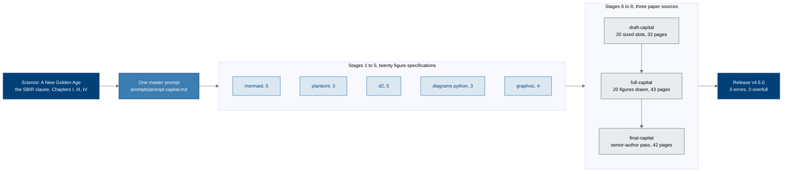
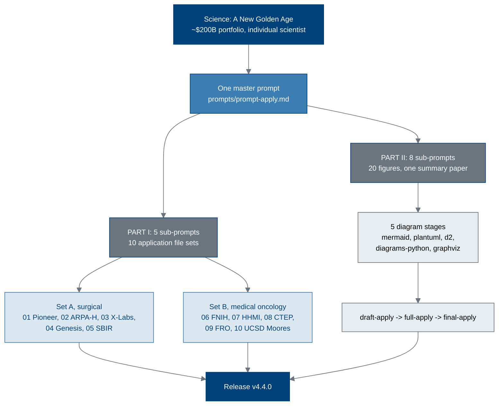

```mermaid
%%{init: {'theme':'base','themeVariables':{'fontSize':'13px','lineColor':'#6C757D'}}}%%
flowchart LR
    MP["Master prompt<br/>prompts/prompt-protocol.md"]:::goal
    S1["Stage 1 mermaid<br/>25 colored figures"]:::light
    S2["Stage 2 draft<br/>bracketed scaffold"]:::light
    S3["Stage 3 full<br/>20 TikZ figures, 11 tables"]:::mid
    S4["Stage 4 final<br/>polished + zip"]:::goal
    REL["Release v4.0.0<br/>CHANGELOG + releases + README"]:::goal
    MP --> S1 --> S2 --> S3 --> S4 --> REL
    classDef light fill:#FFFFFF,stroke:#111111,stroke-width:1px,color:#111111
    classDef mid fill:#6C757D,stroke:#111111,stroke-width:1.2px,color:#FFFFFF
    classDef goal fill:#00417A,stroke:#000000,stroke-width:1.5px,color:#FFFFFF
```

# End-to-End Physical AI Unification of Oncology Clinical Trials

[](https://opensource.org/licenses/MIT)
[](https://github.com/kevinkawchak/physical-ai-oncology-trials)
[](https://github.com/kevinkawchak/physical-ai-oncology-trials)
[](https://github.com/kevinkawchak/physical-ai-oncology-trials)
[](https://doi.org/10.5281/zenodo.18445179)
[](https://www.python.org/)
[](releases.md)
[](trial-protocol)
[](trial-protocol/nih-protocol)
[](https://doi.org/10.5281/zenodo.20780121)
[](https://creativecommons.org/licenses/by/4.0/)
[](trial-phase-2)
[](trial-phase-2)
[](trial-phase-2/final-protocol/publication)
[](trial-documents)
[](trial-ind)
[](funding/pdac-funding-applications)
[](funding/science-golden-age)
[](https://doi.org/10.5281/zenodo.21787424)


**Comprehensive developments for integrating physical AI into oncology clinical trials, by Claude Code; with Assistance from ChatGPT and Google Gemini.**

This repository provides production-ready configurations, validated pipelines, and integration guides for deploying robotic systems, digital twins, and embodied AI agents in oncology. 

**8/14: v4.6.0 (PDAC LLM Clinical Trial System)** *v4.6.0 adds new-trial-system/: the paper Pancreatic Cancer LLM Clinical Trial System: From IND to Protocol to Legislation, Funding, and AI Peer Review.* 

**8/11: v4.5.0 (ChemicalQDevice Capitalization Plan)** *v4.5.0 adds funding/capitalization-plan/: the company-conversion paper From Independent Scientist to Novel Performer, an SBIR operating, milestone and capitalization plan.* [](https://doi.org/10.5281/zenodo.21887807)

**8/3: v4.4.0 (10 PDAC Funding Applications + Summary)** *v4.4.0 adds funding/pdac-funding-applications/: ten recipient-unique Phase 1 pancreatic cancer funding application email file sets written under White House "Science: A New Golden Age".* [](https://doi.org/10.5281/zenodo.21787424)

**7/12: (Clinical Trial Funding Application v2.0)** *RFA-RM-27-001, Kawchak K. The application proposes a first-in-human, combined drug-device investigation of perioperative daraxonrasib and an eight-arm robotic pancreaticoduodenectomy."*  
[](https://doi.org/10.5281/zenodo.21317266)

**7/7: (Clinical Trial Funding Application)** *RFA-RM-27-001. ChemicalQDevice respectfully submits this application to the NIH Director's Pioneer Award for "Daraxonrasib Phase 1 LLM-Directed Robotic Whipple in KRAS-Mutated PDAC."* [](https://doi.org/10.5281/zenodo.21232965)

**7/1: v4.3.0 (Phase 1 PDAC IND: AI Generation, IND v1.0)** *v4.3.0 adds trial-ind/, a single-prompt Phase 1 PDAC IND that hastens the entire IND document-package process across the ReGARDD table of contents and ships 22 grayscale figures.* [](https://doi.org/10.5281/zenodo.21097442)

**6/29: v4.2.0 (Phase 1 Pancreatic Cancer Trial Efficient LLM Document Generations, Paper v1.0)** *v4.2.0 adds trial-documents/, a single-prompt paper that hastens the entire Phase 1 process by generating every relevant documents.* [](https://doi.org/10.5281/zenodo.21018646)

**6/23: v4.1.0 (Physical AI Pancreatic Whipple + Daraxonrasib Phase 2 Randomized Controlled Trial Protocol v1.1.0)** *v4.1.0 delivers the multicenter randomized Phase 2 follow-up: 220 participants randomized 1:1.* [](https://doi.org/10.5281/zenodo.20807027)

**6/20: v4.0.0 (Physical AI Pancreatic Whipple + Daraxonrasib Phase 1 Protocol v1.0.0)** *v4.0.0 delivers the first substantial Physical AI clinical trial protocol: a Phase 1, first-in-human, combined IND/IDE study of on-premises LLM-directed robotic Whipple surgery with perioperative daraxonrasib.* [](https://doi.org/10.5281/zenodo.20780121)

**5/10: v3.9.1 (Glioblastoma 1-Minute Variant Instructions)** *On-prem LLM controlled 1-minute glioblastoma resection simulation with 4 cooperating arms at mixed 1 kHz / 10 kHz force resolution and 16-iteration sweep* - 12-file 1-minute set. [](https://github.com/kevinkawchak/physical-ai-oncology-trials/tree/main/competitions/instructions/one_minute_variant)

**5/9: v3.9.0 (Glioblastoma Robotic Surgery Simulation Instructions)** *On-prem LLM controlled glioblastoma stereotactic resection simulation at 1 ms resolution for 1 hour with 64-iteration sweep* - 17-file instruction set at competitions/instructions/ [](https://github.com/kevinkawchak/physical-ai-oncology-trials/tree/main/competitions/instructions)

**5/6: v3.8.0 (Patient Priority Final Paper)** *Patient Priority and Proposed U.S. Bills for Physical AI Oncology Clinical Trials* - polished LaTeX manuscript at patients/paper/full-paper/final-paper populating the seven proposed federal bills. [](https://doi.org/10.5281/zenodo.20045457)

**5/3: v3.6.0 (Accelerated Patient Prediction Full Paper)** *Polished 70+ page LaTeX paper at new-trial/national-24-7-trial/paper/full-paper/ for "Accelerated Patient Prediction in Physical AI Oncology Clinical Trials: Four Comprehensive LLM Simulations"* [](https://doi.org/10.5281/zenodo.19994945)

**5/1: v3.4.2 (National 24/7 Continuous RTCT)** *National 24/7 Continuous Real-Time Clinical Trial Simulation - FDA April 2026 Response* - Indefinite-duration continuous trial spanning across 4 sites. [](https://github.com/kevinkawchak/physical-ai-oncology-trials/tree/main/new-trial/national-24-7-trial)

**4/6: v3.4.0 (168-Hour Autonomous Sponsor Simulation)** *Fully Automated Sponsor: 7-Day Continuous Simulation with 168 Total Commits* - 168 hourly Python scripts spanning across 7 total days. [](https://doi.org/10.5281/zenodo.18445179)

**4/4 PDF: v3.3.0 (Autonomous Sponsor Code Generation)** *Fully Automated Sponsor: Code Generation, Execution, and Paper Integration* - Automated generation of 108 Python scripts (53 core agents, 24 hours.) [](https://doi.org/10.5281/zenodo.19396256)

**3/28 PDF: v3.0.0 (National Platform Paper)** *National Platform for Physical AI Oncology Trials* - Comprehensive 186-page paper serving as an end-to-end resource for the pharmaceutical and industries. [](https://doi.org/10.5281/zenodo.19244918)

**3/24: v2.9.0 (Trial Site Documentation)** *Physical AI Oncology Clinical Trial Site Documentation* - 11 LaTeX documents for California's first Physical AI oncology trial site: legislation drafts, regulations. [](https://doi.org/10.5281/zenodo.19176370)

**3/23: v2.8.0 (On-Demand Trial Simulation)** *24-Hour On-Demand Physical AI Oncology Clinical Trial Simulation* - Full 24-hour simulation of an autonomous, patient-centric oncology trial serving 168 patients. [](https://github.com/kevinkawchak/physical-ai-oncology-trials/tree/main/new-trial)


**3/20: v2.7.0 (Patient Journey Paper)** *A Cancer Patient's Journey Through a Regulated and Autonomous Physical AI Oncology Trial Illustration* - Comprehensive paper documenting the patient journey [](https://doi.org/10.5281/zenodo.19119939)

📄 **3/20: v2.6.0 (Patient Journey)** *End-to-End Physical AI Oncology Clinical Trial Unification: Single-Patient Journey Orchestration* - 10-stage patient journey for PAT-2026-0042 (58F, Stage IIIB NSCLC) [](https://github.com/kevinkawchak/physical-ai-oncology-trials/tree/main/patient-journey)

📄 **3/18: v2.5.0 (Regulatory Adaptation)** *End-to-End Physical AI Oncology Clinical Trial Unification: Adaption of 21 CFR Part 312 - Investigational New Drug Application* - Adaptation of 21 CFR Part 312 Regulation [](https://doi.org/10.5281/zenodo.19057628)

📄 **3/16: v2.4.0 (Regulatory Adaptation)** *End-to-End Physical AI Oncology Clinical Trial Unification: Adaption of 21 CFR Part 50 - Protection of Human Subjects* - Adaptation of 21 CFR Part 50 Regulation [](https://doi.org/10.5281/zenodo.19040707)

📄 **3/12: v2.2.0 (Regulatory Guidance)** *End-to-End Physical AI Oncology Clinical Trial Unification.* Comprehensive guidance adapted from prior ICH E6(R3), with Sections 1-4, Appendices A-C, and Glossary [](https://doi.org/10.5281/zenodo.18973368)

📄 **3/2: v2.1.0 (Patient Instructions)** *Patient Instructions: Physical AI Oncology Trials* - Paper content documentation with page-by-page instructions, text diagrams, and quantitative patient data [](https://doi.org/10.5281/zenodo.18810541)

📄 **2/26: New Paper (USL)** *Unification Standard Level for Physical AI Oncology Trials. Standardizing and Evaluating Robot Unification Readiness for Multi-Site Clinical Trials. USL scores range from 1.0 to 10.0* [](https://doi.org/10.5281/zenodo.18778219)

> **v1.0.0** — First stable release. 51 Python modules (40,526 LOC), 69 documentation files, 28 examples, 5 CLI tools, and complete privacy/regulatory infrastructure. See [V1_RELEASE.md](V1_RELEASE.md) for full release documentation.

## Responsible use

This repository is complementary and open source, please implement code safely and responsibly. Intended audience: engineers building physical AI systems (robotics, ML, integration, and validation) for clinical trial settings.

## Quick Start

```bash
# Clone the repository
git clone https://github.com/kevinkawchak/physical-ai-oncology-trials.git
cd physical-ai-oncology-trials

# Install base dependencies
pip install -r requirements.txt

# Verify framework availability
python scripts/verify_installation.py

# Detect available simulation frameworks
python unification/cross_platform_tools/framework_detector.py
```
---

## Pancreatic Cancer LLM Clinical Trial System (v4.6.0)

[](new-trial-system/final-new-trial)
[](https://doi.org/10.5281/zenodo.xxxxxxxx)
[](new-trial-system)
[](new-trial-system/final-new-trial)
[](new-trial-system/sub-prompts)
[](new-trial-system/sub-prompts)
[](new-trial-system/final-new-trial/sections)
[](new-trial-system)
[](https://claude.ai/code)

**A 425-character summary.** v4.6.0 adds new-trial-system/: the paper Pancreatic Cancer LLM Clinical Trial System: From IND to Protocol to Legislation, Funding, and AI Peer Review, with the second-prompt update at final-new-trial/update-final/ that makes the bundle compile, redraws Figure 14 from stick actors to a class diagram, rewrites AI Peer Review around four quantified costs, and adds 13 outbound communications. 53 pages, 25 figures, 25 tables.

The prior pancreatic cancer trial system built its documents on a month scale,
through teams, with peer review arriving after completion. This release
discloses the system that replaces it: one author, one master prompt, a 1 to 4
day project time scale, and AI peer review that arrives during development
rather than after it. The four deliverables it produced, an IND, two clinical
trial protocols, a legislative framework and fourteen funding artifacts, are all
separately deposited and separately dated, and the paper reports on them rather
than proposing them.

### The build, end to end



```mermaid
%%{init: {'theme':'base','themeVariables':{'fontSize':'12px','lineColor':'#6B6B6B'}}}%%
flowchart LR
    MP["One master prompt<br/>prompts/prompt-new-trial.md"]:::goal
    subgraph DG["Stages 1 to 5, twenty-five figure specifications"]
        direction TB
        D1["mermaid, 6"]:::soft
        D2["plantuml, 4"]:::soft
        D3["d2, 6"]:::soft
        D4["diagrams python, 4"]:::soft
        D5["graphviz, 5"]:::soft
    end
    subgraph PA["Stages 6 to 8, three paper sources"]
        direction TB
        S6["draft-new-trial<br/>25 sized slots, 83K characters"]:::mid
        S7["full-new-trial<br/>25 figures drawn, 183K"]:::mid
        S8["final-new-trial<br/>senior-author pass, 212K"]:::mid
    end
    MP2["Second master prompt<br/>prompts/prompt-2-new-trial.md"]:::goal
    UF["update-final<br/>compiles, 53 pages"]:::mid
    CM["communications<br/>9 emails, 1 post, 3 messages"]:::soft
    REL["Release v4.6.0<br/>25 figures, 25 tables"]:::proc
    MP --> DG
    DG --> PA
    PA --> MP2
    MP2 --> UF
    UF --> CM
    CM --> REL
    classDef goal fill:#800020,stroke:#2E2E2E,stroke-width:1.5px,color:#FFFFFF
    classDef mid fill:#A32A3C,stroke:#800020,stroke-width:1px,color:#FFFFFF
    classDef soft fill:#E2D6D9,stroke:#A32A3C,stroke-width:1px,color:#2E2E2E
    classDef proc fill:#C9C9C9,stroke:#2E2E2E,stroke-width:1px,color:#2E2E2E
```

### What the four deliverables measured

| Deliverable | Scale reached | Elapsed | Deposited at |
|:--|:--|:--|:--|
| Phase 1 IND | 12 modules, 594,657 characters, 22 figures, 84 tables, 52 CFR cross-references | 4 days | [trial-ind/final-ind](trial-ind/final-ind) |
| Phase 1 protocol | n = 18, 3+3 escalation behind a Phase 0 gate, 169,878 characters, 20 figures | 2 days | [trial-protocol/final-protocol](trial-protocol/final-protocol) |
| Phase 2 protocol | n = 220, eight centers, hazard ratio 0.60, 199,421 characters, 22 figures | 2 days | [trial-phase-2/final-protocol](trial-phase-2/final-protocol) |
| Legislation | 5 bill versions plus 4 companion documents | 19 days | [new-trial-system/inputs](new-trial-system/inputs) |
| Funding | 10 applications, 2 NIH versions, 1 capitalization plan, 1,606,000 dollar ask | 74 days | [funding](funding) |

### The second prompt, and what the update stage changed

A second master prompt, filed at
[new-trial-system/prompts/prompt-2-new-trial.md](new-trial-system/prompts/prompt-2-new-trial.md),
produced [new-trial-system/final-new-trial/update-final](new-trial-system/final-new-trial/update-final).
It is a complete, self-contained Overleaf project that reads nothing from its
parent, and it is the version to compile.

| What changed | Why it mattered |
|:--|:--|
| Three `\foreach` headers re-declared in sec-03, sec-05 and sec-06 | They declared iteration macros with a digit in the name (`\x0`, `\b1`, `\p0`). A TeX control sequence cannot carry a digit, so pdfLaTeX halted inside Figure 7 and the stage 8 bundle produced no PDF at all |
| Section 7 rewritten around quantities | Four costs the prior regime imposes and three the new regime removes, each with a number and a date, replacing an argument made on latency alone |
| Table 21 re-cut to nine axes, Figure 22's grid to seven of them | The figure and the table now carry the same axes in the same order and cannot drift apart |
| Figure 14 redrawn as a class diagram | The use case drawing terminated its association lines at stick-actor captions rather than at the glyphs, so the lines did not appear to connect, and the glyph read as elementary beside a statute |
| Five defects fixed on the rendered pages | Figure 2's callout overlapped its note, Figure 4's loop label sat on an activation bar, Figure 6 ran two edges through its own subject label, Table 13 overflowed by 8.19 pt, and two paragraphs each spilled a two-line orphan |
| Thirteen communications added | [new-trial-system/communications](new-trial-system/communications): nine funding follow-up emails, one LinkedIn post, three general messages, each carrying the paper as its first attachment |

### What Section 7 now measures

| Axis | Prior system | New system | Ratio or delta |
|:--|:--|:--|:--|
| Latency, one round | 7 to 8 weeks best case | Same day | About 50 to 1 |
| Typical journal processing | Several months, 1 to 2 rounds | Hours, rounds unlimited | About 300 to 1 |
| US pancreatic cancer deaths inside one round | About 7,400 over 52 days | About 6 over 1 hour | The cost of the wait |
| Display items one paper carries | Commonly 6 to 8 per article | 25 figures and 25 tables | About 3 to 1 |
| Author cash cost per paper | 2,000 to 6,000 dollars list charge, over 10,000 at flagship titles | 35 dollars of inference across a 14-day study | About 57 to 1 and up |
| Direction the money runs | Author pays the journal to host the author's work | Author pays no journal, deposits under CC BY | Not comparable |
| Reviewers per round | 2 to 3 humans | 3 model manufacturers | 1 to 1 by count |
| Artifacts absorbed per year | 2 to 6 per author | Over 30 deposited in 2026 | About 6 to 1 |
| Corrections before release | None, review follows release | Every round, before deposit | The decisive axis |

Model peer review is not regulatory review. Nothing in the paper substitutes for
an institutional review board, an FDA information request, or a data and safety
monitoring board, and the paper states that limit in its own words.

### Prior system against new system

| Axis | Prior system | New system |
|:--|:--|:--|
| Document production unit | Team-month | Prompt-hour |
| IND assembly time | Months across a group | Four days, one author |
| Peer review entry point | After completion | During development |
| Review latency, one round | 7 to 8 weeks best case | Same day |
| Reviewers per round | 2 to 3 humans | 3 model manufacturers |
| Virtual trial cost | Above 120,000 dollars per run | 36,330 dollars projected |
| Provenance record | Acknowledgement paragraph | Commit history plus DOI |
| Figure format | Raster, not reusable | Machine readable, reusable |
| Revision granularity | Whole manuscript | One file, one commit |
| Author count | Group, plus a CRO | One, plus the models |

### The five diagram platforms, by purpose and not by quota

| Platform | Figures | What it owns | Specifications |
|:--|:--|:--|:--|
| Mermaid | 1, 4, 7, 11, 17, 21 | Order in time, and decisions taken at a point in time | [mermaid](new-trial-system/mermaid) |
| PlantUML | 3, 10, 14, 23 | Formal notation: actors, guards, concurrency | [plantuml](new-trial-system/plantuml) |
| D2 | 2, 8, 12, 16, 18, 22 | Nesting and tabulation | [d2](new-trial-system/d2) |
| Diagrams (Python) | 6, 13, 20, 25 | Clustered infrastructure carrying glyphs | [diagrams-python](new-trial-system/diagrams-python) |
| Graphviz | 5, 9, 15, 19, 24 | Records, clusters, fault and decision trees | [graphviz](new-trial-system/graphviz) |

### Paper contents

| Section | Title | Figures | Tables |
|:--|:--|:--|:--|
| 0 | Abstract, reader's guide, indexes, build record | none | 1, 2, 3 |
| 1 | Introduction | 1, 2 | 4, 5 |
| 2 | Methods | 3, 4, 5 | 6, 7 |
| 3 | IND | 6, 7, 8, 9 | 8, 9, 10 |
| 4 | Trial Protocol | 10, 11, 12, 13 | 11, 12, 13 |
| 5 | Legislation | 14, 15, 16 | 14, 15, 16 |
| 6 | Funding Proposals | 17, 18, 19, 20 | 17, 18, 19, 20 |
| 7 | AI Peer Review | 21, 22, 23, 24 | 21, 22, 23, 24 |
| 8 | Limitations and Future Work | 25 | 25 |
| 9 | Conclusions | none | none |
| 10 | Back matter and references | none | glossary |

Sections 3 through 7 are the paper's main sections and sit within a 2,000
character band of one another.

### Palette

Burgundy `#800020`, lighter burgundy 1 `#A32A3C`, lighter burgundy 2 `#E2D6D9`,
Charcoal `#2E2E2E`, Slate Gray `#6B6B6B`, Mist Gray `#C9C9C9`, white. Charcoal is
a stroke and a text color only, so no figure in the paper carries a black or
near-black fill. The paper body is black text throughout.

### Where to start

| If you are | Open | Then |
|:--|:--|:--|
| A funder | [final-new-trial](new-trial-system/final-new-trial) §6, Table 18 | §2, Figure 3 |
| A regulatory reviewer | [final-new-trial](new-trial-system/final-new-trial) §3, Table 9 | §4, Figure 10 |
| A legislative staffer | [final-new-trial](new-trial-system/final-new-trial) §5, Table 14 | §5, Figure 14 |
| A peer reviewer | [final-new-trial](new-trial-system/final-new-trial) §7, Table 21 | §7, Figure 24 |
| Reproducing the method | [prompts](new-trial-system/prompts) | [sub-prompts](new-trial-system/sub-prompts) |

## ChemicalQDevice Capitalization Plan (v4.5.0)

[](funding/capitalization-plan/final-capital)
[](https://doi.org/10.5281/zenodo.xxxxxxxx)
[](funding/capitalization-plan)
[](funding/capitalization-plan/final-capital)
[](funding/capitalization-plan/sub-prompts)
[](funding/capitalization-plan/sub-prompts)
[](funding/capitalization-plan/final-capital)
[](funding/capitalization-plan)

**A 425-character summary.** v4.5.0 adds funding/capitalization-plan/: the ChemicalQDevice conversion paper From Independent Scientist to Novel Performer, an SBIR operating, milestone and capitalization plan. It prices one program twice, $1,396,000 of direct work inside a $1,606,000 award against $3,500,000 over five years, costs twelve auditable milestones, and sets private capital behind a 21 CFR part 54 firewall. 20 figures, 21 tables, 0 errors.

Ten applications were filed in August 2026 as an independent scientist. Nine
address mechanisms that fund a person or an institution; one, application 05,
addresses the only mechanism built for a company. This release converts the
author to a small-business operator and rewrites that application as the
document it should have been.

### The build, end to end



### One program, two prices

Every table in the paper reconciles to these nine numbers, and the four-layer
split of the five-year budget is reused verbatim from the v4.4.0 work rather
than re-derived.

| Quantity | Value | Where |
|:--|:--|:--|
| Five-year program, direct | $3,500,000 | §3, Table 11 |
| SBIR Phase I, total cost, 9 months | $306,000 | §3, Tables 8 and 9 |
| SBIR Phase II, total cost, 24 months | $1,300,000 | §3, Tables 8 and 10 |
| SBIR route, total, 33 months | $1,606,000 | §3, Table 8 |
| Direct work inside that award | $1,396,000 | §3, Table 11 |
| Delta the award does not reach | $2,104,000 | §3, Table 11 |
| Overhead and fee load on direct | 15.0 percent | §3, Table 8 |
| Private capital behind the firewall | $5,900,000 | §4, Table 13 |
| Private to federal leverage | 3.67 to 1 | §4, against a 3:1 target |

The same $1,396,000 of direct work costs a funder $2,137,000 through a
university at a 57 percent facilities and administrative rate, and $2,091,000 at
the full 40 percent SBIR indirect allowance this company does not claim.

### The twelve auditable milestones

| ID | Months | Milestone | Cost | Stop condition |
|:--|:--|:--|:--|:--|
| M1 | 1 to 2 | Site feasibility executed | $24,000 | No site by month 4 |
| M2 | 2 to 4 | IRB submission accepted | $31,000 | Two rejections |
| M3 | 3 to 6 | Interlock rig bench verification | $96,000 | p95 latency above 250 ms |
| M4 | 4 to 7 | VVUQ suite frozen and hashed | $73,000 | Any credibility factor below gate |
| M5 | 6 to 9 | IND amendment safe to proceed | $82,000 | Clinical hold |
| M6 | 10 to 13 | First participant dosed | $164,000 | No enrollment by month 15 |
| M7 | 12 to 16 | First advised robotic Whipple | $228,000 | Any advisory override event |
| M8 | 15 to 20 | Dose level 1 cleared, n = 3 | $196,000 | Two of three DLTs |
| M9 | 18 to 24 | Audit replay to a third party | $131,000 | Any non-reproducible record |
| M10 | 22 to 28 | Dose level 2 cleared, n = 6 | $242,000 | Fistula grade B or C above 30 pct |
| M11 | 26 to 31 | Interim PK, PD and ctDNA | $187,000 | No target engagement |
| M12 | 30 to 33 | Closeout and public deposit | $152,000 | None; terminal artifact |

M1 to M5 sum to $306,000 and M6 to M12 to $1,300,000, both exactly.

### The twenty figures, by platform and purpose

| Platform | Count | The question only this vocabulary can state | Figures |
|:--|:--|:--|:--|
| Mermaid-type | 5 | What happens next, what decides, how long, who spoke in what order | 1, 7, 12, 13, 19 |
| PlantUML-type | 3 | Who is permitted to act, under what guard, what runs concurrently | 6, 10, 15 |
| D2-type | 5 | What contains what, what is priced against what, what joins to what | 2, 5, 8, 11, 16 |
| Diagrams (python)-type | 3 | What sits where, across which trust boundary | 4, 18, 20 |
| Graphviz-type | 4 | What depends on what, how a failure propagates | 3, 9, 14, 17 |

The split follows purpose rather than quota. No PNG or JPG is generated
anywhere: every figure is pure TikZ on an eight-token palette with no black
fill, and the diagrams-python stage emits a machine-readable specification
rather than a `.py` file, which keeps the three `lint-and-format` checks green.

### Stage outputs

| Stage | Directory | Output | Verified |
|:--|:--|:--|:--|
| 1 to 5 | [`mermaid/`](funding/capitalization-plan/mermaid) .. [`graphviz/`](funding/capitalization-plan/graphviz) | 20 figure specifications | source + TikZ notes |
| 6 | [`draft-capital/`](funding/capitalization-plan/draft-capital) | Skeleton, 20 sized slots, drafting instructions | 0 errors, 32 pages |
| 7 | [`full-capital/`](funding/capitalization-plan/full-capital) | 20 figures drawn, 21 tables | 0 errors, 43 pages |
| 8 | [`final-capital/`](funding/capitalization-plan/final-capital) | Senior-author pass, no `publication/` | 0 errors, 44 pages |

Every source set compiles with pdfLaTeX and BibTeX at zero errors, zero
overfull boxes, zero underfull boxes, zero undefined citations, and zero
undefined references. Every figure and every table carries an identical
6.06 pt caption gap, produced by `\vspace{-0.65cm}` against a rigid 24.5 pt
skip: 41 occurrences against 20 `\figcaption` plus 21 `\tabcap`.

Stage 8 was followed by one update pass, driven by
[`prompts/update-capital.md`](funding/capitalization-plan/prompts/update-capital.md).
Every caption now opens with its own number, `Figure N.` or `Table N.`, on three
centered lines; the twenty frames measure 306.00 pt against a 306 pt page center
and the forty-one captions sit within 0.53 pt of it, a centering defect in the
style file having put every float 13.1 pt to the right of center before; the
reference list prints and links its 20 DOIs and 17 URLs, which `unsrt.bst` had
been dropping; and every figure and table is referred to by number in the
running text. Stages 6 and 7 are unchanged and remain the record of what they
produced.

---

## 10 PDAC Independent-Scientist Funding Applications (v4.4.0)

[](funding/pdac-funding-applications/applications)
[](funding/pdac-funding-applications/applications)
[](funding/pdac-funding-applications/final-apply)
[](funding/pdac-funding-applications/sub-prompts/part-ii)
[](funding/potential-partners/UC-San-Diego)
[](funding/pdac-funding-applications)

**A 425-character summary.** v4.4.0 adds `funding/pdac-funding-applications/`:
ten recipient-unique Phase 1 pancreatic cancer funding applications written as an
independent scientist under the White House report's $200 billion
individual-scientist realignment, five surgical and five medical oncology, all
naming UC San Diego Moores Cancer Center, plus a 20-figure summary paper built
through five diagram stages then draft, full and final. Every source compiles at
zero errors.

### The build, end to end



### The ten recipients

| # | Recipient | Perspective | Term | Direct ask |
|:--|:--|:--|:--|:--|
| 01 | NIH Common Fund, Director's Pioneer Award | Surgical | 5 years | $3,500,000 |
| 02 | ARPA-H mission office | Surgical | 36 months, 3 gates | $2,100,000 |
| 03 | NSF TIP Directorate, X-Labs | Surgical | 5 years | $3,500,000 |
| 04 | DOE Office of Science, Genesis Mission | Surgical | 5 years | $3,500,000 |
| 05 | NIH SEED, SBIR and STTR | Surgical | 9 + 24 months | $1,606,000 |
| 06 | Foundation for the NIH, AMP | Medical oncology | 5 years | $3,500,000 cash |
| 07 | HHMI Investigator Program | Medical oncology | 7 years | $700,000 per year |
| 08 | NCI Cancer Therapy Evaluation Program | Medical oncology | 5 years | $3,500,000 |
| 09 | Convergent Research, FRO program | Medical oncology | 5 years, dissolves | $3,500,000 |
| 10 | UC San Diego Moores Cancer Center | Medical oncology | one meeting | none |

Each qualifies only because *Science: A New Golden Age* names its program or
the mechanism it runs. The trial is constant across all ten, so a reviewer
comparing two of them is comparing two mechanisms with the science held fixed.

### The twenty figures, by platform and purpose

| Platform | Count | The question only this vocabulary can state |
|:--|:--|:--|
| Mermaid-type | 6 | What happens next, what decides, how long, who spoke in what order |
| PlantUML-type | 3 | Who is permitted to act, under what guard, and what runs concurrently |
| D2-type | 4 | What contains what, what tabulates against what, what joins to what |
| Diagrams (python)-type | 3 | What runs where, across which trust boundary |
| Graphviz-type | 4 | What depends on what, how a failure propagates |

The split follows purpose rather than quota. No PNG or JPG is generated
anywhere: every figure is pure TikZ, and the diagrams-python stage emits a
machine-readable specification rather than a `.py` file, which also keeps the
repository's three `lint-and-format` checks green.

### Stage outputs

| Stage | Directory | Output | Verified |
|:--|:--|:--|:--|
| PART I | [`applications/`](funding/pdac-funding-applications/applications) | 10 email `.txt`, 10 attachments, 10 zips | 0 errors, 4 to 5 pages each |
| Diagrams | [`mermaid/`](funding/pdac-funding-applications/mermaid) .. [`graphviz/`](funding/pdac-funding-applications/graphviz) | 20 figure specifications | source + TikZ notes |
| Stage 6 | [`draft-apply/`](funding/pdac-funding-applications/draft-apply) | Skeleton, 20 slots, drafting instructions | 0 errors, 20 pages |
| Stage 7 | [`full-apply/`](funding/pdac-funding-applications/full-apply) | 20 figures drawn, 18 tables | 0 errors, 33 pages |
| Stage 8 | [`final-apply/`](funding/pdac-funding-applications/final-apply) | Senior-author pass, no `publication/` | 0 errors, 34 pages |

---

## Phase 1 PDAC IND: AI Generation (v4.3.0)

This release adds [`trial-ind/`](trial-ind): a single-prompt Phase 1 Investigational
New Drug (IND) application, *Phase 1 PDAC IND: AI Generation* (IND v1.0), that hastens
the entire Phase 1 IND document-package process and ships 22 grayscale Mermaid figures,
each from a unique perspective, reproduced exactly in LaTeX. Authored by Kevin Kawchak (ChemicalQDevice), IND v1.0, DOI [10.5281/zenodo.21097442](https://doi.org/10.5281/zenodo.21097442), July 1, 2026.

### Contents of this version

- [Build pipeline](#build-pipeline-v430) (mermaid -> draft -> full -> final)
- [Stage outputs](#stage-outputs-v430)
- [IND at a glance](#ind-at-a-glance-v430)
- [trial-ind structure](#trial-ind-structure-v430)

### Build pipeline (v4.3.0)

```mermaid
%%{init: {'theme':'base','themeVariables':{'fontSize':'13px','lineColor':'#6C757D'}}}%%
flowchart LR
    MP["Master prompt<br/>prompts/prompt-ind.md"]:::goal
    S1["Stage 1 mermaid<br/>22 grayscale figures"]:::input
    S2["Stage 2 draft-ind<br/>12 scaffolds + instructions"]:::input
    S3["Stage 3 full-ind<br/>prose + TikZ + tables"]:::accent
    S4["Stage 4 final-ind<br/>polished + zip"]:::goal
    REL["Release v4.3.0<br/>README + releases + CHANGELOG"]:::proc
    MP --> S1 --> S2 --> S3 --> S4 --> REL
    classDef goal   fill:#000000,stroke:#000000,stroke-width:1.5px,color:#FFFFFF
    classDef proc   fill:#3F3F3F,stroke:#000000,stroke-width:1.4px,color:#FFFFFF
    classDef accent fill:#6C757D,stroke:#000000,stroke-width:1.3px,color:#FFFFFF
    classDef input  fill:#ECECEC,stroke:#3F3F3F,stroke-width:1.2px,color:#111111
```



### Stage outputs (v4.3.0)

| Stage | Directory | Output |
|:--|:--|:--|
| Bootstrap | `trial-ind/prompts`, `sub-prompts` | master prompt, output, 4 sub-prompts, READMEs |
| 1 mermaid | `trial-ind/mermaid` | 22 grayscale Mermaid figures (8-tone ramp) |
| 2 draft | `trial-ind/draft-ind` | 12 ReGARDD section scaffolds + zip |
| 3 full | `trial-ind/full-ind` | 12 full sections, 20 TikZ figures, 31 tables + zip |
| 4 final | `trial-ind/final-ind` | polished sections, 22 figures, ~90 tables + zip (no publication dir) |

### IND at a glance (v4.3.0)

| Item | Value |
|:--|:--|
| Drug | Daraxonrasib (RMC-6236), oral RAS(ON) multi-selective inhibitor |
| Indication | Resectable / borderline KRAS G12-mutated PDAC; ECOG 0-1 |
| Design | Phase 1, first-in-human, combined IND / IDE; 3+3 dose finding |
| Dose levels | DL1 160 mg, DL2 220 mg, DL3 300 mg once daily; 28-day DLT |
| Device | On-premises LLM-directed eight-arm robotic Whipple (56 DOF, 640 channels) |
| Sample size | Up to 18 treated (about 36 screened), single academic site |
| Primary endpoints | 30-day device / procedure SAE rate; MTD / RP2D; task-completion feasibility |
| Document scale | 12 ReGARDD sections, 22 grayscale figures, ~90 full-width tables, ~10x the source paper |

### trial-ind structure (v4.3.0)

```
trial-ind/
  README.md                 build hub (badges, pipeline, milestones)
  prompts/                  prompt-ind.md (verbatim) + output-ind.md
  sub-prompts/              prompt-1-mermaid .. prompt-4-final-ind
  mermaid/        (Stage 1) 22 grayscale Mermaid figures + README + output
  draft-ind/      (Stage 2) main.tex, indstyle.sty, references.bib, sections/, zip
  full-ind/       (Stage 3) same set, 20 TikZ figures + 31 tables
  final-ind/      (Stage 4) same set, polished, 22 figures (no publication subdirectory)
  inputs/                   ReGARDD IND template, FDA 1571 instructions, ReGARDD guidance, references.bib
```

---

## Phase 1 Pancreatic Cancer Trial Efficient LLM Document Generations (v4.2.0)

This release adds [`trial-documents/`](trial-documents): a single-prompt paper
(paper v1.0), *Phase 1 Pancreatic Cancer Trial Efficient LLM Document Generations*,
that shows how a repository based large language model, driven by one master prompt
that first writes and then executes a schedule of sub-prompts, hastens the entire
Phase 1 process by generating every relevant large trial document through a mermaid
to draft to full to final pipeline. Authored by Kevin Kawchak (ChemicalQDevice),
paper v1.0, DOI [10.5281/zenodo.21018646](https://doi.org/10.5281/zenodo.21018646)
June 29, 2026.

### Contents of this version

- [Build pipeline](#build-pipeline-v420) (mermaid -> draft -> full -> final)
- [Stage outputs](#stage-outputs-v420)
- [The six acceleration targets](#the-six-acceleration-targets-v420)
- [trial-documents structure](#trial-documents-structure-v420)

### Build pipeline (v4.2.0)

```mermaid
%%{init: {'theme':'base','themeVariables':{'fontSize':'13px','lineColor':'#6C757D'}}}%%
flowchart LR
    MP["Master prompt<br/>prompts/prompt-paper.md"]:::goal
    S1["Stage 1 mermaid<br/>24 colored figures"]:::input
    S2["Stage 2 draft-paper<br/>scaffold + instructions"]:::input
    S3["Stage 3 full-paper<br/>prose + TikZ + tables"]:::accent
    S4["Stage 4 final-paper<br/>polished + zip"]:::goal
    REL["Release v4.2.0<br/>README + releases + CHANGELOG"]:::proc
    MP --> S1 --> S2 --> S3 --> S4 --> REL
    classDef goal   fill:#8B2E3F,stroke:#000000,stroke-width:1.5px,color:#FFFFFF
    classDef proc   fill:#2F5D7C,stroke:#000000,stroke-width:1.4px,color:#FFFFFF
    classDef accent fill:#D08770,stroke:#000000,stroke-width:1.3px,color:#111111
    classDef input  fill:#BFD7EA,stroke:#2F5D7C,stroke-width:1.2px,color:#111111
```



### Stage outputs (v4.2.0)

| Stage | Directory | Output |
|:--|:--|:--|
| Bootstrap | `trial-documents/prompts`, `sub-prompts` | master prompt, output, 4 sub-prompts, READMEs |
| 1 mermaid | `trial-documents/mermaid` | 24 colored Mermaid figures (5-step palette) |
| 2 draft | `trial-documents/draft-paper` | 8 section scaffolds + zip |
| 3 full | `trial-documents/full-paper` | 8 full sections, 24 TikZ figures, 6 tables + zip |
| 4 final | `trial-documents/final-paper` | polished sections + zip (no publication dir) |

### The six acceleration targets (v4.2.0)

| # | Document target | Gate | Binding clock |
|:--|:--|:--|:--|
| 1 | Initial IND and IRB package | Hard | 30-day FDA review; IRB calendar |
| 2 | Protocol amendments + synchronized consent | Hard | IRB approval; serial-revision loss |
| 3 | Cohort-review packages after safety data mature | Protocol-defined | DLT observation window |
| 4 | Complete clinical-hold response | Hard | 30-day FDA review of a complete response |
| 5 | Phase 2-to-3 briefing package and Phase 3 protocol | Decision | EOP2 scheduling |
| 6 | Pivotal CSR and NDA/BLA modules after database lock | Decision/filing | Database lock; RTOR staging |

### trial-documents structure (v4.2.0)

```
trial-documents/
  README.md                 build hub (badges, pipeline, milestones)
  prompts/                  prompt-paper.md (verbatim) + output-paper.md
  sub-prompts/              prompt-1-mermaid .. prompt-4-final-paper
  mermaid/        (Stage 1) 24 colored Mermaid figures + README + output
  draft-paper/    (Stage 2) main.tex, paperstyle.sty, references.bib, sections/, zip
  full-paper/     (Stage 3) same set, 24 TikZ figures + 6 tables
  final-paper/    (Stage 4) same set, polished (no publication subdirectory)
  inputs/                   llm-adoption template + references.bib
  research/                 document-types (2) + industry-workflow (2) AI sources
```

---

## Physical AI Pancreatic Whipple + Daraxonrasib Phase 2 Randomized Controlled Trial Protocol (v4.1.0)

This release adds [`trial-phase-2/`](trial-phase-2): the multicenter randomized
**Phase 2** follow-up to the Phase 1 protocol. With the Phase 1 protocol having
established the daraxonrasib recommended Phase 2 dose (RP2D, 300 mg once daily) and
the feasibility and safety of the on-premises LLM-directed eight-arm robotic
Whipple, genuine clinical equipoise now exists, so this study randomizes **220
participants 1:1 across eight high-volume academic centers**. Authored by Kevin Kawchak (ChemicalQDevice), protocol
v1.1.0, DOI [10.5281/zenodo.20807027](https://doi.org/10.5281/zenodo.20807027),
June 23, 2026.

### Contents of this version

- [Build pipeline](#physical-ai-pancreatic-whipple--daraxonrasib-phase-2-randomized-controlled-trial-protocol-v410) (mermaid -> draft -> full -> final -> publication)
- [Stage outputs](#stage-outputs-phase-2)
- [Protocol at a glance (Phase 2)](#protocol-at-a-glance-phase-2)
- [trial-phase-2 structure](#trial-phase-2-structure)

### Build pipeline



```mermaid
%%{init: {'theme':'base','themeVariables':{'fontSize':'13px','lineColor':'#6B6B6B'}}}%%
flowchart LR
    MP["Master prompt<br/>prompts/prompt-protocol.md"]:::goal
    S1["Stage 1 mermaid<br/>24 colored figures"]:::light
    S2["Stage 2 draft<br/>bracketed scaffold"]:::light
    S3["Stage 3 full<br/>22 TikZ figures, 11 tables"]:::mid
    S4["Stage 4 final<br/>polished + zip"]:::mid
    PUB["Publication<br/>author edits, paper URL dir"]:::goal
    REL["Release v4.1.0<br/>CHANGELOG + releases + README"]:::goal
    MP --> S1 --> S2 --> S3 --> S4 --> PUB --> REL
    classDef light fill:#F5F5F5,stroke:#800020,stroke-width:1.2px,color:#111111
    classDef mid fill:#6B6B6B,stroke:#111111,stroke-width:1.4px,color:#FFFFFF
    classDef goal fill:#800020,stroke:#000000,stroke-width:1.6px,color:#FFFFFF
```

### Stage outputs (Phase 2)

| Stage | Directory | Output |
|:--|:--|:--|
| Bootstrap | `trial-phase-2/prompts`, `sub-prompts` | master prompt, 4 sub-prompts, READMEs |
| 1 mermaid | `trial-phase-2/mermaid` | 24 colored Mermaid figures (Burgundy #800020 palette) |
| 2 draft | `trial-phase-2/draft-protocol` | 13 NIH section scaffolds + zip |
| 3 full | `trial-phase-2/full-protocol` | 13 full sections, 22 TikZ, 11 tables + zip |
| 4 final | `trial-phase-2/final-protocol` | polished sections + zip |
| publication | `trial-phase-2/final-protocol/publication` | author-edited paper URL directory + zip |

### Protocol at a glance (Phase 2)

| Element | Value |
|:--|:--|
| Design | Phase 2, multicenter (8 centers), randomized 1:1, parallel-group, controlled, open-label with BICR |
| Arm A | Daraxonrasib RP2D (300 mg once daily) + on-premises LLM-directed eight-arm robotic Whipple |
| Arm B | Modified FOLFIRINOX + institutional-standard high-volume pancreaticoduodenectomy |
| Primary endpoint | Progression-free survival; HR 0.60; 85% power; two-sided alpha 0.05; about 140 events; one group-sequential interim |
| Key secondary (hierarchical) | OS; R0 rate; ISGPS grade B/C fistula; major pathologic response; ctDNA clearance |
| Device readiness | Phase 0 USL >= 8.0; >= 5000 sims; >= 3 frameworks; sim-to-real < 1.5 mm / < 0.4 N; fleet harmonization |
| Funding | Patient-Aligned Co-Investment Facility behind a capital firewall (21 CFR part 54; H.R. 9510 VVUQ) |

### trial-phase-2 structure

```
trial-phase-2/
├── README.md                 # build hub (v1.1.0)
├── prompts/                  # prompt-protocol.md (master) + output-protocol.md
├── sub-prompts/              # prompt-1-mermaid .. prompt-4-final-protocol
├── mermaid/                  # Stage 1: 24 colored Mermaid figures (#800020 palette)
├── draft-protocol/           # Stage 2: 13 NIH section scaffolds + zip
├── full-protocol/            # Stage 3: full sections, 22 TikZ, 11 tables + zip
├── final-protocol/           # Stage 4: polished sections + zip
│   └── publication/          # author-edited paper URL directory (the paper)
├── template/                 # paper template (recolored #800020)
├── nih-protocol/             # NIH-FDA Phase 2/3 IND/IDE template grounding
├── inputs/                   # main documents + Phase 1 predicate (grounding)
└── research/                 # Phase 2 evidence base and background
```

---

## Physical AI Pancreatic Whipple + Daraxonrasib Phase 1 Protocol (v4.0.0)

This release adds [`trial-protocol/`](trial-protocol): the first substantial
**Physical AI clinical trial protocol** in this repository. It is a **Phase 1,
first-in-human, combined IND/IDE** study of **on-premises LLM-directed robotic
pancreaticoduodenectomy (the Whipple procedure)** with **perioperative
daraxonrasib (RMC-6236)** in KRAS-mutated pancreatic ductal adenocarcinoma. Authored by Kevin Kawchak (ChemicalQDevice), DOI [10.5281/zenodo.20780121](https://doi.org/10.5281/zenodo.20780121),
June 20, 2026.

### Contents of this version

- [Build pipeline](#physical-ai-pancreatic-whipple--daraxonrasib-phase-1-protocol-v400) (mermaid -> draft -> full -> final)
- [Stage outputs and commit counts](#stage-outputs)
- [Protocol at a glance](#protocol-at-a-glance)
- [trial-protocol structure](#trial-protocol-structure)

### Build pipeline



### Stage outputs

| Stage | Directory | Output | Commits |
|:--|:--|:--|:--|
| Bootstrap | `trial-protocol/prompts`, `sub-prompts` | master prompt, 4 sub-prompts, READMEs | per file |
| 1 mermaid | `trial-protocol/mermaid` | 25 colored Mermaid figures | 28 |
| 2 draft | `trial-protocol/draft-protocol` | 13 NIH section scaffolds + zip | 21 |
| 3 full | `trial-protocol/full-protocol` | 13 full sections, 20 TikZ, 11 tables + zip | 21 |
| 4 final | `trial-protocol/final-protocol` | polished sections + zip | 21 |

### Protocol at a glance

| Element | Value |
|:--|:--|
| Design | Phase 1, first-in-human, open-label, single-arm, combined IND/IDE |
| Drug arm | Daraxonrasib (RMC-6236), RAS(ON) multi-selective inhibitor, 3+3 (160 / 220 / 300 mg) |
| Device arm | Eight-arm LLM-directed robotic Whipple; 56 DOF; 640 sensor channels; 3 N / 18 N force caps; 3 ms E-stop |
| Population | KRAS G12 PDAC, ECOG 0-1, resectable / borderline-resectable; up to n = 18 |
| Primary endpoints | 30-day device/procedure serious-AE incidence; MTD/RP2D; unsafe-conversion-free task completion |
| Safety | 5-vessel no-fly gate; VVUQ ten-gate; hash-chained audit trail (21 CFR part 11); USL $\geq$ 7.0 |

### trial-protocol structure

```
trial-protocol/
├── README.md                 # build hub (v4.0.0)
├── prompts/                  # prompt-protocol.md (master) + output-protocol.md
├── sub-prompts/              # prompt-1-mermaid .. prompt-4-final-protocol
├── mermaid/                  # Stage 1: 25 colored Mermaid figures
├── draft-protocol/           # Stage 2: 13 NIH section scaffolds + zip
├── full-protocol/            # Stage 3: full sections, 20 TikZ, 11 tables + zip
├── final-protocol/           # Stage 4: polished sections + zip
├── template/                 # paper template (recolored #00417A)
├── nih-protocol/             # NIH-FDA IND/IDE template (10 chunks)
├── inputs/                   # 3 main documents + author_works.bib
└── research/                 # 2026 Physical AI FDA + oncology-strategy markdowns
```

---

## Glioblastoma 1-Minute Variant Instructions (v3.9.1)

```
  4-Arm Sensor Streams         Per-Arm XYZ Commands     1-Min vs 1-Hr Compare
  (50 ch/arm x 4 arms,   --->  (per-arm phase-      --> (on-prem LLM,
   200 ch total at mixed         conditioned 1 kHz       4-round tournament)
   1 kHz + 10 kHz force)         with 5 ms e-stop)
  +-----------------------+    +------------------------+   +----------------+
  | Arm 1 hyb u-w-p cut   | -> | Per-arm x, y, z, q,    |-> | Quality 0.40   |
  | Arm 2 bipolar coag    |    | linear_vel up to       |   | Time     0.25  |
  | Arm 3 suction collect |    | 1,000 mm/s, force      |   | Cost     0.20  |
  | Arm 4 iMRI + 5-ALA    |    | clamp 5 N/arm, tool,   |   | Safety   0.10  |
  | 1 kHz heartbeat bus   |    | 7-state command enum   |   | PtExp    0.05  |
  | 12 N cumulative cap   |    | + heartbeat watchdog   |   | TrueSkill mu/s |
  +-----------------------+    +------------------------+   +----------------+
             |                             |                        |
             v                             v                        v
  +-----------------------+    +-----------------------+   +----------------+
  | NeuroSpeed 1.0 (2030) |    | 4-phase 60s timeline  |   | Compare vs     |
  | 4 arms x 7 DOF, 28    |    | P1 dural 0-5s, P2     |   | v3.9.0 1-hr    |
  | DOF total, 0.1 mm RMS |    | bulk 5-45s @ 800      |   | ROSA ONE Brain |
  | at 1,000 mm/s, 5 ms   |    | mm cubed per s, P3    |   | v3.0 baseline  |
  | e-stop, 800 mm cubed  |    | margin 45-55s, P4     |   | + manual human |
  | per s peak via hybrid |    | hemostasis 55-60s     |   | (no published  |
  | u-w-p removal         |    | (pre-op precomputed)  |   |  1-min human)  |
  +-----------------------+    +-----------------------+   +----------------+
             |                            |                         |
             v                            v                         v
  +-----------------------------------------------------------------------------+
  | v3.9.1: 12-file 1-minute variant instruction set at                         |
  | competitions/instructions/one_minute_variant/ for a future Claude Code Opus |
  | 4.7 1M Max session to author the simulation across 7 sequential commits in  |
  | 1 PR. L1 (20 Hz) + L2 (1 Hz) + L3 (per-phase) + events committed at 510 KB  |
  | per iteration; 16 iterations total 8.2 MB committed within 10 MB cap. L0    |
  | raw of 26 MB per iteration archived to Zenodo (416 MB total, free 50 GB     |
  | tier). Inherits parent v3.9.0 instructions verbatim except for 4-arm and    |
  | 1-minute-specific overrides; nothing in glioblastoma-1hr-trial/ is touched. |
  +-----------------------------------------------------------------------------+
```

## Glioblastoma Robotic Surgery Simulation Instructions (v3.9.0)

```
  Sensor Stream                XYZ Commands               Comparison Agent
  (50 channels @ 1 kHz)  --->  (phase-conditioned    ---> (on-prem LLM,
                                1 kHz / 100 Hz)            skill rating)
  +-----------------------+    +-----------------------+   +----------------+
  | Joints x 18 channels  | -> | x, y, z, qw, qx, qy,  |-> | Quality 0.40   |
  | EE pose x 7 channels  |    | qz, vel, force_clamp, |   | Time     0.25  |
  | EE force x 6 channels |    | tool, command_state   |   | Cost     0.20  |
  | Nav dev x 3 channels  |    | + 2 metadata          |   | Safety   0.10  |
  | Tool flags x 6 chan.  |    | ~2.73M commands/hr    |   | PtExp    0.05  |
  | Safety enums x 2 ch.  |    | Parquet 90 MB         |   | TrueSkill mu/s |
  | + 8 metadata fields   |    +-----------------------+   +----------------+
  | 3.6M ticks/hr         |               |                        |
  | Parquet 60 MB         |               v                        v
  +-----------------------+    +-----------------------+   +----------------+
        |                      | ROSA ONE Brain v3.0   |   | Tournament 8   |
        v                      | firmware 3.1.4        |   | rounds: this   |
  +-----------------------+    | 6 DOF, 0.5 mm RMS,    |   | project vs.    |
  | Layer 1: generators   |    | 50 mm/s max linear    |   | prior version  |
  | Layer 2: 7 commits in |    | velocity, IEC 80601-  |   | snapshots,     |
  | one PR with per-      |    | 2-77 force limits,    |   | NeuroMate,     |
  | commit budgets        |    | 21 CFR 50.30 task-    |   | Brainlab Cirq, |
  | Layer 3: per-file     |    | order lifecycle       |   | Modus V,       |
  | chunking caps         |    +-----------------------+   | Mazor X, human |
  +-----------------------+                                +----------------+
           |                                |                       |
           v                                v                       v
  +-----------------------------------------------------------------------------+
  |  v3.9.0: 17-file instruction set at competitions/instructions/ for a future |
  |  Claude Code Opus 4.7 1M Max session to author the simulation across 7      |
  |  sequential commits in 1 PR. ASCII and Mermaid diagrams replace SVG for     |
  |  high-frequency series. SHA-256 manifested release snapshot enables future  |
  |  release-vs-release comparisons via the on-prem LLM comparison agent.       |
  +-----------------------------------------------------------------------------+
```

## Accelerated Patient Prediction Paper Template (v3.5.0)

```
  Four LLM Simulations           Paper Template                   Future Pass
  (Inputs)                --->   (this PR)                 --->   (Population)
  +-------------------+          +---------------------+          +------------+
  | Sim 1: 24/7 RTCT  |   --->   | main.tex            |   --->   | 70+ pages  |
  | (84 hours x 7     |   --->   | new_paper.sty       |   --->   | Color      |
  |  files, 4 sites,  |          | references.bib (35) |          | diagrams   |
  |  116 robots)      |          | abstract.tex        |          | added in a |
  | Sim 2: Patient    |   --->   | introduction.tex    |   --->   | second     |
  | Journey (10       |          | methods.tex (prose) |          | author-    |
  | stages, 1 patient)|          | results.tex (4 sims)|          | driven     |
  | Sim 3: 24h        |   --->   | discussion.tex      |   --->   | pass       |
  | Sponsor (24 .py,  |          | limitations.tex     |          |            |
  | 53 agents, 75 dx) |          | conclusions.tex     |          | Senior     |
  | Sim 4: 168h, 7d   |   --->   | back_matter.tex     |   --->   | author     |
  | (525 dx, 168 .py, |          | LaTeX_Source_Files  |          | white-     |
  | 7 PRs, Core i5)   |          | .zip (Overleaf)     |          | space pass |
  +-------------------+          +---------------------+          +------------+
           |                                |                           |
           v                                v                           v
  +-----------------------------------------------------------------------------+
  |  v3.5.0: bracketed instructions naming exact directories and file paths,    |
  |  ASCII diagrams to embed verbatim, individual patient and robot examples,   |
  |  and DOIs and clickable URLs for every reference (GitHub + Zenodo).         |
  +-----------------------------------------------------------------------------+
```

## Repository Structure

```
physical-ai-oncology-trials/
├── README.md
├── V1_RELEASE.md
├── LICENSE
├── requirements.txt
│
├── new-trial-system/                  # ★ Pancreatic Cancer LLM Clinical Trial System (v4.6.0)
│   ├── README.md                      # directory map, section-to-figure-to-table map, palette
│   ├── prompts/                       # 2 master prompts + 2 build outputs, verbatim
│   ├── sub-prompts/                   # 8 stage sub-prompts, one directory each
│   ├── mermaid/ plantuml/ d2/         # figure specifications, 6 + 4 + 6
│   ├── diagrams-python/ graphviz/     # figure specifications, 4 + 5
│   ├── draft-new-trial/               # Stage 6: skeleton, 25 sized slots + zip
│   ├── full-new-trial/                # Stage 7: 25 figures drawn, 25 tables + zip
│   ├── final-new-trial/               # Stage 8: senior-author pass + zip, no publication/
│   │   └── update-final/              # ★ second-prompt update: compiles, 53 pages + zip
│   ├── communications/                # ★ 9 funding emails + 1 LinkedIn post + 3 messages
│   ├── abstracts/                     # the author's deposited abstracts, 2024 to 2026
│   ├── inputs/                        # 3 legislation archives + the AI peer review archive
│   ├── references/                    # references.bib + trump-ai-cancer-2025-2026.bib
│   └── template-new-system/           # the paper template this work adapts
│
├── funding/                           # ChemicalQDevice Capitalization Plan (v4.5.0)
│   ├── README.md                      # funding hub: structure, DOIs, source map
│   ├── capitalization-plan/           # v4.5.0 build, one eight-stage schedule
│   │   ├── prompts/                   # prompt-capital.md + update-capital.md + output-capital.md
│   │   ├── sub-prompts/               # 8 stage sub-prompts, one directory each
│   │   ├── mermaid/ plantuml/ d2/     # figure specifications, 5 + 3 + 5
│   │   ├── diagrams-python/ graphviz/ # figure specifications, 3 + 4
│   │   ├── draft-capital/             # Stage 6: skeleton, 20 sized slots + zip
│   │   ├── full-capital/              # Stage 7: 20 figures drawn, 21 tables + zip
│   │   └── final-capital/             # Stage 8: senior-author pass + zip (no publication dir)
│   ├── pdac-funding-applications/     # v4.4.0 build
│   │   ├── prompts/                   # prompt-apply.md (master, verbatim) + output-apply.md
│   │   ├── sub-prompts/part-i/        # 5 sub-prompts: the ten application file sets
│   │   ├── sub-prompts/part-ii/       # 8 sub-prompts: the summary paper
│   │   ├── applications/              # app-01 .. app-10: .txt, main.tex, sections/, zip
│   │   ├── mermaid/ plantuml/ d2/     # figure specifications, 6 + 3 + 4
│   │   ├── diagrams-python/ graphviz/ # figure specifications, 3 + 4
│   │   ├── draft-apply/               # Stage 6: skeleton, 20 slots, drafting instructions
│   │   ├── full-apply/                # Stage 7: 20 figures drawn, 18 tables + zip
│   │   └── final-apply/               # Stage 8: senior-author pass + zip (no publication dir)
│   ├── science-golden-age/            # the July 2026 White House report, chunked + BibTeX
│   ├── RFA-RM-27-001/ RFA-RM-27-001-v2/  # the two completed NIH applications (LaTeX sources)
│   ├── pdfs/                          # compiled PDFs of both applications
│   ├── supplementary/                 # founding documents + 3 LaTeX source zips
│   └── potential-partners/            # UC San Diego (partner of choice) and Scripps
│
├── trial-ind/                         # ★ Phase 1 PDAC IND: AI Generation (v4.3.0)
│   ├── README.md                      # build hub (IND v1.0 / repo v4.3.0)
│   ├── prompts/                       # prompt-ind.md (master, verbatim) + output-ind.md
│   ├── sub-prompts/                   # prompt-1-mermaid .. prompt-4-final-ind
│   ├── mermaid/                       # Stage 1: 22 grayscale Mermaid figures + README + output
│   ├── draft-ind/                     # Stage 2: 12 ReGARDD section scaffolds + zip
│   ├── full-ind/                      # Stage 3: 12 full sections, 20 TikZ, 31 tables + zip
│   ├── final-ind/                     # Stage 4: polished, 22 figures, ~90 tables + zip (no publication dir)
│   └── inputs/                        # ReGARDD IND template, FDA 1571 instructions, references.bib
│
├── trial-documents/                   # ★ Phase 1 PDAC Efficient LLM Document Generations Paper (v4.2.0)
│   ├── README.md                      # build hub (paper v1.0 / repo v4.2.0)
│   ├── prompts/                       # prompt-paper.md (verbatim) + output-paper.md
│   ├── sub-prompts/                   # 4 generated stage sub-prompts
│   ├── mermaid/                       # Stage 1: 24 colored Mermaid figures (5-step palette)
│   ├── draft-paper/                   # Stage 2: 8 section scaffolds + zip
│   ├── full-paper/                    # Stage 3: 8 full sections, 24 TikZ, 6 tables + zip
│   ├── final-paper/                   # Stage 4: polished sections + zip
│   │   └── publication/               # author-edited paper URL directory (the paper)
│   ├── inputs/                        # llm-adoption template + references.bib
│   └── research/                      # document-types + industry-workflow AI sources
│
├── trial-phase-2/                     # ★ Physical AI Whipple + Daraxonrasib Phase 2 Randomized Controlled Trial Protocol (v4.1.0)
│   ├── README.md                      # build hub (v1.1.0 / repo v4.1.0)
│   ├── prompts/                       # Phase 2 master prompt (verbatim) + output
│   ├── sub-prompts/                   # 4 generated stage sub-prompts
│   ├── mermaid/                       # Stage 1: 24 figures recolored to #800020
│   ├── draft-protocol/                # Stage 2: 13 NIH section scaffolds + zip
│   ├── full-protocol/                 # Stage 3: full sections, 22 TikZ, 11 tables + zip
│   ├── final-protocol/                # Stage 4: polished sections + zip
│   │   └── publication/               # author-edited paper URL directory (the paper)
│   ├── template/                      # paper template (recolored #800020)
│   ├── nih-protocol/                  # NIH-FDA Phase 2/3 IND/IDE template grounding
│   ├── inputs/                        # main documents + Phase 1 predicate (grounding)
│   └── research/                      # Phase 2 evidence base and background
│
├── trial-protocol/                    # ★ Physical AI Whipple + Daraxonrasib Phase 1 Protocol (v4.0.0)
│   ├── README.md                      # build hub
│   ├── prompts/                       # master prompt (verbatim) + full output
│   ├── sub-prompts/                   # 4 generated stage sub-prompts
│   ├── mermaid/                       # Stage 1: 25 colored Mermaid figures
│   ├── draft-protocol/                # Stage 2: 13 NIH section scaffolds + zip
│   ├── full-protocol/                 # Stage 3: full sections, 20 TikZ, 11 tables + zip
│   ├── final-protocol/                # Stage 4: polished sections + zip
│   ├── template/                      # paper template (recolored #00417A)
│   ├── nih-protocol/                  # NIH-FDA IND/IDE template (10 chunks)
│   ├── inputs/                        # 3 main documents + author_works.bib
│   └── research/                      # 2026 Physical AI FDA + oncology-strategy markdowns
│
├── sponsor/                           # ★ Fully Automated Sponsor (v3.3.0)
│   ├── input_files/                   # Sponsor playbook and organization inputs (16 files)
│   │   ├── README.md                  # Cross-document alignment and processing notes
│   │   ├── sponsor_01-08_*.md         # End-to-End Sponsor Playbook (8 chunks)
│   │   └── org_01-07_*.md             # Sponsor Organization (7 chunks)
│   ├── paper/                         # Complete Autonomous Sponsor Paper (v3.2.0)
│   │   ├── main.tex                   # Main document (18 sections + 6 appendices)
│   │   ├── sponsor_paper.sty          # Style file (adapted from arxiv.sty, CC BY 4.0)
│   │   ├── references.bib             # Bibliography (48+ entries with DOIs/URLs)
│   │   ├── README.md                  # Paper documentation and compilation guide
│   │   └── sections/                  # 19 section .tex files (complete paper content)
│   ├── final_paper/                   # ★ Final Paper with Code Generations (v3.3.0)
│   │   ├── main.tex                   # Updated document with execution results
│   │   ├── sections/                  # 19 updated .tex files
│   │   ├── README.md                  # Comprehensive documentation
│   │   ├── scripts/                   # 108 generated Python scripts (v3.3.0)
│   │   │   ├── run_sponsor_simulation.py  # Master 24-hour simulation runner
│   │   │   ├── generate_all_diagrams.py   # 75 text diagram generator
│   │   │   ├── sponsor_server/        # FastAPI sponsor control server (15 files)
│   │   │   ├── hourly/                # 24 hourly sponsor generators + JSON output
│   │   │   ├── diagrams/              # 75 ASCII text diagrams (3 perspectives)
│   │   │   ├── coordination/          # Agent event bus, escalation, gates
│   │   │   ├── safety/                # Robotic safety workflows
│   │   │   ├── dashboard/             # Terminal dashboard and reports
│   │   │   ├── core_agents/           # 53 core agent implementations
│   │   │   └── output/                # Simulation results and reports
│   │   └── 168_hours/                 # ★ 168-Hour Simulation (v3.4.0)
│   │       ├── README.md              # Simulation overview and statistics
│   │       ├── run_168h_simulation.py # Master 168-hour simulation runner
│   │       ├── day_01/ - day_07/      # 7 day directories (24 hours each)
│   │       │   ├── hourly/            # 24 sponsor_hour_XXX.py + JSON output
│   │       │   ├── diagrams/          # 75 text diagrams per day (72 hourly + 3 cumulative)
│   │       │   └── output/            # Day summary JSON
│   │       └── instructions/          # Real-time execution instructions
│   │           ├── rtx_4090_openclaw/ # RTX 4090 setup (Linux, macOS, Windows)
│   │           ├── mac_mini_m4_pro_openclaw/ # M4 Pro setup (Linux, macOS, Windows)
│   │           └── core_i5_6200u_4gb/ # Core i5-6200U 4GB setup (Windows 10 Pro)
│   └── template/                      # Autonomous Sponsor Paper Template (v3.1.0)
│       ├── main.tex                   # Template document (18 sections + appendices)
│       ├── sponsor_paper.sty          # Style file (adapted from arxiv.sty, CC BY 4.0)
│       ├── references.bib             # Bibliography (48 entries with DOIs/URLs)
│       ├── orcid_icon.png             # ORCID icon for author attribution
│       ├── README.md                  # Template documentation and processing guide
│       └── sections/                  # 19 section .tex files with processing instructions
│
├── new-trial/                         # ★ 24-Hour On-Demand Trial Simulation (v2.8.0)
│   ├── README.md                      # Simulation overview and results
│   ├── psl_framework.md               # PSL scoring framework definition
│   ├── site_specification.md          # Facility and staffing specifications
│   ├── format_comparison.md           # On-demand vs. traditional comparison
│   ├── prompts.md                     # v2.8.0 development prompt
│   ├── hour-00/ through hour-23/      # 24 hourly simulation directories
│   │   ├── hour_XX_simulation.md      # Master simulation log
│   │   ├── hour_XX_robot_logs.md      # Per-robot telemetry
│   │   ├── hour_XX_patient_records.md # Patient vitals and records
│   │   ├── hour_XX_psl_scores.md      # PSL scores for all 10 robots
│   │   ├── hour_XX_diagram_facility.txt     # Facility layout diagram
│   │   ├── hour_XX_diagram_patient_flow.txt # Patient flow diagram
│   │   └── hour_XX_diagram_robot_status.txt # Robot status timeline
│   ├── final-commit/                  # Error review and 24-hour summaries
│   │   ├── final_error_review.md      # Consistency check
│   │   ├── final_24h_summary.md       # Performance summary
│   │   ├── final_psl_cumulative.md    # PSL trajectory analysis
│   │   └── final_diagram_*.txt        # Summary diagrams (3 files)
│   ├── national-24-7-trial/           # ★ National 24/7 Continuous RTCT (v3.4.2)
│   │   ├── README.md                  # Continuous trial overview and FDA mapping
│   │   ├── FDA-April-2026/            # Source FDA news release (28 Apr 2026)
│   │   ├── Background-A/              # Deep research chunk set A (17 bib entries)
│   │   ├── Background-B/              # Deep research chunk set B (9 bib entries)
│   │   ├── hour-00/ through hour-55/  # Hourly folders, 7 files each
│   │   ├── extra-hours/               # hour-56 through hour-83 (approximated)
│   │   └── paper/                     # Paper Template (v3.5.0)
│   │       ├── main.tex               # Document skeleton + global formatting brief
│   │       ├── new_paper.sty          # Style file (arxiv-derived, CC BY 4.0)
│   │       ├── references.bib         # 35 entries with DOIs and clickable URLs
│   │       ├── orcid_icon.png         # Title-page ORCID hyperlink asset
│   │       ├── README.md              # Paper-template documentation
│   │       ├── LaTeX_Source_Files.zip # Overleaf-ready archive
│   │       ├── sections/              # 8 section .tex files
│   │       └── full-paper/            # ★ Polished Full Paper (v3.6.0)
│   │           ├── main.tex           # Polished document with stronger formatting
│   │           ├── new_paper.sty      # Updated style with displaywidowpenalty
│   │           ├── references.bib     # 35 entries + 2 added Zenodo refs
│   │           ├── orcid_icon.png     # Title-page ORCID hyperlink asset
│   │           ├── README.md          # DOI badges + ASCII diagrams + tables
│   │           ├── LaTeX_Source_Files.zip # Overleaf-ready archive
│   │           └── sections/          # 8 section .tex files (final prose)
│   └── site/                          # Trial Site Documentation (v2.9.0)
│       ├── README.md                  # Site documentation overview
│       ├── 01-legislation-authorization/     # SB 1042 authorization act
│       ├── 02-legislation-patient-rights/    # AB 2847 patient rights act
│       ├── 03-legislation-data-transparency/ # SB 892 data protection act
│       ├── 04-city-regulations/       # SF municipal code update
│       ├── 05-state-regulations/      # CA Title 22 Chapter 14
│       ├── 06-national-regulations/   # FDA compliance guide
│       ├── 07-building-code/          # Facility construction standards
│       ├── 08-premises-code/          # Site safety and access
│       ├── 09-parking-transportation/ # Parking and transit standards
│       ├── 10-site-operations/        # Activation and SOPs
│       ├── 11-emergency-preparedness/ # Emergency response plan
│       ├── all-documents/             # Combined 11-document source
│       │   ├── all_documents.tex      # Full combined LaTeX source
│       │   └── all_documents_chunk/   # Chunked into 11 files (v2.9.1)
│       │       └── README.md          # Reconstruction instructions
│       └── zips/                      # LaTeX source archives (12 zips)
│
├── patient-journey/                   # ★ Single-Patient Journey Orchestration (v2.6.0)
│   ├── patient_state.py               # Central data model (10 enums, 14 dataclasses)
│   ├── stage_01_prescreening.py       # Stage 1: Pre-Screening & Referral Intake
│   ├── stage_02_enrollment.py         # Stage 2: Enrollment & Informed Consent
│   ├── stage_03_digital_twin.py       # Stage 3: Digital Twin Construction
│   ├── stage_04_robot_qualification.py# Stage 4: Robot Qualification
│   ├── stage_05_surgery.py            # Stage 5: Robot-Assisted Surgery
│   ├── stage_06_recovery.py           # Stage 6: Post-Operative Recovery
│   ├── stage_07_immunotherapy.py      # Stage 7: Immunotherapy Treatment
│   ├── stage_08_federation.py         # Stage 8: Federated Learning
│   ├── stage_09_surveillance.py       # Stage 9: Long-Term Surveillance
│   ├── stage_10_closeout.py           # Stage 10: Trial Closeout
│   ├── master_journey.py              # Master orchestrator (all 10 stages)
│   ├── diagrams/                      # 30 ASCII progress diagrams (3 x 10)
│   ├── deliverables/                  # Charts, tables, FDA analysis, guidance
│   ├── paper/                         # ★ Patient Journey Paper (v2.7.0)
│   │   ├── patient_journey_paper.tex  # LaTeX source
│   │   ├── patient_journey_paper_chunk/ # Chunked into 3 files (v2.9.1)
│   │   │   └── README.md              # Reconstruction instructions
│   │   ├── patient_journey_paper.pdf  # Compiled PDF (compile from .tex)
│   │   ├── Latex_Source_Code.zip      # Source archive
│   │   ├── arxiv.sty                  # Style file
│   │   ├── orcid_icon.png             # ORCID icon
│   │   ├── README.md                  # Paper documentation
│   │   └── template/                  # Formatting template
│   └── prompts.md                     # Development prompts archive
│
├── patients/                          # ★ Patient Instructions (v2.1.0)
│   ├── patient_robot_instructions_fixed.tex    # LaTeX source (10 robot categories)
│   ├── patient_robot_instructions_fixed_chunk/ # Chunked into 2 files (v2.9.1)
│   │   └── README.md                  # Reconstruction instructions
│   ├── README.md                      # Paper content, instructions, text diagrams
│   ├── paper/                         # ★ Patient Priority Paper Template (v3.7.0)
│   │   ├── README.md                  # Template documentation, AVAILABLE DIRECTORIES
│   │   ├── main.tex                   # Document skeleton + global formatting brief
│   │   ├── patient_priority.sty       # Style file (adapted from prior templates)
│   │   ├── patient_priority.bib       # 56 entries with DOIs + clickable URLs (biber)
│   │   ├── LaTeX_Source_Files.zip     # Overleaf-ready archive
│   │   ├── Deep-Research-1/           # AI and patient control evidence (3 chunks)
│   │   ├── Deep-Research-2/           # Layered legal-stack baseline (4 chunks)
│   │   ├── Deep-Research-3/           # Oncology trial laws + patient control (4 parts)
│   │   ├── sections/                  # 15 template section .tex files (v3.7.0)
│   │   │   ├── abstract.tex
│   │   │   ├── introduction.tex
│   │   │   ├── patient_priority.tex
│   │   │   ├── hr_4501_patient_self_selection.tex
│   │   │   ├── hr_4502_robot_humanoid_choice.tex
│   │   │   ├── hr_4503_procedural_modification.tex
│   │   │   ├── hr_4504_error_reduction.tex
│   │   │   ├── hr_4505_realtime_sponsor.tex
│   │   │   ├── hr_4506_american_leadership.tex
│   │   │   ├── hr_4507_data_self_custody.tex
│   │   │   ├── implementation_metrics.tex
│   │   │   ├── discussion.tex
│   │   │   ├── limitations_future.tex
│   │   │   ├── conclusions.tex
│   │   │   └── back_matter.tex
│   │   └── full-paper/                # ★ Patient Priority Full Paper (v3.8.0)
│   │       ├── README.md              # Full paper documentation + DOI badges + ASCII diagram
│   │       ├── main.tex               # 7-Bill consolidated document entry point
│   │       ├── patient_priority.sty   # Polished style with widow/orphan + flushbottom
│   │       ├── patient_priority.bib   # 47 entries, single canonical URL each (biber)
│   │       ├── LaTeX_Source_Files.zip # Overleaf-ready archive
│   │       └── sections/              # 8 final-prose section .tex files
│   │           ├── hr_9501_patient_self_selection.tex   # Adaption of 21 CFR 50, FDA DCT, 42 USC 300gg-8
│   │           ├── hr_9502_robot_humanoid_choice.tex    # Revision of CA AB 2847, FDA AI Draft 2025
│   │           ├── hr_9503_procedural_modification.tex  # Adaption of OHRP Broad Consent, Cures Act
│   │           ├── hr_9504_error_reduction.tex          # Adaption of HTI-1 DSI, FDA AI Draft 2025
│   │           ├── hr_9505_realtime_sponsor.tex         # Revision of FDA RTCT, FDA DCT
│   │           ├── hr_9506_american_leadership.tex      # New Statute Adapting FDORA Sec 3209, Cures Act
│   │           ├── hr_9507_data_self_custody.tex        # Revision of HHS HIPAA, ONC Cures Rule
│   │           └── back_matter.tex
│   ├── research/                      # Archived generation scripts
│   │   ├── v1.9.1/
│   │   │   ├── generate_pdf.py        # reportlab + Pillow generator
│   │   │   ├── paper/README           # Paper access (Drive link)
│   │   │   └── images/README.md       # Image access (Drive link)
│   │   └── v1.9.0/
│   │       ├── README.md
│   │       ├── generate_illustrations.py
│   │       ├── generate_pdf.py
│   │       ├── paper/README
│   │       ├── svg/README.md
│   │       ├── pdf/README.md
│   │       └── png/README.md
│   └── prompts/
│       └── prompts.md                 # Development prompts archive
│
├── competitions/                      # ★ Competitions and Instruction Sets
│   ├── instructions/                  # ★ Glioblastoma Trial Instructions (v3.9.0)
│   │   ├── README.md                  # Top-level orientation and table of contents
│   │   ├── glioblastoma_context.md    # Patient PAT-GBM-0001 + 5-phase procedure timeline
│   │   ├── robot_specification.md     # Medtronic ROSA ONE Brain v3.0 + 50-channel sensors
│   │   ├── chunking_strategy.md       # 3-layer chunking to keep future LLM in memory
│   │   ├── file_format_conventions.md # .md, .pdf, .json, .jsonl, .yaml, .toml, .parquet, etc.
│   │   ├── ascii_diagram_guide.md     # ASCII + Mermaid templates that replace SVG
│   │   ├── runtime_environments.md    # MacOS, Windows, Linux, Docker, server recipes
│   │   ├── competition_protocol.md    # Prior versions, competitor robots, hybrid teams
│   │   ├── ci_compliance_checklist.md # Pre-commit ruff and yamllint checklist
│   │   ├── pr_workflow.md             # 7-commit single-PR pattern
│   │   ├── commit_01_project_overview.md         # Future Commit 1: 7 files
│   │   ├── commit_02_sensor_specifications.md    # Future Commit 2: 8 files
│   │   ├── commit_03_xyz_mapping.md              # Future Commit 3: 9 files
│   │   ├── commit_04_iteration_design.md         # Future Commit 4: 10 files (incl. Cargo.toml)
│   │   ├── commit_05_comparison_competition.md   # Future Commit 5: 12 files + release snapshot
│   │   ├── commit_06_error_fixes.md              # Future Commit 6: 7-check pre-commit error scan
│   │   ├── commit_07_repository_updates.md       # Future Commit 7: parent README, releases.md, CHANGELOG.md
│   │   └── one_minute_variant/        # ★ Glioblastoma 1-Minute Variant Instructions (v3.9.1)
│   │       ├── README.md              # 1-min variant orientation and inheritance map from v3.9.0
│   │       ├── glioblastoma_context_1min.md      # 4-phase 60-second procedure timeline (pre-op precomputed)
│   │       ├── robot_specification_neurospeed.md # Medtronic NeuroSpeed 1.0 (2030) 4 arms x 7 DOF
│   │       ├── sensor_specification_10khz.md     # Mixed 1 kHz / 10 kHz force, 200 channels (50/arm x 4)
│   │       ├── multi_arm_coordination.md         # 1 kHz heartbeat, 5 ms e-stop, 12 N cumulative cap
│   │       ├── file_size_pyramid_1min.md         # Layer 4 pyramid: 510 KB committed + 26 MB Zenodo per iter
│   │       ├── commit_01_overview_1min.md        # Future Commit 1: 8 files (vs parent 7)
│   │       ├── commit_02_sensors_1min.md         # Future Commit 2: 9 files (vs parent 8)
│   │       ├── commit_03_xyz_4arm.md             # Future Commit 3: 11 files (vs parent 9, adds heartbeat)
│   │       ├── commit_04_iterations_1min.md      # Future Commit 4: 14 files (16 iter sweep at 1 min)
│   │       ├── commit_05_competition_1min.md     # Future Commit 5: 13 files + v3.9.1 snapshot + Zenodo patch
│   │       └── zenodo_archive_protocol.md        # 416 MB L0 raw deposition, DOI assignment, SHA-256 manifest
│   ├── inputs/                        # Reference papers and Kaggle competition source files
│   │   ├── paper-a/                   # CodeClash paper chunked into 10 markdown files
│   │   ├── paper-b/                   # FAERS paper chunked into 10 markdown files
│   │   └── site-1/                    # Orbit Wars Kaggle competition chunked into 3 files
│   ├── data/                          # Future generated competition data
│   └── paper/                         # Future generated competition paper
│
├── digital-twins/
│   ├── README.md
│   ├── patient-modeling/
│   │   ├── README.md
│   │   └── tumor_twin_pipeline.py
│   ├── treatment-simulation/
│   │   ├── README.md
│   │   └── treatment_simulator.py
│   ├── clinical-integration/
│   │   ├── README.md
│   │   └── clinical_dt_interface.py
│   └── examples-twins/
│       ├── README.md
│       ├── 01_realtime_dt_synchronization.py
│       ├── 02_multi_organ_toxicity_twin.py
│       ├── 03_adaptive_radiation_therapy_dt.py
│       ├── 04_tumor_microenvironment_immunotherapy_dt.py
│       ├── 05_virtual_trial_cohort_dt.py
│       └── 06_dt_validation_verification.py
│
├── examples/
│   ├── README.md
│   ├── 01_surgical_robot_training.py
│   ├── 02_digital_twin_surgical_planning.py
│   ├── 03_cross_framework_validation.py
│   ├── 04_agentic_clinical_workflow.py
│   └── 05_treatment_response_prediction.py
│
├── examples-new/
│   ├── README.md
│   ├── 01_realtime_safety_monitoring.py
│   ├── 02_sensor_fusion_intraoperative.py
│   ├── 03_ros2_surgical_deployment.py
│   ├── 04_hand_eye_calibration_registration.py
│   ├── 05_shared_autonomy_teleoperation.py
│   └── 06_robotic_sample_handling.py
│
├── q1-2026-standards/
│   ├── README.md
│   ├── objective-1-bidirectional-conversion/
│   │   ├── isaac_to_mujoco_pipeline.py
│   │   ├── mujoco_to_isaac_pipeline.py
│   │   └── physics_equivalence_tests.py
│   ├── objective-2-robot-model-repository/
│   │   ├── model_registry.yaml
│   │   └── model_validator.py
│   ├── objective-3-validation-benchmark/
│   │   └── benchmark_runner.py
│   └── implementation-guide/
│       ├── timeline.md
│       └── compliance_checklist.md
│
├── unification/
│   ├── README.md
│   ├── simulation_physics/
│   │   ├── challenges.md
│   │   ├── opportunities.md
│   │   ├── isaac_mujoco_bridge.py
│   │   ├── urdf_sdf_mjcf_converter.py
│   │   └── physics_parameter_mapping.yaml
│   ├── agentic_generative_ai/
│   │   ├── challenges.md
│   │   ├── opportunities.md
│   │   └── unified_agent_interface.py
│   ├── surgical_robotics/
│   │   ├── challenges.md
│   │   └── opportunities.md
│   ├── cross_platform_tools/
│   │   ├── framework_detector.py
│   │   └── validation_suite.py
│   ├── usl/                          # ★ Unification Standard Level
│   │   ├── README.md                 # USL standard overview
│   │   ├── prompts.md                # Development prompts archive
│   │   ├── paper/                    # USL Paper (v1.8.0)
│   │   │   ├── Unification Standard Level for Physical AI Oncology Trials.pdf
│   │   │   ├── Latex Source Code.zip # .tex, .sty, .bib, README
│   │   │   ├── usl_oncology_trials.tex
│   │   │   ├── usl_oncology_trials_chunk/ # Chunked into 2 files (v2.9.1)
│   │   │   │   └── README.md              # Reconstruction instructions
│   │   │   ├── usl-oncology.sty
│   │   │   ├── references.bib
│   │   │   └── README
│   │   ├── humanoids/                # ★ Humanoid Robots (v1.6.0)
│   │   │   ├── README.md             # Humanoid evaluations & diagrams
│   │   │   ├── usl_humanoid_scoring.py
│   │   │   ├── boston_dynamics_atlas/
│   │   │   ├── tesla_optimus/
│   │   │   └── agility_digit/
│   │   ├── surgical/                 # Surgical Robots (v1.5.0)
│   │   │   ├── README.md             # Surgical evaluations & diagrams
│   │   │   ├── usl_surgical_scoring.py
│   │   │   ├── intuitive_davinci/
│   │   │   ├── medtronic_hugo/
│   │   │   └── cmr_versius/
│   │   └── cobots/                   # Cobots (v1.4.0)
│   │       ├── README.md             # Cobot evaluations & diagrams
│   │       ├── usl_scoring_framework.py
│   │       ├── franka_panda/
│   │       ├── kinova_gen3/
│   │       └── ufactory_xarm7/
│   ├── standards_protocols/
│   └── integration_workflows/
│
├── generative-ai/                     # VLA models, diffusion policies, synthetic data
│   ├── strengths.md
│   ├── limitations.md
│   └── results.md
├── agentic-ai/                        # LLM-based robot control, multi-agent systems
│   ├── README.md
│   ├── strengths.md
│   ├── limitations.md
│   ├── results.md
│   └── examples-agentic-ai/
│       ├── 01_mcp_clinical_robotics_server.py
│       ├── 02_react_procedure_planner.py
│       ├── 03_realtime_adaptive_treatment_agent.py
│       ├── 04_autonomous_simulation_orchestrator.py
│       ├── 05_safety_constrained_agent_executor.py
│       └── 06_protocol_rag_compliance_agent.py
├── reinforcement-learning/            # RL for surgical autonomy, sim2real transfer
│   ├── strengths.md
│   ├── limitations.md
│   └── results.md
├── self-supervised-learning/          # Contrastive learning, foundation models
│   ├── strengths.md
│   ├── limitations.md
│   └── results.md
├── supervised-learning/               # Segmentation, detection, classification
│   ├── strengths.md
│   ├── limitations.md
│   └── results.md
│
├── frameworks/
│   ├── nvidia-isaac/                  # Isaac Sim, Isaac Lab, Isaac for Healthcare
│   │   └── INTEGRATION.md
│   ├── mujoco/                        # MuJoCo, MJX, MuJoCo Playground
│   │   └── INTEGRATION.md
│   ├── gazebo/                        # Gazebo Ionic, ROS 2 integration
│   │   └── INTEGRATION.md
│   └── pybullet/                      # PyBullet medical simulation
│       └── INTEGRATION.md
│
├── privacy/
│   ├── README.md
│   ├── phi-pii-management/
│   │   ├── README.md
│   │   └── phi_detector.py
│   ├── de-identification/
│   │   ├── README.md
│   │   └── deidentification_pipeline.py
│   ├── access-control/
│   │   ├── README.md
│   │   └── access_control_manager.py
│   ├── breach-response/
│   │   ├── README.md
│   │   └── breach_response_protocol.py
│   └── dua-templates/
│       ├── README.md
│       └── dua_generator.py
│
├── regulatory/
│   ├── README.md
│   ├── Adaption-21-CFR-Part-312/                  # ★ Physical AI 21 CFR Part 312 Adaptation (v2.5.0)
│   │   └── source/
│   │       ├── Physical_AI_21_CFR_Part_312.tex    # LaTeX source (94 pages compiled)
│   │       ├── Physical_AI_21_CFR_Part_312_chunk/ # Chunked into 5 files (v2.9.1)
│   │       │   └── README.md                      # Reconstruction instructions
│   │       ├── Physical_AI_21_CFR_Part_312.sty    # Custom style package
│   │       ├── Physical_AI_21_CFR_Part_312.bib    # Bibliography (42 references)
│   │       ├── Physical_AI_21_CFR_Part_312.pdf    # Compiled PDF
│   │       ├── Physical_AI_21_CFR_Part_312.zip    # Source archive
│   │       └── prompts.md                         # Development prompts archive
│   ├── Adaption-21-CFR-Part-50/                   # ★ Physical AI 21 CFR Part 50 Adaptation (v2.4.0)
│   │   └── source/
│   │       ├── Physical_AI_21_CFR_Part_50.tex     # LaTeX source (37 pages compiled)
│   │       ├── Physical_AI_21_CFR_Part_50_chunk/  # Chunked into 3 files (v2.9.1)
│   │       │   └── README.md                      # Reconstruction instructions
│   │       ├── Physical_AI_21_CFR_Part_50.sty     # Custom style package
│   │       ├── Physical_AI_21_CFR_Part_50.bib     # Bibliography (19 references)
│   │       ├── Physical_AI_21_CFR_Part_50.pdf     # Compiled PDF
│   │       ├── Physical_AI_21_CFR_Part_50.zip     # Source archive
│   │       ├── prompts.md                         # Development prompts archive (v2.4.0)
│   │       └── README.md
│   ├── adaption-ich-e6r3/             # ★ Physical AI Unification Guidance (v2.2.0)
│   │   ├── prompts.md                 # Development prompts archive
│   │   └── source/
│   │       ├── main.tex               # LaTeX source (Sections 1-4, Appendices, Glossary)
│   │       ├── main_chunk/            # Chunked into 4 files (v2.9.1)
│   │       │   └── README.md          # Reconstruction instructions
│   │       ├── ich_guideline_style.sty
│   │       ├── references.bib
│   │       ├── compiled.pdf
│   │       └── README.md
│   ├── fda-compliance/
│   │   ├── README.md
│   │   └── fda_submission_tracker.py
│   ├── irb-management/
│   │   ├── README.md
│   │   └── irb_protocol_manager.py
│   ├── ich-gcp/
│   │   ├── README.md
│   │   └── gcp_compliance_checker.py
│   └── regulatory-intelligence/
│       ├── README.md
│       └── regulatory_tracker.py
│
├── regulatory-submit/                   # FDA Submission Automation (v1.0.0)
│   ├── README.md
│   ├── presub_generator.py              # Pre-Submission (Q-Sub) package generation
│   ├── pccp_engine.py                   # PCCP document authoring
│   ├── classification_advisor.py        # 510(k)/De Novo/PMA pathway classification
│   ├── iec62304_generator.py            # IEC 62304 lifecycle documentation
│   ├── clinical_evidence.py             # Clinical evidence reports
│   ├── audit_trail.py                   # 21 CFR Part 11 audit trails
│   └── examples-regulatory-submit/      # 6 submission workflow examples
│
├── federation/
│   ├── README.md
│   ├── federated_coordinator.py
│   ├── differential_privacy.py
│   ├── secure_aggregation.py
│   ├── site_enrollment.py
│   ├── data_harmonization.py
│   ├── consortium_reporting.py
│   ├── privacy_analytics.py
│   └── examples-federation/
│       ├── README.md
│       ├── 01_basic_two_site.py
│       ├── 02_differential_privacy.py
│       ├── 03_secure_aggregation.py
│       ├── 04_enrollment_sync.py
│       ├── 05_data_harmonization.py
│       └── 06_full_consortium.py
│
├── tools/
│   ├── README.md
│   ├── dicom-inspector/
│   │   └── dicom_inspector.py
│   ├── dose-calculator/
│   │   └── dose_calculator.py
│   ├── trial-site-monitor/
│   │   └── trial_site_monitor.py
│   ├── sim-job-runner/
│   │   └── sim_job_runner.py
│   └── deployment-readiness/
│       └── deployment_readiness.py
│
├── images/
│   ├── README.md
│   ├── prompts/                       # Human-authored + AI-recommended prompts
│   │   ├── plan.md
│   │   ├── 1st.md
│   │   ├── 2nd.md
│   │   └── 3rd.md
│   ├── interactive/                   # Python visualization scripts
│   │   ├── 1st/                       # 10 scripts (architecture, clinical)
│   │   ├── 2nd/                       # 10 scripts (AI/ML benchmarks)
│   │   └── 3rd/                       # 10 scripts (regulatory, privacy)
│   └── png/                           # Static PNG exports (1920×1080 @2x)
│       ├── 1st/                       # 20 PNGs (10 light + 10 dark)
│       ├── 2nd/                       # 20 PNGs (10 light + 10 dark)
│       └── 3rd/                       # 20 PNGs (10 light + 10 dark)
│
├── national-platform/                 # ★ National Platform for Physical AI Oncology Trials
│   ├── RESEARCH-A                     # Federal regulatory research (plain text)
│   ├── RESEARCH-A-CHUNK/              # Chunked into 2 files (v2.9.1)
│   │   └── README.md                  # Reconstruction instructions
│   ├── RESEARCH-B                     # State/federal comparative research (plain text)
│   ├── RESEARCH-B-CHUNK/              # Chunked into 2 files (v2.9.1)
│   │   └── README.md                  # Reconstruction instructions
│   ├── 21cfr312_adapt/                # 21 CFR Part 312 adaptation chunks (5 files)
│   ├── 21cfr50_adapt/                 # 21 CFR Part 50 adaptation chunks (3 files)
│   ├── ich_e6r3_adapt/                # ICH E6(R3) adaptation chunks (4 files)
│   ├── federated_learning/            # Federated learning paper chunks (4 files)
│   ├── national_mcp/                  # National MCP servers paper chunks (4 files)
│   ├── new_trial_psl/                 # Trial site PSL documentation chunks (11 files)
│   ├── patient_journey/               # Patient journey paper chunks (3 files)
│   ├── patient_robot/                 # Patient robot instructions chunks (2 files)
│   ├── usl_standard/                  # USL standard paper chunks (2 files)
│   ├── research_a/                    # Research A analysis chunks (2 files)
│   ├── research_b/                    # Research B analysis chunks (2 files)
│   ├── paper_template/                # Original Groningen LaTeX template
│   ├── new_template/                  # National Platform LaTeX template (v2.9.2)
│   │   ├── main.tex                   # Template entry point (16 sections)
│   │   ├── page_styles.tex            # Page styles with attribution
│   │   ├── references.bib             # Bibliography (35 sources)
│   │   ├── README.md                  # Template documentation
│   │   └── sections/                  # 20 section .tex files
│   └── new_paper/                     # ★ Compiled National Platform Paper (v3.0.0)
│       ├── main.tex                   # Main document (191 pages)
│       ├── main.pdf                   # Compiled PDF
│       ├── page_styles.tex            # Page styles
│       ├── references.bib             # Bibliography (34 sources, clickable URLs/DOIs)
│       ├── latex_source.zip           # Complete LaTeX source archive
│       ├── README.md                  # Paper documentation
│       └── sections/                  # 21 section .tex files
│
├── configs/
│   └── training_config.yaml
│
└── scripts/
    └── verify_installation.py
```

---

## Core Technologies (Updated October 2025 - March 2026)

### Simulation & Physics

| Framework | Version | Last Update | Use Case | Unification Status |
|-----------|---------|-------------|----------|-------------------|
| NVIDIA Isaac Lab | 2.3.1 | Dec 2024 | GPU-accelerated robot training | ✓ Bridge available |
| NVIDIA Isaac Sim | 5.0.0 | Jan 2026 | High-fidelity physics simulation | ✓ Bridge available |
| Newton Physics Engine | Beta | Jan 2026 | GPU physics (NVIDIA/DeepMind/Disney) | ✓ Isaac Lab integrated |
| MuJoCo | 3.4.0 | Dec 2024 | Precision physics simulation | ✓ Bridge available |
| MuJoCo Warp | Beta | Jan 2026 | GPU-optimized MuJoCo (NVIDIA) | ✓ Bridge available |
| Gazebo Sim (Jetty) | 10.0.0 | Oct 2024 | ROS 2 integrated simulation | ◐ In progress |
| PyBullet | 3.2.5 | Apr 2023 | Rapid prototyping | ✓ Bridge available |

### Agentic & Generative AI

| Framework | Stars | Last Update | Use Case | Unification Status |
|-----------|-------|-------------|----------|-------------------|
| NVIDIA GR00T N1.6 | - | Jan 2026 | Humanoid robot foundation model | ✓ Adapter available |
| NVIDIA Cosmos Predict 2.5 | - | Jan 2026 | World foundation model, synthetic data | ✓ Native support |
| NVIDIA Cosmos Reason 2 | - | Jan 2026 | Reasoning VLM for physical AI | ✓ Native support |
| CrewAI | 100K+ | Jan 2026 | Multi-agent orchestration (v1.6.1) | ✓ Unified interface |
| LangChain/LangGraph | 95K+ | Jan 2026 | LLM-robot integration (v1.1.0) | ✓ Unified interface |
| Model Context Protocol | - | Dec 2025 | Agent-tool communication (AAIF/Linux Foundation) | ✓ Native support |
| MONAI Multimodal | - | Jan 2026 | Medical imaging + agentic AI | ✓ Integrated |

### Surgical Robotics

| Framework | Institution | Last Update | Use Case | Unification Status |
|-----------|-------------|-------------|----------|-------------------|
| ORBIT-Surgical | Stanford/JHU | Dec 2024 | Surgical task benchmarking | ✓ Primary benchmark |
| dVRK 2.4.0 | JHU | Jan 2026 | da Vinci research platform (ROS 2 Jazzy) | ✓ Bridge available |
| dVRK-Si | JHU | 2025 | Next-gen da Vinci Si/S support | ✓ Bridge available |
| SurgicalGym | - | 2025 | GPU-based surgical RL | ◐ In progress |
| Isaac Lab-Arena | NVIDIA | Jan 2026 | Large-scale policy evaluation | ✓ Benchmark integration 

---

## ★ Digital Twins for Oncology

The new `digital-twins/` directory provides comprehensive tools for creating and using patient-specific digital twins in oncology clinical trials.

### Key Capabilities

| Capability | Framework | Clinical Application |
|------------|-----------|---------------------|
| Tumor growth modeling | TumorTwin | Patient-specific progression prediction |
| Treatment simulation | Custom PK/PD | Response prediction before treatment |
| Surgical planning | Isaac Sim integration | Virtual surgery rehearsal |
| Clinical integration | FHIR/DICOM | Hospital system connectivity |


---

## Dependencies

### Core Requirements
```
python>=3.10
torch>=2.5.0
numpy>=1.24.0
scipy>=1.11.0
```

### Framework-Specific
```
# NVIDIA Isaac (requires NVIDIA GPU)
isaacsim>=5.0.0
isaaclab>=2.3.0

# MuJoCo
mujoco>=3.4.0
mujoco-mjx>=3.4.0  # JAX backend

# ROS 2 (Kilted Kaiju or Jazzy)
ros-jazzy-desktop  # or ros-kilted-desktop

# Agentic AI
langchain>=1.0.0
langgraph>=1.0.0
crewai>=1.0.0
```

---

## Actively Maintained Repositories (Referenced)

All referenced repositories have been updated within October 2025 - March 2026:

| Repository | Purpose | Last Commit |
|------------|---------|-------------|
| [isaac-sim/IsaacLab](https://github.com/isaac-sim/IsaacLab) | Robot learning framework (v2.3.1) | Dec 2024 |
| [newton-physics/newton](https://github.com/newton-physics/newton) | GPU physics engine (Linux Foundation) | Jan 2026 |
| [google-deepmind/mujoco](https://github.com/google-deepmind/mujoco) | Physics simulation (v3.4.0) | Dec 2024 |
| [google-deepmind/mujoco_warp](https://github.com/google-deepmind/mujoco_warp) | GPU-optimized MuJoCo | Jan 2026 |
| [orbit-surgical/orbit-surgical](https://github.com/orbit-surgical/orbit-surgical) | Surgical simulation | Sep 2024 |
| [jhu-dvrk/sawIntuitiveResearchKit](https://github.com/jhu-dvrk/sawIntuitiveResearchKit) | dVRK platform (v2.4.0) | Jan 2026 |
| [NVIDIA/Isaac-GR00T](https://github.com/NVIDIA/Isaac-GR00T) | GR00T N1.6 foundation model | Jan 2026 |
| [RobotecAI/rai](https://github.com/RobotecAI/rai) | ROS 2 agentic framework | Active |
| [crewAIInc/crewAI](https://github.com/crewAIInc/crewAI) | Multi-agent orchestration (v1.6.1) | Jan 2026 |
| [langchain-ai/langgraph](https://github.com/langchain-ai/langgraph) | Durable agent framework (v1.1.0) | Jan 2026 |
| [modelcontextprotocol](https://github.com/modelcontextprotocol) | MCP specification (AAIF) | Jan 2026 |
| [Project-MONAI/MONAI](https://github.com/Project-MONAI/MONAI) | Medical imaging AI | Jan 2026 |
| [SCAI-Lab/ros4healthcare](https://github.com/SCAI-Lab/ros4healthcare) | Healthcare robotics | 2025 |
| [bulletphysics/bullet3](https://github.com/bulletphysics/bullet3) | Physics engine (v3.2.5) | Apr 2023 |
| [OncologyModelingGroup/TumorTwin](https://github.com/OncologyModelingGroup/TumorTwin) | Patient-specific cancer DTs | 2025 |
| [surgical-robotics-ai](https://github.com/surgical-robotics-ai) | Surgical robotics ML | Active |
| [SamuelSchmidgall/SurgicalGym](https://github.com/SamuelSchmidgall/SurgicalGym) | GPU surgical simulation | Active |
| [med-air/SurRoL](https://github.com/med-air/SurRoL) | dVRK-compatible RL platform | 2025 |

---

## Citation

If you use this repository in your research, please cite using BibTeX:

```bibtex
@software{kawchak2026physicalai,
  author = {Kawchak, Kevin},
  title = {Physical AI for Oncology Clinical Trials},
  version = {3.4.1},
  year = {2026},
  publisher = {GitHub},
  url = {https://github.com/kevinkawchak/physical-ai-oncology-trials}
}
```

---

## License

MIT License - See [LICENSE](LICENSE) for details.
