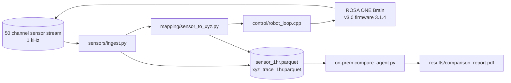
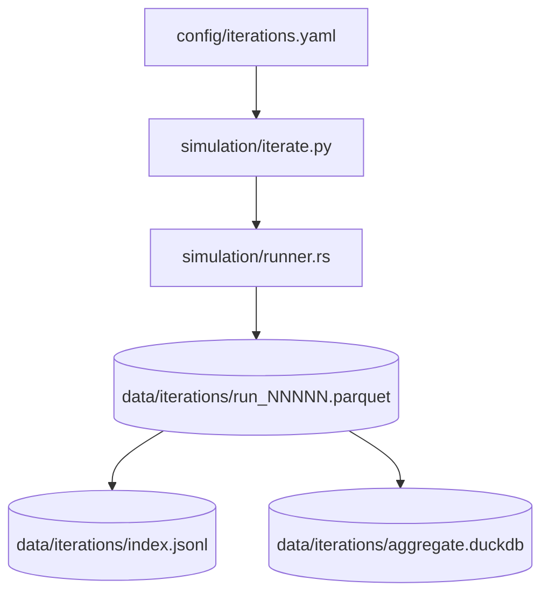

# ASCII and Mermaid Diagram Guide

This file fixes how the future Claude Code session draws diagrams across the seven future commits. The decision rule lives in `file_format_conventions.md`. This file gives the future session concrete templates and rejects any SVG output for high-frequency time series.

## Why SVG is Rejected for High-Frequency Series

A 1-hour, 1 kHz, three-axis Cartesian path contains 10.8 million coordinate pairs. An SVG `<path>` element with that many segments easily exceeds 100 MB and crashes most web browsers. The future session therefore must aggregate or sample any time series before drawing it. Two acceptable patterns are:

- Aggregate to per-second mean position and standard deviation. 3,600 points; SVG remains under 50 KB.
- Sample every 1,000th millisecond record. 3,600 points; SVG remains under 50 KB.

Both patterns must be implemented in the matching Python script in `viz/` and the script must reference the canonical Parquet input by path.

## ASCII Templates

The future session uses the following templates for `.txt` ASCII diagrams. The templates inherit from `new-trial/national-24-7-trial/hour-00/hour_00_diagram_facility.txt` and `new-trial/national-24-7-trial/hour-00/hour_00_diagram_robot_status.txt`.

### Template 1: Operating Suite Snapshot

```
+==========================================================================+
|     GLIOBLASTOMA RESECTION SUITE - PROCEDURE TIME 00:23:14.512           |
+==========================================================================+
|                                                                          |
|     +-------------------+     +---------------------+                    |
|     | ROSA ONE Brain    |     | StealthStation S8   |                    |
|     | State: ACTIVE     |     | Tracking: LIVE      |                    |
|     | Tool: bipolar     |     | Reg error: 0.7 mm   |                    |
|     | Force tip: 1.4 N  |     | Cross-stream: 0.3 mm|                    |
|     +-------------------+     +---------------------+                    |
|                                                                          |
|     Phase: tumor_resection_coarse  Elapsed in phase: 11:14.512           |
|     5-ALA UV: ON  iMRI: standby  US: standby  E-stop: nominal            |
|                                                                          |
|     Patient PAT-GBM-0001  HR 72  MAP 78  SpO2 99  ETCO2 36  Temp 36.4    |
+==========================================================================+
```

### Template 2: End-Effector Path Aggregate

```
+==========================================================================+
|     END EFFECTOR PATH (per-second mean, world frame, mm)                 |
+==========================================================================+
|     X axis (left+):                                                      |
|       +60                                                                |
|       +40                  ___---___                                     |
|       +20             ___-           -___                                |
|         0  ___------                       ------___                     |
|       -20                                                                |
|       0s        600s       1200s      1800s      2400s      3600s        |
|                                                                          |
|     Y axis (anterior+):                                                  |
|       +40                                                                |
|       +20      ___---       _-_       ---___                             |
|         0  ---       -_____-   -_____-       ---                         |
|     0s        600s       1200s      1800s      2400s      3600s          |
|                                                                          |
|     Z axis (superior+):                                                  |
|       +80                ___-___                                         |
|       +60          ___---       ---___                                   |
|         0  ___----                       ----___                         |
|     0s        600s       1200s      1800s      2400s      3600s          |
+==========================================================================+
```

The future session must compute the actual values from the Parquet file and embed the resulting ASCII chart verbatim. The future session must not hand-draw values that do not match the data.

### Template 3: Per-Phase Robot State Timeline

```
+==========================================================================+
|     ROBOT STATE TIMELINE (1 ms ticks aggregated to 1 second)             |
+==========================================================================+
|     Phase                           0s    600s   900s   2400s 3300s 3600s|
|     setup_and_registration         [SETUP=========>]                     |
|     dural_opening_and_exposure                  [READY===>]              |
|     tumor_resection_coarse                              [ACTIVE========>]|
|     tumor_resection_fine                                          [ACT=>]|
|     hemostasis_and_closure_prep                                    [ACT=]|
|                                                                          |
|     Pause events: 12   E-stop engagements: 0   Forbidden ops blocked: 0  |
+==========================================================================+
```

## Mermaid Templates

The future session uses Mermaid for box-and-arrow architecture diagrams inside `.md` files. The Mermaid block must use the default theme.

### Template 4: System Architecture

````

````

### Template 5: Iteration Orchestration

````

````

## ASCII Drawing Rules

- 80 columns maximum per line. The future session must not exceed this even for special characters.
- 60 lines maximum per `.txt` file. Split into multiple files if more lines are needed.
- Use `+` for corners, `-` for horizontal lines, `|` for vertical lines, `=` for double horizontal emphasis.
- Use only ASCII printable characters in the range 0x20 to 0x7E.
- Do not use Unicode box drawing characters; they break copy-paste in some terminals and break automated diff tools.

## Source Files Cited

- `new-trial/national-24-7-trial/hour-00/hour_00_diagram_facility.txt`. 54-line ASCII facility template that templates 1, 2, and 3 above adapt to a single-suite layout.
- `new-trial/national-24-7-trial/hour-00/hour_00_diagram_robot_status.txt`. 38-line robot status timeline that template 3 adapts to a single-robot timeline.
- `new-trial/national-24-7-trial/hour-00/hour_00_diagram_patient_flow.txt`. 37-line patient flow diagram that template 1 adapts to a single-patient suite snapshot.
- `patients/paper/full-paper/sections/`. Source for the principle that ASCII diagrams may be embedded verbatim in published manuscripts; the v3.8.0 release embedded ASCII comparison diagrams directly in the LaTeX source.
