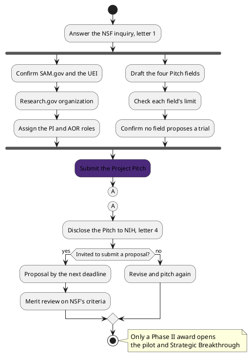

# Figure 11 - From the Answer to a Proposal

**Platform.** PlantUML. **Native construct.** An activity diagram with a fork, a
join, a decision, and a connector.

## Perspective no other figure in this day gives

Table 17 lists the day's actions in order. It cannot show which of them run at
the same time, or that two must both finish before the Pitch goes. The fork and
join do: the registration branch and the drafting branch run in parallel, and
the Pitch waits on both. The connector lets the diagram break and resume beside
itself rather than run off the page.

## Native source

## TikZ construction

| Element | Style | Geometry |
|:--|:--|:--|
| Start and stop | `umlinit`, `umlfinal` | `(3.50,0.30)` and `(10.60,-5.45)` |
| Fork and join bars | `umlbar`, 70 mm | y = -1.00 and -4.20 |
| Two branches | `umlbox`, 40 mm, rows 0.95 cm apart | x = 1.25 and 5.75 |
| The Pitch | `umlkey`, 46 mm | `(3.50,-4.85)` |
| Connector A | A 4.2 mm circle, drawn twice | `(3.50,-5.55)` and `(10.60,0.30)` |
| Decision | A diamond, aspect 2.4, 26 mm text width | `(10.60,-1.55)` |
| Guards | `umlguard`, `[yes]` and `[no]` | On the two outgoing edges |
| Merge and note | A small diamond; `umlnote` joined by a dashed line to the stop | `(10.60,-4.70)`; `(14.10,-5.45)` |

## Caption, exactly as set

> Figure 11. The route from the answer to a proposal, with registration and drafting
> run in parallel and joined before the Pitch, then one decision that NSF alone makes.

The two lines are 82 and 84 characters.

## Where it is used

`../packet/sections/sec-02-action-register.tex`, after Table 17.
