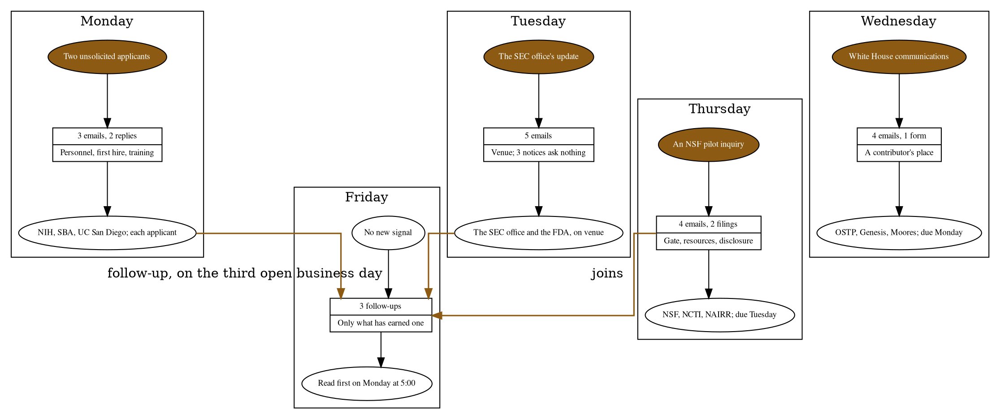

# Figure 13 - The Week as a Record Chain

**Platform.** Graphviz. **Native construct.** Record nodes in ranks, one rank per
weekday, with orthogonal edges.

## Perspective no other figure in this day gives

Table 21 lists the four signals. Table 23 lists the sixteen letters. Neither
shows how one day's letters reach another day. The chain does: each weekday is a
rank from signal to letters to pending answers, and the only edges that cross
ranks are the follow-ups, which is why Friday receives from Monday and Tuesday
and from nowhere else.

## Native source

## TikZ construction

| Element | Style | Geometry |
|:--|:--|:--|
| Rank headers | `gvcellh`, 22 mm | y = 0.05; x = 0.00, 3.20, 6.40, 9.60, 12.80 |
| Signals | `gvkey`, 19 mm; Friday's as `gvgray` | y = -0.95 |
| Letters | Two-field records: `gvcells` over `gvcell`, 25 mm; Friday's header field as `gvcellh` | y = -2.05 and -2.57 |
| Pending answers | `gvgray`, 19 mm; Friday's as `gvsoft` | y = -3.80 |
| Follow-up edges | `gvundirb` into a channel at y = -4.85, rising at x = 11.20 into Friday's record | One label on the channel |
| The join | `gvedgeb` from Thursday's record to Friday's | Label above the edge |

## Caption, exactly as set

> Figure 13. The week as a record chain, one rank per weekday, with the follow-up edges
> that let Monday's and Tuesday's letters, and no others, reach Friday's three follow-ups.

The two lines are 85 and 88 characters.

## Where it is used

`../packet/sections/sec-01-the-week-in-one-record.tex`, after Table 21.
