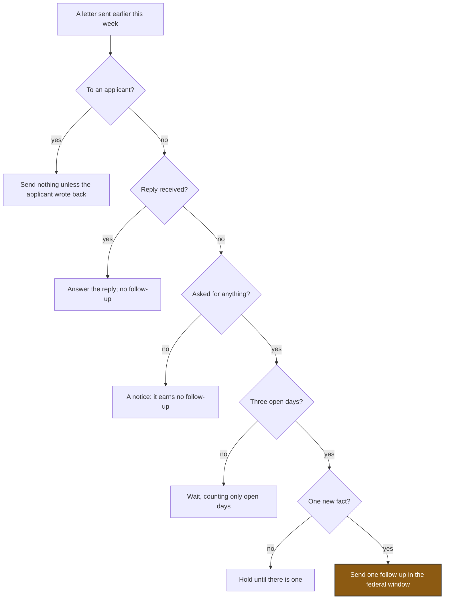

# Figure 15 - The Follow-Up Rule as Five Questions

**Platform.** Mermaid. **Native construct.** A top-down flowchart with decision
nodes.

## Perspective no other figure in this day gives

Table 23 applies the rule to each letter. It does not show the rule itself, or
which part of it stopped each letter. The flowchart does: five questions asked in
order, each able to stop a second message, with the number of this week's
messages each one stopped written beside it.

## Native source

The counts beside each outcome are drawn as notes in the TikZ version; Mermaid
itself would carry them as a second label line on each outcome.

## TikZ construction

| Element | Style | Geometry |
|:--|:--|:--|
| Start | `mmin`, 30 mm | `(0,0)` |
| Decisions | `mmdec`, aspect 4, 24 mm | x = 0; y = -1.30, -2.55, -3.80, -5.05, -6.30 |
| Stopping outcomes | `mmgray`, 40 mm; the reply outcome as `mmsoft` | x = 5.40, level with each decision |
| Counts | Gray `\scriptsize` notes | Anchored west at x = 8.10 |
| Goal | `mmgoal`, 34 mm, with an accent note beside it | `(0,-7.60)` |
| Edge labels | `mmlabel`, yes or no | Right of the down edges; above the side edges |

## Caption, exactly as set

> Figure 15. The follow-up rule as five questions asked in order, each able to stop
> a second message, with the number of this week's messages each question stopped.

The two lines are 81 and 80 characters.

## Where it is used

`../packet/sections/sec-03-the-follow-up-rule.tex`, after Table 23 and the
subsections on the NIH follow-up and on silence.
