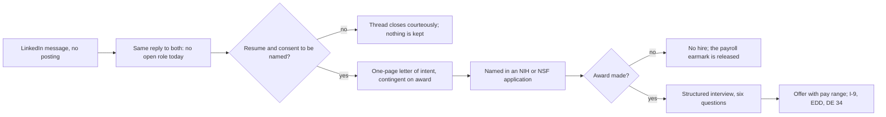

# Figure 1 - From a LinkedIn Message to a Funded Offer

**Platform.** Mermaid. **Native construct.** A flowchart with two decisions and
two terminal stops.

## Perspective no other figure in this day gives

Table 1 says what the two inquiries prove and Table 2 says what is done today.
Neither shows where the thread can end. This figure draws every ending: the
applicant does not answer, the award is not made, or an offer follows. It also
marks the one point after which either side owes the other anything.

## Native source

## TikZ construction

Two rows read as one path: left to right on the upper row and right to left on
the lower row, so the figure fits the text measure without shrinking its type.

| Element | Style | Position |
|:--|:--|:--|
| A, the message | `mmin` | `(0,0)` |
| B, the reply | `mmstep` | `(3.65,0)` |
| C, first decision | `mmdec`, text width 19 mm | `(7.35,0)` |
| D, letter of intent | `mmstep` | `(11.05,0)` |
| E, named in an application | `mmstep` | `(11.05,-2.35)` |
| F, second decision | `mmdec`, text width 19 mm | `(7.35,-2.35)` |
| G, interview | `mmstep` | `(3.65,-2.35)` |
| H, offer | `mmgoal` | `(0,-2.35)` |
| S1, stop above C | `mmgray` | `(7.35,1.75)` |
| S2, stop below F | `mmgray` | `(7.35,-4.10)` |
| Happy-path edges after a decision | `mmedgeb`, labeled "yes" | |
| Stop edges | `mmedged`, labeled "no" | |

Node labels are set with hyphenation switched off by the style, so no word is
broken across two lines inside a box.

## Caption, exactly as set

> Figure 1. The path from an unprompted LinkedIn message to a funded offer, with the
> two places the thread ends and the one point after which an obligation begins.

The two lines are 82 and 78 characters.

## Where it is used

`../packet/sections/sec-01-the-signal.tex`, after Table 1.
