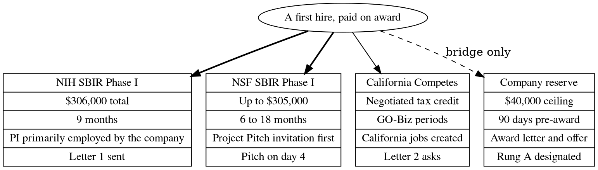

# Figure 3 - Four Routes That Can Fund a First Hire, as Records

**Platform.** Graphviz. **Native construct.** Record nodes with the same fields,
under one root node.

## Perspective no other figure in this day gives

Table 5 gives the four routes as sentences. A record layout gives them as
structure: the same five fields on every route, so a reader compares amount,
window, gate and status straight across, and the edge styles from the root show
which routes pay salary, which credits tax, and which only bridges timing.

## Native source

## TikZ construction

| Element | Style | Geometry |
|:--|:--|:--|
| Root | `gvkey` ellipse, text width 30 mm | `(5.35,1.55)` |
| Field-name column | `gvcellg`, 17 mm wide | x = -2.35 |
| Record headers | `gvcellh` for the three funding routes, `gvcells` for the reserve | y = 0 |
| Record fields | `gvcell`, 30 mm wide, 7 mm tall | y = -0.72, -1.44, -2.16, -2.88 |
| Record columns | Four, at x = 0.00, 3.55, 7.10 and 10.65 | |
| Salary edges | `gvedgeb`, curved | To NIH and NSF |
| Tax credit edge | `gvedge` | To California Competes |
| Bridge edge | `gvedged`, labeled "bridge only" | To the company reserve |

The records are drawn by a `\foreach` over the four columns; the loop names no
node, so no node name carries the decimal x coordinate.

## Caption, exactly as set

> Figure 3. The four routes as records under one root, with the same five fields on
> each, so that amount, window, gate and status can be read straight across the rows.

The two lines are 81 and 83 characters.

## Where it is used

`../packet/sections/sec-05-funding-routes.tex`, after Table 5.
