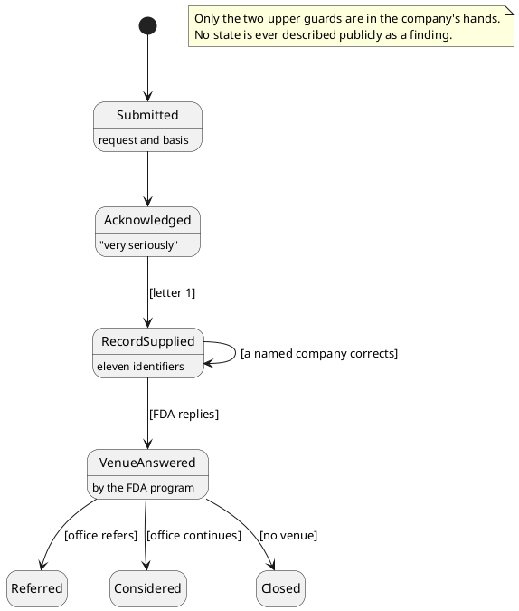

# Figure 4 - The Request as a State Machine

**Platform.** PlantUML. **Native construct.** A state diagram with guarded
transitions.

## Perspective no other figure in this day gives

Table 7 lists what the company does today. It cannot show where the request
stands, or which next steps belong to the company and which belong to the
office. A state machine shows both: the current state is filled, and every
transition carries the condition that moves it. Only two of those conditions are
in the company's hands.

## Native source

## TikZ construction

| Element | Style | Position |
|:--|:--|:--|
| Initial state | `umlinit` | `(-1.05,0)` |
| Submitted | `umlstate`, text width 24 mm | `(0.95,0)` |
| Acknowledged, the current state | `umlstateon`, filled with the accent | `(4.65,0)` |
| Record supplied | `umlstatesoft` | `(8.35,0)` |
| Venue answered | `umlstatesoft` | `(12.05,0)` |
| Three outcomes | `umlstategray` | `(4.65,-2.75)`, `(8.35,-2.75)`, `(12.05,-2.75)` |
| Upper guards | `umlguard`, 5.5 mm above each arrow | Between the states they connect |
| Correction loop | A Bezier loop above Record supplied | Guard above the loop |
| Note | `umlnote`, text width 30 mm | Lower left |

Guards on the upper row sit above the gap between two states rather than on the
arrow itself, because the gap between two 24 mm states is narrower than the
guard text.

## Caption, exactly as set

> Figure 4. The request as a state machine, with today's state filled, the guard on each
> transition written in brackets, and the three outcomes that only the office decides.

The two lines are 86 and 84 characters.

## Where it is used

`../packet/sections/sec-02-action-register.tex`, after Table 7.
