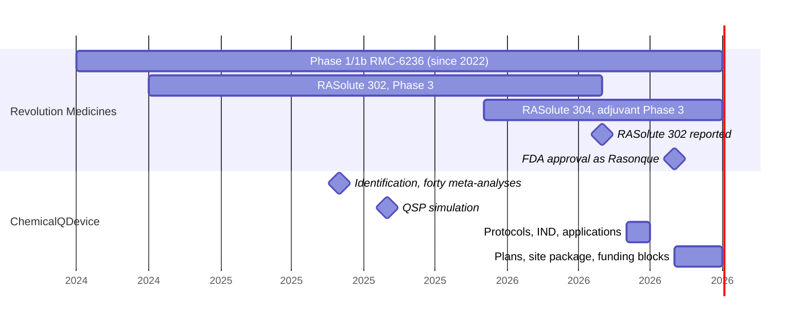

# Figure 5 - The Developer's Trials and the Company's Papers on One Axis

**Platform.** Mermaid. **Native construct.** A gantt chart with two sections.

## Perspective no other figure in this day gives

Table 8 states the two calendars in rows, and rows read one at a time. A gantt
chart reads all at once: a reader sees immediately that the company's first two
papers sit inside the Phase 3 enrollment window, before the readout, and that
its later work brackets the approval. That picture is the whole of the word
"simultaneously" in the request.

## Native source

## TikZ construction

The axis runs from mid 2024 to late 2026 at 5 cm per year, so every position is
`x = (year - 2024.5) * 5`. A Phase 1/1b bar that began in 2022 is drawn from the
left edge and labeled "since 2022" rather than compressing the whole chart.

| Element | Style | Geometry |
|:--|:--|:--|
| Calendar 2025 band | `fundgrayl` fill | x = 2.50 to 7.50 |
| Year ticks | Hairlines with labels | x = 0, 2.50, 7.50, 11.25 |
| Developer bars | `mmbarg` via `\ganttrow` | Rows at y = -0.40, -0.95, -1.50 |
| Developer milestones | Gray and accent diamonds, 2.6 mm | y = -2.05 at x = 9.55 and 10.75 |
| Company milestones | Accent diamonds | y = -3.05 at x = 4.75 and 5.60 |
| Company bars | `mmbark` via `\ganttrow` | Rows at y = -3.60 and -4.15 |
| Approval line | Dashed accent rule | x = 10.75, full height |

## Caption, exactly as set

> Figure 5. The developer's three trials and the company's deposits on one time
> axis, with the company's first two papers inside the Phase 3 enrollment window.

The two lines are 77 and 79 characters.

## Where it is used

`../packet/sections/sec-03-independence-and-simultaneity.tex`, after Table 8.
