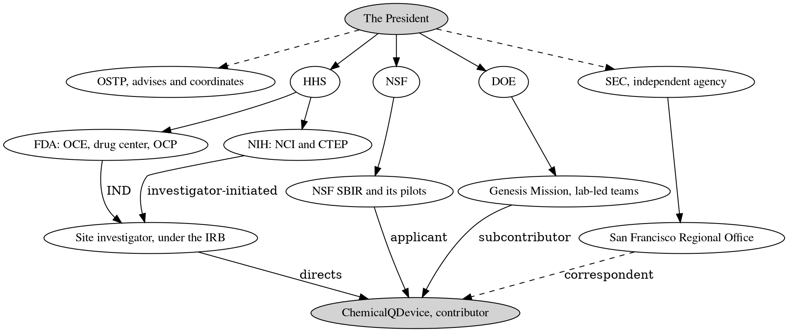

# Figure 7 - Authority Runs Down to the Company

**Platform.** Graphviz. **Native construct.** A directed tree, ranked top to
bottom.

## Perspective no other figure in this day gives

Table 13 lists ten authorities as rows, each with the company's place. A table
cannot show that the company sits below all of them at once. A directed tree
does: every edge points down, and the one accent node, the company, is at the
bottom with four edges arriving from above. That is the second priority,
adaptation to existing authority, order, and structure, drawn.

## Native source

## TikZ construction

| Rank | y | Nodes, left to right |
|:--|:--|:--|
| 0 | 0 | The President, `gvkey`, at x = 6.45 |
| 1 | -1.50 | OSTP and SEC as `gvgray`; HHS, NSF, DOE as `gvnode`; x = 0.25, 3.35, 6.45, 9.55, 12.65 |
| 2 | -3.00 | FDA, NIH, NSF SBIR, Genesis Mission, San Francisco office; x = 0.85, 3.85, 6.85, 9.85, 12.85 |
| 3 | -4.60 | Site investigator, `gvsoft`, at x = 2.35 |
| 4 | -6.30 | ChemicalQDevice, `gvkey`, at x = 6.85 |

Solid edges (`gvedge`) are line authority. Dashed edges (`gvedged`) mark the
advisory office and the independent agency. The four edges into the company are
`gvedgeb`, the accent, except the correspondent edge from the SEC office, which
stays dashed. Labels on the converging edges sit near their sources, at 25 to 35
percent of the edge, so that they do not collide above the company node.

## Caption, exactly as set

> Figure 7. The federal part of the structure map as a directed tree, with every
> edge pointing down to the company, which sits at the bottom as a contributor.

The two lines are 78 and 77 characters.

## Where it is used

`../packet/sections/sec-03-the-structure-map.tex`, after Table 13.
