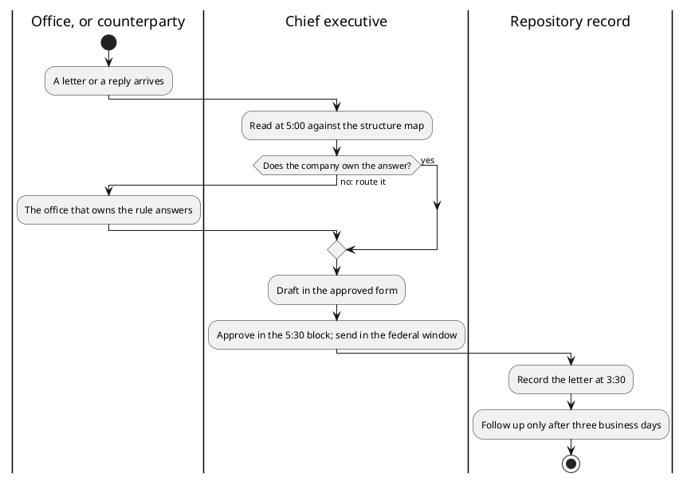

# Figure 9 - One Letter, Three Lanes

**Platform.** PlantUML. **Native construct.** An activity diagram with three
swimlanes and one decision.

## Perspective no other figure in this day gives

Table 12 lists today's actions. It does not show the path every action follows.
The activity diagram does, across the three parties it touches: the office, the
chief executive, and the repository record. Its one decision is the first
priority in action: if the company does not own the answer, the question goes to
the office that does, before the company acts.

## Native source

## TikZ construction

| Element | Style | Geometry |
|:--|:--|:--|
| Three lanes | Filled bands, `fundgrayl`, `fundpale`, `fundgrayl` | x = -2.30 to 2.30, 2.30 to 7.90, 7.90 to 12.50 |
| Lane titles | `umlpkgtab` | Top of each lane |
| Start and stop | `umlinit`, `umlfinal` | Office lane top; record lane bottom |
| Activities | `umlbox`; the approval step as `umlkey` | Centered in their lanes |
| Decision | A diamond, aspect 2.2, 26 mm text width | `(5.10,-2.45)` |
| Guards | `umlguard`, `[yes]` and `[no: route it]` | On the two outgoing edges |

## Caption, exactly as set

> Figure 9. The path every letter follows across three lanes, with one decision that
> sends a question to the office that owns its rule before the company acts on it.

The two lines are 82 and 80 characters.

## Where it is used

`../packet/sections/sec-02-action-register.tex`, after Table 12.
