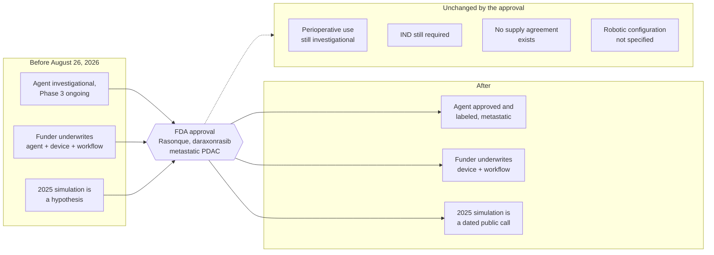

# Figure 1 - What the Approval Changes in the Ask

**Platform.** Mermaid. **Native construct.** Flowchart with a dated transition
node between two vertical stacks.

## Perspective no other figure in this day gives

Figure 2 shows five mechanisms as records and Figure 3 shows money against a
horizon. Neither shows the single thing this whole day turns on: that one dated
external event moved three items from one column to another and left four items
where they were. A flowchart is the only construct among the five platforms that
reads left to right as a change of state, so it is the one used here.

## Native source



## TikZ construction

Three-column layout on a 5.6 cm horizontal pitch and a 1.55 cm vertical pitch.
The unchanged panel sits below the transition node so that it reads as a
qualification of the arrow rather than as a fourth column.

| Element | Style | Coordinates |
|:--|:--|:--|
| Before column, three boxes | `mmgray` | `(0,0)`, `(0,-1.55)`, `(0,-3.10)` |
| Transition node | `mmdec` | `(5.6,-1.55)` |
| After column, three boxes | `mmgoal`, `mmmid`, `mmsoft` | `(11.2,0)`, `(11.2,-1.55)`, `(11.2,-3.10)` |
| Unchanged panel, four boxes | `mmsoft` at 0.9 scale | `(2.4,-5.0)` to `(11.2,-5.0)`, 2.95 cm pitch |
| Panel frame | `mmlane` fitted | Encloses the four unchanged boxes and their title |
| Edges, before to node | `mmedge` | Three, converging |
| Edges, node to after | `mmedgeb` | Three, diverging |
| Edge, node to panel | `mmedged` | One, dashed, downward |

Edge routing: the three converging edges enter the transition node at its west
anchor and the three diverging edges leave at its east anchor, so no edge crosses
a box. The dashed edge leaves the south anchor and drops 1.6 cm before the panel
frame begins, which is clearance enough that it does not touch the panel title.

## Value provenance

| Value in the figure | Source |
|:--|:--|
| Approval date and agent identity | [FDA press announcement, August 26, 2026](https://www.fda.gov/news-events/press-announcements/fda-approves-first-class-targeted-therapy-metastatic-pancreatic-cancer) |
| The three before and after pairs | `../README.md`, the changed-fact table |
| The four unchanged items | `../briefs/brief-01-approval-delta.md`, "What the approval does not change" |

## Caption, exactly as printed

```
Figure 1. What the FDA approval changed in the ask, as three items moving
across one dated transition, and four items the approval leaves untouched.
```

Line 1 is 71 characters, line 2 is 71 characters. The two lines are of equal
length, inside the small spread this build holds captions to.

## Sources read

- `funding/auto-fund/02Sep26/briefs/brief-01-approval-delta.md`
- `funding/daraxonrasib-llm-story.md`
- `funding/capitalization-plan/final-capital/capstyle.sty`, for the `mm*` styles
