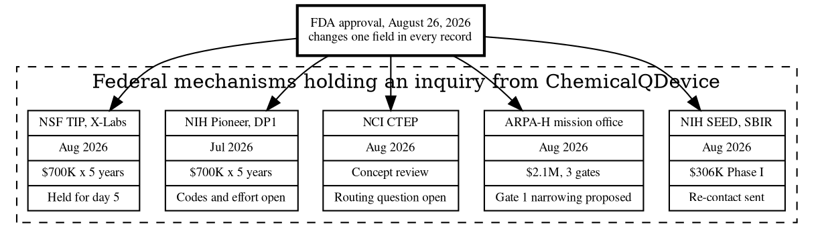

# Figure 2 - The Five Federal Mechanisms as Records

**Platform.** Graphviz. **Native construct.** Record nodes inside a dashed
cluster subgraph, with a corner title.

## Perspective no other figure in this day gives

Figure 1 shows one transition. This figure shows the five separate objects that
transition applies to, each with the four fields a program officer would want:
what was sent, when, what was asked, and what state the file is in now. A
Graphviz record node is a ruled box divided into fields, which is exactly what a
per-mechanism record is, and no other platform in the set draws a record without
inventing a box grid by hand.

## Native source



## TikZ construction

A five-row, four-column record table. Column widths are cut to the longest real
cell in each column, so no row carries one deep cell beside three shallow ones.
Row pitch is 0.78 cm and the header row is 0.72 cm deep.

| Element | Style | Geometry |
|:--|:--|:--|
| Header row, four cells | `gvcellh` | Widths 30 mm, 17 mm, 25 mm, 34 mm; centered at `y = 0` |
| Record rows 1 to 5 | `gvcell`, `gvcells` on the state column | Same widths; `y = -0.78` to `y = -3.90` |
| Cluster frame | `gvcluster` fitted | Encloses the header, all five rows, and the cluster title |
| Cluster title | `gvctitle` | Anchored north west, 2 mm inside the frame |
| Approval node | `gvboxk`, `text width=44mm` | `(6.0,-5.35)` |
| Edges, approval to rows | `gvedgeb` | Five, leaving the node's north anchor |

Edge routing: the five edges leave the approval node at its north anchor and
enter each row at the row's south west corner, fanning across 5.6 cm. The fan is
drawn below the cluster frame so no edge passes through a cell. The widest fan
angle is under 40 degrees, which keeps every edge distinguishable at the figure's
compiled scale.

## Value provenance

| Value in the figure | Source |
|:--|:--|
| The five mechanisms and their contact months | `funding/pdac-funding-applications/applications/emailed-source/README.md` |
| $306,000 Phase I | `funding/pdac-funding-applications/applications/app-05-nih-sbir-seed` |
| $2,100,000 across three gates | `funding/pdac-funding-applications/applications/app-02-arpa-h` |
| $700,000 per year for five years | `funding/pdac-funding-applications/final-apply/sections/sec-08-budget-and-leverage.tex` |
| The state column | `../emails/README.md`, the five-letter index |
| Approval date | [FDA press announcement](https://www.fda.gov/news-events/press-announcements/fda-approves-first-class-targeted-therapy-metastatic-pancreatic-cancer) |

## Caption, exactly as printed

```
Figure 2. Five federal mechanisms as records, each with what was sent, when,
what was asked, and the state of the file after one change of external fact.
```

Line 1 is 75 characters, line 2 is 76 characters.

## Sources read

- `funding/pdac-funding-applications/applications/emailed-source/README.md`
- `funding/pdac-funding-applications/applications/app-02-arpa-h`, `app-05-nih-sbir-seed`
- `funding/capitalization-plan/final-capital/capstyle.sty`, for the `gv*` styles
