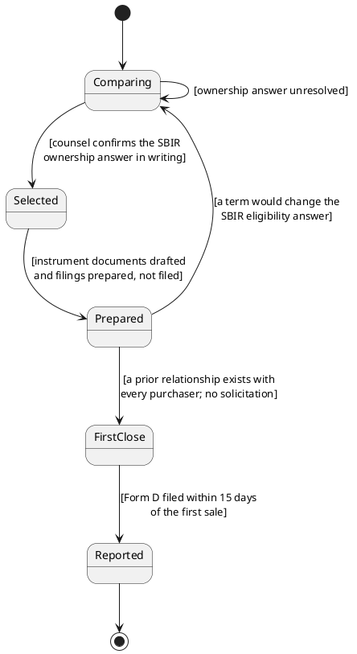

# Figure 5 - The Financing as Five States and Four Guards

**Platform.** PlantUML. **Native construct.** A state machine whose transitions
carry guard conditions in square brackets.

## Perspective no other figure in this day gives

Figure 4 compares instruments and Figure 6 orders signatures. Neither says what
must be **true** before the company moves from one stage of a financing to the
next. A guard is a first-class construct in PlantUML state notation and is not
one in the other four platforms, so a diagram whose whole content is four
conditions belongs here.

## Native source



## TikZ construction

Five states on a single horizontal chain at a 2.85 cm pitch, with two return
transitions drawn below the chain so that no return edge crosses a state. Guard
labels sit above the forward transitions and below the return transitions.

| Element | Style | Geometry |
|:--|:--|:--|
| Initial marker | `umlinit` | `(-0.75,0)` |
| State 1, Comparing | `umlstateon` | `(0.35,0)` |
| State 2, Selected | `umlstatesoft` | `(3.20,0)` |
| State 3, Prepared | `umlstatesoft` | `(6.05,0)` |
| State 4, First close | `umlstate` | `(8.90,0)` |
| State 5, Reported | `umlstategray` | `(11.75,0)` |
| Final marker | `umlfinal` | `(12.95,0)` |
| Forward transitions | `umlarrow` | Four, left to right along the chain |
| Guard labels, forward | `umlguard`, `text width=25mm` | Above each forward arrow, 0.62 cm clearance |
| Return transition, self loop on state 1 | `umldash` | Above state 1, 0.9 cm loop |
| Return transition, state 3 to state 1 | `umldash` | Below the chain at `y = -1.35`, so it passes under states 2 and 3 rather than through them |
| Return guard labels | `umlguard` | On the return paths |

Edge routing: the long return transition from Prepared to Comparing is routed at
`y = -1.35`, which is 0.55 cm below the deepest state box edge. That clearance is
what keeps it from touching state 2's south edge, and it is the only edge in the
figure that passes beneath another node.

## The four guards, and why each is a guard rather than a step

| Guard | Why it gates rather than follows |
|:--|:--|
| Counsel confirms the SBIR ownership answer in writing | Because the answer determines the instrument, not the reverse |
| Documents drafted and filings prepared, not filed | Because a Form D filed before a first sale publishes an offering that does not exist |
| A prior relationship exists with every purchaser | Because Rule 506(b) permits no general solicitation, and the condition is about the past rather than the present |
| Form D filed within 15 days of the first sale | Because the clock starts at the sale and is not extended |

## Value provenance

| Value in the figure | Source |
|:--|:--|
| The five state names | `../briefs/brief-01-instrument-comparison.md` and `../forms/form-01-reg-d-506b-form-d.md` |
| Guard 1 | 13 CFR 121.702, through `../briefs/brief-01-instrument-comparison.md` |
| Guards 2 and 4 | [SEC Rule 506(b)](https://www.sec.gov/education/smallbusiness/exemptofferings/rule506b) and the fifteen-day rule |
| Guard 3 | The no-general-solicitation rule in `../emails/README.md` |
| The two return transitions | `../briefs/brief-01-instrument-comparison.md`, the recommendation section |

## Caption, exactly as printed

```
Figure 5. The financing as five states and the four conditions that gate the
transitions between them, with the two paths that return to the first state.
```

Line 1 is 74 characters, line 2 is 76 characters.

## Sources read

- `funding/auto-fund/03Sep26/briefs/brief-01-instrument-comparison.md`
- `funding/auto-fund/03Sep26/forms/form-01-reg-d-506b-form-d.md`
- `funding/capitalization-plan/final-capital/sections/sec-04-capital-bridge.tex`
- `funding/capitalization-plan/final-capital/capstyle.sty`, for the `uml*` styles
