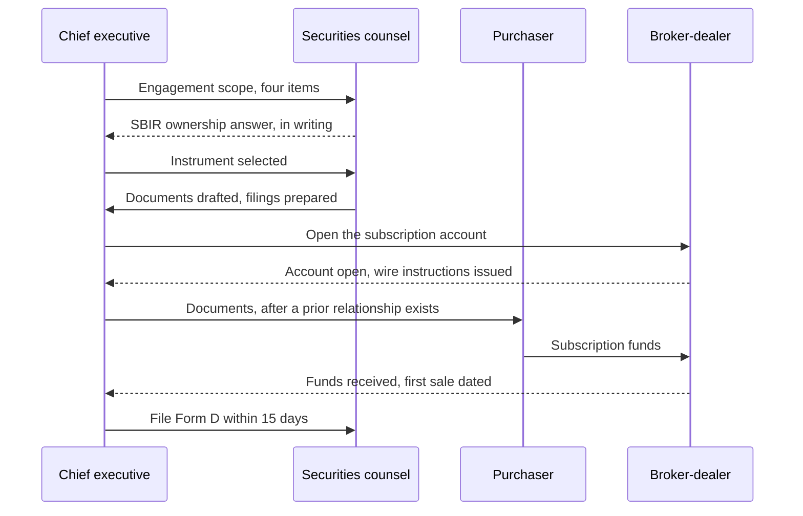

# Figure 6 - Who Signs What, and in What Order

**Platform.** Mermaid. **Native construct.** A sequence diagram with four
lifelines, activation bars, and one return message.

## Perspective no other figure in this day gives

Figure 5 says what must be true before a transition. This one says who does the
work and, more usefully, who is **idle** while someone else acts. A sequence
diagram is the only construct in the set that shows both order and idleness, and
idleness is what makes a financing take six weeks instead of two.

## Native source



## TikZ construction

Four lifelines on a 3.30 cm horizontal pitch, nine messages on a 0.62 cm vertical
pitch. The `\seqrow` helper in `fundstyle.sty` draws one message row, so the
source stays readable and a message can be moved by changing one number.

| Element | Style | Geometry |
|:--|:--|:--|
| Participant heads | `mmactor` | `(0,0)`, `(3.30,0)`, `(6.60,0)`, `(9.90,0)` |
| Lifelines | `mmlife` | From `y = -0.42` to `y = -6.10`, one per participant |
| Activation bars | `mmact`, height set per span | On the participant that owns each span |
| Forward messages | `mmmsg` through `\seqrow` | Seven, at `y = -0.85` to `y = -5.60` |
| Return messages | `mmret` through `\seqrow` | Four, dashed |
| Idle spans | `mmband` | Behind the lifeline of any participant with no activation in that band |
| Elapsed-time notes | `pnote` | Right of the diagram at three points |

Edge routing: every message is horizontal and connects two adjacent or
non-adjacent lifelines without bending, so no message crosses a participant head.
The only vertical elements are the lifelines and the activation bars, and neither
carries a label.

## The point the figure makes

The chief executive appears in eight of the nine messages and is idle for none of
them. Counsel is idle for four consecutive spans in the middle. The purchaser
appears twice and is idle for seven spans. That distribution is the argument for
engaging counsel on a defined scope rather than an open retainer: the scope is
what counsel does in the four spans where counsel is not idle, and it is
priceable in advance.

## Value provenance

| Value in the figure | Source |
|:--|:--|
| The four participants | `../emails/email-04-securities-counsel-engagement.txt` and `../emails/email-05-brokerage-corporate-account.txt` |
| The nine messages and their order | `../briefs/brief-01-instrument-comparison.md` and `../forms/form-01-reg-d-506b-form-d.md` |
| The fifteen-day final message | [SEC Rule 506(b)](https://www.sec.gov/education/smallbusiness/exemptofferings/rule506b) |
| The subscription account messages | `../investing/capital-02-corporate-reserve-allocation.md`, the segregation rule |

No amount appears anywhere in this figure.

## Caption, exactly as printed

```
Figure 6. The signing order of a private financing across four participants,
drawn so that both the sequence and the idle spans between it are visible.
```

Line 1 is 75 characters, line 2 is 74 characters.

## Sources read

- `funding/auto-fund/03Sep26/emails/email-04-securities-counsel-engagement.txt`
- `funding/auto-fund/03Sep26/forms/form-01-reg-d-506b-form-d.md`
- `funding/auto-fund/03Sep26/investing/capital-02-corporate-reserve-allocation.md`
- `funding/capitalization-plan/final-capital/capstyle.sty`, for the `mm*` styles
