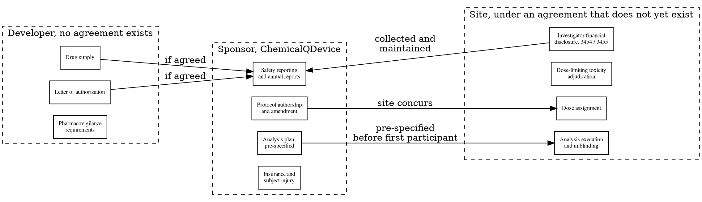

# Figure 7 - Site, Sponsor, and Developer Obligations as Three Clusters

**Platform.** Graphviz. **Native construct.** Three dashed cluster subgraphs with
corner titles, and edges only between clusters.

## Perspective no other figure in this day gives

Figure 8 shows where functions sit and Figure 9 shows a funnel over time. Neither
answers the question that actually blocks a site agreement, which is who is
responsible for what. Three disjoint sets with edges between them is a clustered
digraph, and a Graphviz cluster is the only construct in the set that draws a
boundary a node can belong to without drawing a box a reader mistakes for a
process step.

## Native source



## TikZ construction

Three clusters on a single row at a 4.75 cm horizontal pitch. Each cluster holds
three or four `gvbox` nodes on a 0.92 cm vertical pitch, with the cluster title
anchored north west inside the frame.

| Element | Style | Geometry |
|:--|:--|:--|
| Site cluster nodes, four | `gvboxs` | `(0,0)` down to `(0,-2.76)` |
| Sponsor cluster nodes, four | `gvboxm` | `(4.75,0)` down to `(4.75,-2.76)` |
| Developer cluster nodes, three | `gvboxg2` | `(9.50,0)` down to `(9.50,-1.84)` |
| Cluster frames | `gvcluster` fitted, braced fit values | Enclose the nodes and their titles |
| Cluster titles | `gvctitle` | Anchored north west, 2 mm inside each frame |
| Inter-cluster edges | `gvedgeb` and `gvedged` | Five, all between clusters, none inside one |
| Edge labels | `gvedge` node labels at midway | Five, each at most three words |
| Conditional marker | `pnote` | One line under the developer cluster |

Edge routing: every edge runs between clusters and none runs inside one, which is
the property that makes the clusters readable. The two edges from the developer
cluster are dashed, because they are conditional on an agreement that does not
exist, and the printed note under that cluster says so in words as well as in
line style.

## The one thing this figure must not let a reader believe

That any of it is agreed. The site cluster's title says "under an agreement that
does not yet exist" and the developer cluster's title says "no agreement exists".
Those phrases are in the cluster titles rather than in a footnote, because a
figure is screenshotted more often than a footnote is read.

## Value provenance

| Value in the figure | Source |
|:--|:--|
| The four site obligations | `funding/potential-partners/UC-San-Diego/priority-steps.md` §12, and 21 CFR part 54 |
| The four sponsor obligations | `funding/auto-fund/03Sep26/briefs/brief-02-firewall-and-part-54.md` |
| The three developer items | `funding/potential-partners/UC-San-Diego/priority-steps.md` §2 |
| The dashed edges | The same file: no agreement of any kind is in place |

## Caption, exactly as printed

```
Figure 7. Site, sponsor and developer obligations as three disjoint sets, with
edges only between them and dashed lines wherever no agreement yet exists.
```

Line 1 is 76 characters, line 2 is 75 characters.

## Sources read

- `funding/potential-partners/UC-San-Diego/priority-steps.md` §2 and §12
- `funding/auto-fund/03Sep26/briefs/brief-02-firewall-and-part-54.md`
- `funding/capitalization-plan/final-capital/capstyle.sty`, for the `gv*` styles
