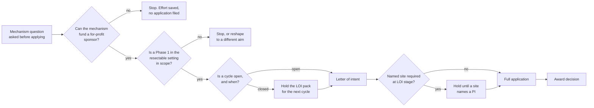

# Figure 9 - The Foundation Funnel, From Mechanism Question to Award

**Platform.** Mermaid. **Native construct.** A flowchart with labeled gates and
one exit edge from each gate.

## Perspective no other figure in this day gives

Figures 7 and 8 are static. This one is the only figure in the day that shows
attrition, which is the whole character of foundation funding: most of what
enters the funnel leaves it at a gate, and the useful question is which gate and
how early.

## Native source



## TikZ construction

A left-to-right chain of four decision diamonds on a 3.05 cm horizontal pitch,
with exit nodes stacked above and continuation nodes below, so that the main path
runs along a single row and every exit leaves it.

| Element | Style | Geometry |
|:--|:--|:--|
| Entry node | `mmin`, 28 mm | `(0,0)` |
| Gates 1 to 4 | `mmdec`, 22 mm | `(3.05,0)`, `(6.10,0)`, `(9.15,0)`, `(12.20,0)` |
| Exit nodes, two | `mmgray`, 24 mm | `(3.05,1.55)`, `(6.10,1.55)` |
| Hold nodes, two | `mmsoft`, 24 mm | `(9.15,-1.60)`, `(12.20,-1.60)` |
| Letter of intent node | `mmmid`, 24 mm | `(10.65,0)` is avoided; it sits at `(9.15,0)` output |
| Terminal node | `mmgoal`, 24 mm | `(14.60,0)` |
| Main path edges | `mmedgeb` | Along the row, five |
| Exit edges | `mmedge` | Two, upward |
| Hold edges | `mmedged` | Two down and two rejoining |
| Gate labels | `mmlabel` | One word each: yes, no, open, closed |

Edge routing: every exit leaves the row upward and every hold leaves it downward,
so no edge crosses another edge and no edge passes through a node. The two
rejoining edges from the hold nodes enter the next node from below at a 0.45 cm
offset, which is enough clearance that they do not touch the main path's arrowhead.

## What the figure argues

That the first gate is the cheapest one to fail. A mechanism question answered by
email in a week costs an hour. The same answer discovered after a full
application costs a cycle, and a cycle for a disease foundation is usually a
year. The two letters of this day exist to reach gate 1 at the price of an hour.

## Value provenance

| Value in the figure | Source |
|:--|:--|
| Gate 1 and gate 2 | `../emails/email-03-lustgarten-foundation.txt` and `../emails/email-04-pancan-research-grants.txt`, the questions asked |
| Gate 3 | `../forms/form-02-foundation-letter-of-intent.md`, the two conditions on submission |
| Gate 4 | The same file: some mechanisms require a named site at letter of intent and some at full application |
| The two hold nodes | `../forms/form-02-foundation-letter-of-intent.md` |

No amount appears in this figure. Foundation ceilings differ by mechanism and
none has been confirmed.

## Caption, exactly as printed

```
Figure 9. The foundation funnel drawn as four gates, with the exit at each and
the two holds, so that the cheapest gate to fail is visible as the first one.
```

Line 1 is 77 characters, line 2 is 77 characters.

## Sources read

- `funding/auto-fund/04Sep26/emails/email-03-lustgarten-foundation.txt`
- `funding/auto-fund/04Sep26/forms/form-02-foundation-letter-of-intent.md`
- `funding/capitalization-plan/final-capital/capstyle.sty`, for the `mm*` styles
