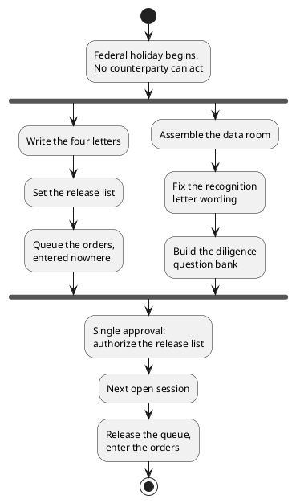

# Figure 10 - The Two Lanes a Closed Market Forces

**Platform.** PlantUML. **Native construct.** An activity diagram with one fork
into two concurrent lanes and one join.

## Perspective no other figure in this day gives

Figures 11 and 12 are static structures. This one is the only figure that shows
what the day actually *is*: a fork into two lanes that can run at once because
neither needs a counterparty, and a join at the next open session where both
become releasable. A fork and a join are first-class PlantUML activity
constructs and are not first-class in the other four platforms.

## Native source



## TikZ construction

A vertical spine with one fork bar and one join bar, and two lanes running
between them at a 4.20 cm horizontal separation. Lane steps sit on a 1.05 cm
vertical pitch.

| Element | Style | Geometry |
|:--|:--|:--|
| Initial marker | `umlinit` | `(4.20,0.85)` |
| Opening step | `umlbox`, 46 mm | `(4.20,0.10)` |
| Fork bar | `umlbar`, 62 mm wide | `(4.20,-0.75)` |
| Left lane, three steps | `umlstatesoft`, 34 mm | `(2.10,-1.55)`, `(2.10,-2.60)`, `(2.10,-3.65)` |
| Right lane, three steps | `umlbox`, 34 mm | `(6.30,-1.55)`, `(6.30,-2.60)`, `(6.30,-3.65)` |
| Join bar | `umlbar`, 62 mm wide | `(4.20,-4.45)` |
| Approval step | `umlkey`, 46 mm | `(4.20,-5.25)` |
| Session step | `umlctrl`, 46 mm | `(4.20,-6.15)` |
| Release step | `umlbox`, 46 mm | `(4.20,-7.05)` |
| Final marker | `umlfinal` | `(4.20,-7.75)` |
| Lane labels | `umlguard` | Above each lane's first step |
| Hold marker | `pnote` | Right of the left lane, naming the release condition |

Edge routing: the two lanes leave the fork bar at its left and right thirds and
rejoin at the corresponding thirds of the join bar, so no lane edge crosses the
spine. Every edge is vertical or has one right angle, and no edge passes through
a node.

## Why the left lane is drawn in the pale shade

The left lane produces things that must be **held**: letters and orders. The
right lane produces things that are finished on the day they are written: a data
room, a wording decision, a question bank. Drawing the held lane in a lighter
fill and labeling it makes the distinction visible without reading the steps,
which is the point of a figure.

## Value provenance

| Value in the figure | Source |
|:--|:--|
| The three left-lane steps | `../emails/README.md` and `../investing/capital-04-queued-orders.md` |
| The three right-lane steps | `../briefs/README.md` |
| The approval step wording | `../README.md`, the single approval step |
| The release condition | `../emails/README.md`, the hold line |

## Caption, exactly as printed

```
Figure 10. The closed day as one fork into two concurrent lanes, one of which
must be held for release, joined at the single approval the day asks for.
```

Line 1 is 75 characters, line 2 is 74 characters.

## Sources read

- `funding/auto-fund/07Sep26/emails/README.md`
- `funding/auto-fund/07Sep26/briefs/README.md`
- `funding/auto-fund/07Sep26/investing/capital-04-queued-orders.md`
- `funding/capitalization-plan/final-capital/capstyle.sty`, for the `uml*` styles
