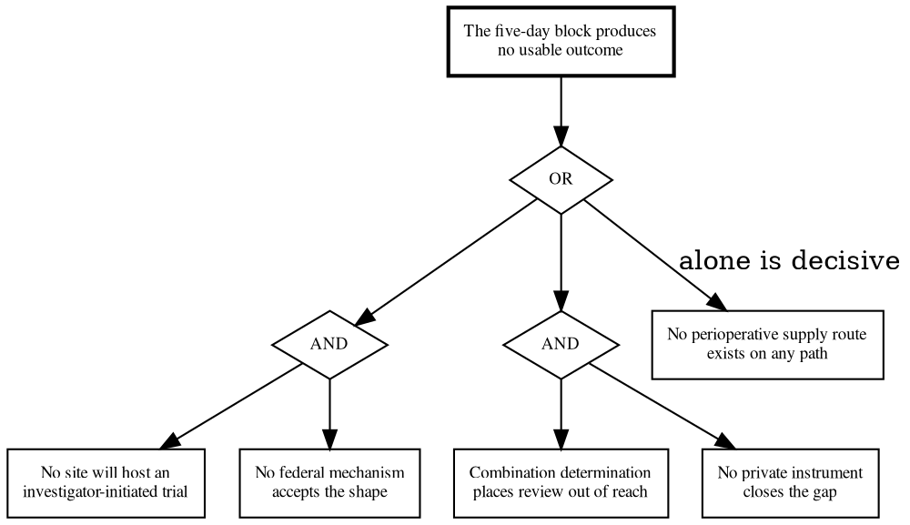

# Figure 12 - What Has to Fail for the Week to Produce Nothing

**Platform.** Graphviz. **Native construct.** A fault tree: a top condition, AND
and OR gates, and leaf events.

## Perspective no other figure in this day gives

Every other figure in the five-day block enumerates. This one is the only figure
that answers by **combination**: which pairs of failures are survivable, and
which single failure is not. That is the difference between a risk list and an
analysis, and a fault tree is the only construct in the set that draws it.

## Native source



## TikZ construction

A three-level tree. The top condition sits at the apex, one OR gate below it, and
two AND gates on the third level with two leaves each. One leaf hangs directly
from the OR gate, because it is decisive on its own.

| Element | Style | Geometry |
|:--|:--|:--|
| Top condition | `gvboxk`, 46 mm | `(5.60,0)` |
| OR gate | `\umlgateor` | `(5.60,-1.05)` |
| Decisive leaf | `gvboxg2`, 34 mm | `(1.30,-2.55)` |
| AND gate 1 | `\umlgateand` | `(5.60,-2.20)` |
| AND gate 2 | `\umlgateand` | `(9.30,-2.20)` |
| Leaves under gate 1 | `gvboxs`, 32 mm | `(4.30,-3.60)`, `(6.90,-3.60)` |
| Leaves under gate 2 | `gvboxs`, 32 mm | `(8.20,-3.60)`, `(10.80,-3.60)` |
| Edges | `gvundir` | Seven, all straight, none crossing |
| Decisive label | `gvedge` node | On the edge to the decisive leaf |

Edge routing: the tree is drawn so that the decisive leaf hangs to the left at a
shallower depth than the AND gates, which keeps its edge from crossing either
gate. Every other edge is a straight segment between a gate and a node directly
below it. No edge crosses another.

## What the figure argues

That there is exactly one single point of failure and it is drug supply for the
perioperative investigational use. Everything else requires a pair. That
asymmetry is the reason the developer letter was sent on day 2 rather than
deferred, and the reason the Pre-Request for Designation is written on the
quietest day rather than squeezed into a busy one.

It also argues something reassuring, which is worth saying because a fault tree
usually does not. Two of the four paired failures have a second route already
open: a second clinical site was approached in parallel on day 3, and a second
class of funder, the disease foundations, was approached on the same day.

## Value provenance

| Value in the figure | Source |
|:--|:--|
| The four leaf events | `../briefs/brief-03-diligence-question-bank.md`, the stop conditions |
| The decisive designation on supply | The same file: "the first is decisive on its own" |
| The pairing structure | `funding/capitalization-plan/final-capital/sections/sec-09-risks-and-limits.tex` |
| The two second routes | `../../04Sep26/briefs/brief-02-two-site-parallel-approach.md` |

No probability is attached to any leaf. Assigning one would invent precision the
evidence does not support, and a fault tree is useful for its structure whether
or not its leaves carry numbers.

## Caption, exactly as printed

```
Figure 12. What has to fail for the week to produce nothing, by combination:
one decisive single point, and two pairs that each need both halves to fail.
```

Line 1 is 74 characters, line 2 is 75 characters.

## Sources read

- `funding/auto-fund/07Sep26/briefs/brief-03-diligence-question-bank.md`
- `funding/capitalization-plan/final-capital/sections/sec-09-risks-and-limits.tex`
- `funding/capitalization-plan/final-capital/capstyle.sty`, for the `gv*` styles and the gate glyphs
