# Figure 13 - One Market Session, Sequenced

**Platform.** Mermaid. **Native construct.** A Gantt chart across a single
trading session, with one instant drawn as a rule rather than as a bar.

## Perspective no other figure in this day gives

Figures 14 and 15 are structural. This one is the only figure in the day that
carries time of day, and time of day is what makes an execution session go wrong:
an order entered in the first fifteen minutes, an auction cutoff missed by ten,
a limit written yesterday. A Gantt shows duration and overlap together, which no
other construct in the set does.

## Native source

```mermaid
gantt
    title One open session, release and execution
    dateFormat HH:mm
    axisFormat %H:%M
    section Before open
    Confirm market open, re-read auctions   :a1, 06:15, 25m
    Write this morning's limit prices       :a2, after a1, 15m
    section Early
    Release four held letters               :b1, 06:45, 20m
    Enter auction bids, lines 1 to 3        :b2, 07:05, 20m
    section Mid
    Enter line 4, limit, day                :c1, 07:30, 10m
    Enter line 5, limit, day                :c2, 08:00, 10m
    section Any time
    Send the three follow-ups               :d1, 08:15, 30m
    Submit portal items                     :d2, 09:00, 45m
    section Close
    Reconcile, write the fill record        :e1, 12:40, 20m
    File the release record                 :e2, after e1, 15m
```



## TikZ construction

A seven-hour rule at 1.55 cm per hour, with nine bars on a 0.52 cm vertical
pitch. `\ganttrow` in `fundstyle.sty` draws one bar, so a bar is moved by
changing one number.

| Element | Style | Geometry |
|:--|:--|:--|
| Hour rule | `axisx` from 0 to 10.85 | At `y = 0.42` |
| Hour ticks and labels | Every 1.55 cm | Session open to close |
| Bars, pre-open group | `mmbarg` | `y = 0`, `y = -0.52` |
| Bars, early group | `mmbark` | `y = -1.04`, `y = -1.56` |
| Bars, mid group | `mmbar` | `y = -2.08`, `y = -2.60` |
| Bars, any-time group | `mmbar` | `y = -3.12`, `y = -3.64` |
| Bars, close group | `mmbark` | `y = -4.16`, `y = -4.68` |
| Auction cutoff | A vertical `fundaccent` rule, 0.9 pt | At the cutoff hour, spanning all bars |
| First and last fifteen minutes | `mmband`, two narrow bands behind the bars | At each end of the session |
| Row labels | `\ganttrow`'s own east-anchored label | Left of the rule |
| Legend | `legkey`, three swatches | Below the chart |

Edge routing: there are no edges. A Gantt relates its bars by position on a
shared axis, and a connector between two bars would assert a dependency the chart
already shows by ordering.

## Why the cutoff is a rule and not a bar

An auction cutoff is an instant, and drawing an instant as a bar would give it a
duration it does not have. It is drawn as a vertical rule crossing every row,
which is also visually correct: it constrains all of them, not one.

The two shaded bands at each end of the session mark the first and last fifteen
minutes, where the exchange-traded line is never entered. Marking them as bands
rather than as a note makes the constraint visible at the same glance as the bar
it constrains.

## Value provenance

| Value in the figure | Source |
|:--|:--|
| The four pre-open and early steps | `../investing/capital-05-execution-and-settlement.md`, the six checks and the entry sequence |
| The entry order of lines 1 to 5 | The same file, the entry sequence table |
| The first and last fifteen minute bands | `../../02Sep26/investing/capital-01-treasury-ladder.md` |
| The release and follow-up steps | `../README.md`, the run order |
| The reconciliation and record steps | `../investing/capital-05-execution-and-settlement.md` |

The clock times are illustrative of sequence and duration. They are not a
commitment about any specific session, and the figure carries no date.

## Caption, exactly as printed

```
Figure 13. One open market session, with the release and execution steps in
sequence and the auction cutoff drawn as an instant that constrains them all.
```

Line 1 is 74 characters, line 2 is 77 characters.

## Sources read

- `funding/auto-fund/08Sep26/investing/capital-05-execution-and-settlement.md`
- `funding/auto-fund/07Sep26/investing/capital-04-queued-orders.md`
- `funding/capitalization-plan/final-capital/capstyle.sty`, for the `mm*` styles and `\ganttrow`
