# Figure 9 - Which work packages the money reaches, and which it does not

**Type.** graphviz-type, directed acyclic graph with three clusters.
**Section.** §3, The $1.6M Gate and the $3.5M Programme. **Perspective.** *Every
work package in the five-year programme, every dependency between them, and the
two funding lines drawn across the graph.* No other figure shows dependency;
Figure 8 shows the same shortfall as money, which says how much and never what.

**Caption (three balanced lines, 61 to 64 characters).**

```
Seventeen work packages and every edge between them. Five close
at 306,000, seven more at 1,606,000, and five are unreachable
at that figure, all five downstream of the sixth participant.
```

## Graphviz source

```dot
digraph packages {
  rankdir=LR;
  ranksep=0.85;
  nodesep=0.40;
  node [shape=box, style="rounded,filled", fontname="Times", fontsize=9,
        color="#000000", fillcolor="#FFFFFF"];
  edge [color="#6C757D", arrowsize=0.7];

  subgraph cluster_p1 {
    label="Reachable at 306,000, months 1 to 9";
    style=dashed; color="#00417A"; fontname="Times"; fontsize=10;
    WP1 [label="WP1 site feasibility\nand budget", fillcolor="#DCE8F1"];
    WP2 [label="WP2 protocol final\nand IRB package", fillcolor="#DCE8F1"];
    WP3 [label="WP3 interlock rig\nbench build", fillcolor="#DCE8F1"];
    WP4 [label="WP4 VVUQ freeze\nand hash", fillcolor="#DCE8F1"];
    WP5 [label="WP5 IND amendment\nand FDA package", fillcolor="#3C7DB2", fontcolor="#FFFFFF"];
  }

  subgraph cluster_p2 {
    label="Reachable at 1,606,000, months 10 to 33";
    style=dashed; color="#3C7DB2"; fontname="Times"; fontsize=10;
    WP6  [label="WP6 site activation\nand first dosing"];
    WP7  [label="WP7 first advised\nrobotic Whipple"];
    WP8  [label="WP8 dose level 1\ncleared, DSMB"];
    WP9  [label="WP9 audit replay\ndemonstration"];
    WP10 [label="WP10 dose level 2\ncleared, n equals 6"];
    WP11 [label="WP11 interim PK, PD\nand ctDNA"];
    WP12 [label="WP12 closeout and\npublic deposit", fillcolor="#00417A", fontcolor="#FFFFFF"];
  }

  subgraph cluster_gap {
    label="Unreachable at 1,606,000, needs 2,104,000 more";
    style=dashed; color="#6C757D"; fontname="Times"; fontsize=10;
    WP13 [label="WP13 participants 7 to 18\ndose levels 3 and 4", fillcolor="#E9ECEF"];
    WP14 [label="WP14 correlative PK,\nctDNA and tissue", fillcolor="#E9ECEF"];
    WP15 [label="WP15 full VVUQ re-run\nand credibility file", fillcolor="#E9ECEF"];
    WP16 [label="WP16 second engineer\nmonths 34 to 60", fillcolor="#E9ECEF"];
    WP17 [label="WP17 archive, hosting\nand IND to month 60", fillcolor="#E9ECEF"];
  }

  WP1 -> WP2; WP2 -> WP6; WP3 -> WP5; WP4 -> WP5; WP5 -> WP6;
  WP6 -> WP7; WP7 -> WP8; WP8 -> WP9; WP8 -> WP10;
  WP10 -> WP11; WP11 -> WP12;
  WP10 -> WP13 [style=dashed]; WP13 -> WP14 [style=dashed];
  WP9  -> WP15 [style=dashed]; WP12 -> WP17 [style=dashed];
  WP13 -> WP16 [style=dashed];
}
```



## The seventeen packages, with their money line

Work packages 1 to 12 map one to one onto milestones M1 to M12, and carry the
identical cost, so Figures 8, 9 and 13 can be checked against one another.

| WP | Package | Milestone | Cluster | Direct cost | Depends on |
|:--|:--|:--|:--|:--|:--|
| WP1 | Site feasibility and budget | M1 | Phase I | $24,000 | none |
| WP2 | Protocol final and IRB package | M2 | Phase I | $31,000 | WP1 |
| WP3 | Interlock rig bench build | M3 | Phase I | $96,000 | none |
| WP4 | VVUQ freeze and hash | M4 | Phase I | $73,000 | none |
| WP5 | IND amendment and FDA package | M5 | Phase I | $82,000 | WP3, WP4 |
| WP6 | Site activation and first dosing | M6 | Phase II | $164,000 | WP2, WP5 |
| WP7 | First advised robotic Whipple | M7 | Phase II | $228,000 | WP6 |
| WP8 | Dose level 1 cleared, DSMB | M8 | Phase II | $196,000 | WP7 |
| WP9 | Audit replay demonstration | M9 | Phase II | $131,000 | WP8 |
| WP10 | Dose level 2 cleared, n = 6 | M10 | Phase II | $242,000 | WP8 |
| WP11 | Interim PK, PD and ctDNA | M11 | Phase II | $187,000 | WP10 |
| WP12 | Closeout and public deposit | M12 | Phase II | $152,000 | WP11 |
| WP13 | Participants 7 to 18, DL3 and DL4 | none | Gap | $900,000 | WP10 |
| WP14 | Correlative PK, ctDNA and tissue | none | Gap | $286,000 | WP13 |
| WP15 | Full VVUQ re-run and credibility file | none | Gap | $228,000 | WP9 |
| WP16 | Second engineer, months 34 to 60 | none | Gap | $392,000 | WP13 |
| WP17 | Archive, hosting and IND to month 60 | none | Gap | $298,000 | WP12 |

Phase I sums to $306,000. Phase II sums to $1,300,000. The gap sums to
$2,104,000. All three totals are exact and match Figures 8 and 13.

Two of the five gap packages are downstream of WP13, participants 7 to 18, and
WP13 is itself downstream of WP10. That is the structural reason the shortfall
concentrates where it does: the money runs out one participant after the second
dose level clears.

## The two gap packages that are not about participants

| WP | Amount | What it actually buys | Why it cannot be cut |
|:--|:--|:--|:--|
| WP15 | $228,000 | The full VVUQ re-run against post-trial data and an ASME V&V 40 credibility file | Without it the 81.9 credibility score is a pre-trial claim only |
| WP17 | $298,000 | The permanent archive, replay hosting, and IND maintenance to month 60 | Without it the artifacts in Figure 20's public cluster stop being replayable |

WP17 is the single package whose removal changes what Figure 20 can claim, which
is why it sits in the gap rather than being absorbed into WP12.

## TikZ construction notes

Canvas 14.6 by 7.6 cm. Left to right, because a dependency graph with a
twelve-node critical path is wide, not tall.

| Element | Style token | Placement |
|:--|:--|:--|
| Phase I nodes | `gvboxs`, `gvboxm` for WP5, `text width=24mm` | WP1 and WP2 at x = 0, y = 0 and -1.35; WP3 and WP4 at x = 0, y = -2.70 and -4.05; WP5 at x = 2.85, y = -3.38 |
| Phase I cluster | `gvcluster`, `fit` WP1 to WP5 | `inner sep=6pt`, title at north west |
| Phase II nodes | `gvbox`, `gvboxk` for WP12, `text width=24mm` | Columns x = 6.20, 9.05, 11.90; ranks y = 0, -1.35, -2.70 |
| Phase II cluster | `gvcluster`, `fit` WP6 to WP12 | `inner sep=6pt` |
| Gap nodes | `gvboxg`, `text width=24mm` | Columns x = 6.20, 9.05, 11.90 at y = -5.55 and -6.90 |
| Gap cluster | `gvcluster2`, `fit` WP13 to WP17 | `inner sep=6pt`, `pagrayl` fill |
| Solid edges | `gvedge` | Eleven, all within or between the two funded clusters |
| Dashed edges | `gvedged` | Five, every one entering the gap cluster |
| Money rules | `protoblue` vertical at x = 4.95; `pagrayd` horizontal at y = -4.85 | The two funding lines |
| Rule labels | `\tiny\sffamily\bfseries`, `fill=protowhite` | On each rule, at its left end |
| Cluster totals | `gvcellh`, `gvcellh`, `gvcellg`, `minimum width=20mm` | Anchored south east on each cluster |
| In-figure note | `pnote`, `text width=134mm` | x = 0, y = -7.75 |

Rank discipline: no rank carries more than four nodes. The graph is genuinely
acyclic and every edge points right or down, so no edge back-tracks and no
arrowhead is ambiguous.

Edge crossing: exactly two edges cross, WP4 to WP5 and WP8 to WP10, and both
crossings are at a shallow angle in open canvas rather than over a node. Every
other edge is either horizontal within a rank pair or vertical within a column.
The five dashed edges enter the gap cluster from three different sides, so none
of them shares a segment with another.

## Repository sources

- `funding/pdac-funding-applications/final-apply/sections/sec-08-budget-and-leverage.tex` - the four-layer budget the seventeen package costs are cut from
- `funding/pdac-funding-applications/applications/app-05-nih-sbir-seed/` - the two funding lines
- `funding/capitalization-plan/mermaid/fig-13-twelve-milestone-calendar.md` - the twelve milestones WP1 to WP12 close, at identical cost
- `funding/capitalization-plan/d2/fig-08-two-prices-one-programme.d2.md` - the $2,104,000 the gap cluster sums to
- `funding/capitalization-plan/diagrams-python/fig-20-artifact-custody.md` - the public cluster WP17 keeps replayable
- `trial-protocol/` - the 3+3 escalation that makes WP13 depend on WP10
