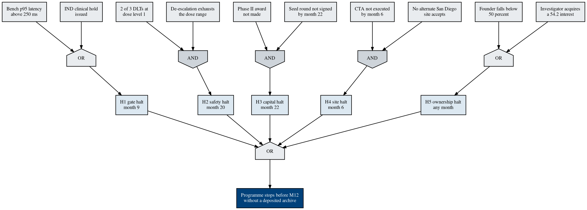

# Figure 15 - What has to fail, and in what combination, for the programme to stop

**Type.** graphviz-type, fault tree with AND and OR gates. **Section.** §5,
Twelve Milestones a Program Officer Can Audit. **Perspective.** *Five halt
points, the ten basic events beneath them, and which combinations are single
points of failure.* No other figure in this paper is about failure; Figure 7's
state machine shows that a Terminated state exists and never shows how it is
reached.

**Caption (3 balanced lines, 63 to 69 characters, numbered as printed).**

```
Figure 15. One top event, five halt points, and ten basic events
below. Three are AND gates, so no single failure stops the programme.
The two OR branches are the month-nine gate and ownership test.
```

## Graphviz source



## The five halt points

| Halt | Month | Gate | Basic events | Single point of failure |
|:--|:--|:--|:--|:--|
| H1, gate halt | 9 | OR | Bench p95 latency above 250 ms; IND clinical hold | Yes, either alone |
| H2, safety halt | 20 | AND | 2 of 3 DLTs at DL1; de-escalation exhausts the range | No |
| H3, capital halt | 22 | AND | Phase II award not made; seed round unsigned | No |
| H4, site halt | 6 | AND | CTA not executed; no alternate San Diego site | No |
| H5, ownership halt | any | OR | Founder below 50 percent; investigator §54.2 interest | Yes, either alone |

Three AND gates and two OR gates. The two OR branches are the honest part of the
figure: they are the two places where one event alone stops the programme, and
neither is technical. H1 is regulatory and instrumental; H5 is a corporate fact
about who owns the shares.

## What survives each halt

The top event is not a stop. It is a stop **without a deposited archive**, and
the bottom band of the figure shows why the two are different.

| Halt | Milestones already deposited | What a third party still has |
|:--|:--|:--|
| H4, month 6 | M1 partial | The protocol, the IND package, the VVUQ suite, all pre-existing |
| H1, month 9 | M1 to M4, and M5 if the hold is late | Bench verification report and hashed VVUQ manifest |
| H2, month 20 | M1 to M8 | The first operative record and advisory log, and a DSMB safety table |
| H3, month 22 | M1 to M9 | All of the above plus a demonstrated audit replay |
| H5, any month | Whatever has closed | The public cluster of Figure 20, which needs no custodian |

At every halt point the archive is already deposited for every closed milestone,
which is why the top event as drawn is difficult to reach. Reaching it would
require a halt plus a failure to deposit, and the deposit is a Phase I deliverable
that does not depend on the halt's cause.

## TikZ construction notes

Canvas 14.6 by 8.6 cm. Strictly layered, five ranks, no edge skipping a rank.

| Element | Style token | Placement |
|:--|:--|:--|
| Top event | `gvboxk`, `text width=46mm` | x = 7.10, y = 0 |
| Top gate | `\umlgateor{7.10}{-1.05}` | Rank 1 |
| Halt points H1 to H5 | `gvboxs`, `text width=22mm` | Rank 2, y = -2.45, x = 0.75, 4.00, 7.10, 10.20, 13.45 |
| Branch gates | `\umlgateor` for G1 and G5; `\umlgateand` for G2, G3, G4 | Rank 3, y = -3.55, same five x values |
| Basic events E01 to E10 | `gvboxg`, `text width=19mm` | Rank 4, y = -5.05, paired at x offset -0.95 and +0.95 from each gate |
| Top gate feed edges | `gvedge` | Five, from each halt to the top gate's lower edge, fanned across a 1.2 cm span |
| Gate to halt edges | `gvedge` | Five, vertical, 2.6 mm long each |
| Event to gate edges | `gvedge` | Ten, from each event's north to the gate's lower edge at offset -0.28 and +0.28 |
| Survival band | `gvcellg` row of five, `minimum width=25mm` | y = -6.60, one beneath each halt, carrying the milestones already deposited |
| Band rule | `pagrayd`, 0.5 pt | y = -6.05, full width |
| In-figure note | `pnote`, `text width=134mm` | x = 0, y = -7.70 |

Layering discipline: no edge skips more than one rank. The five halt-to-gate
edges are fanned across a 1.2 cm span on the top gate's underside so their
arrowheads are 3 mm apart, and no edge passes within 4 mm of a gate glyph other
than its own target.

Gate glyphs: `\umlgateand` has a flat bottom and takes `pagraym`;
`\umlgateor` has a curved bottom and takes `pagrayl`. Neither is filled black.
Each gate's AND or OR label is set beneath its glyph at the fixed 0.22 cm offset
the macro applies, never inside it.

## Repository sources

- `funding/capitalization-plan/mermaid/fig-07-phase-gate-state-machine.md` - the four guards H1 is the failure of
- `funding/capitalization-plan/mermaid/fig-13-twelve-milestone-calendar.md` - the twelve milestones the survival band counts
- `funding/capitalization-plan/plantuml/fig-11-capital-firewall-guards.puml.md` - the two states H5 corresponds to
- `funding/capitalization-plan/diagrams-python/fig-20-artifact-custody.md` - the public cluster the survival band relies on
- `trial-protocol/` - the 3+3 de-escalation rule behind E03 and E04
- 13 CFR 121.702 and 21 CFR §54.2, the two events beneath H5
