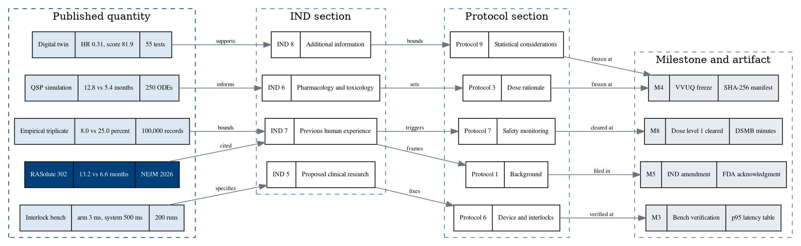

# Figure 17 - Published quantity to IND section to protocol section to milestone

**Type.** graphviz-type, record chain. **Section.** §6, The Clinical Evidence a
Funder Is Buying. **Perspective.** *Where each published number actually lands
in a filing, with the link type named on every edge.* No other figure traces
provenance forward; Figure 16 states the same six quantities as magnitudes and
says nothing about where they go.

**Caption (three balanced lines, 60 to 63 characters).**

```
Five published quantities and the exact filing section each one
reaches. Every edge carries its link type, and every chain ends
at a milestone whose artifact a program officer can request.
```

## Graphviz source



## The five chains, end to end

| Quantity | Value | IND section | Protocol section | Milestone | Artifact a reviewer can request |
|:--|:--|:--|:--|:--|:--|
| RASolute 302 | 13.2 vs 6.6 months | §7 Previous human experience | §1 Background | M5 | FDA acknowledgment, 30-day clock closed |
| QSP simulation | 12.8 vs 5.4 months | §6 Pharmacology and toxicology | §3 Dose rationale | M4 | VVUQ report and SHA-256 manifest |
| Digital twin | HR 0.31, credibility 81.9 | §8 Additional information | §9 Statistical considerations | M4 | Same manifest, test-level results |
| Interlock bench | arm stop 3 ms, system stop 500 ms | §5 Proposed clinical research | §6 Device and interlocks | M3 | 200-run p95 latency table |
| Empirical triplicate | grade 3 plus, 8.0 vs 25.0 percent | §7 Previous human experience | §7 Safety monitoring | M8 | DSMB minutes and cumulative safety table |

## The five link types, and what each licenses

| Link | Meaning | What it does not license |
|:--|:--|:--|
| cited | A published result is quoted with its own interval and limitation | Restating a metastatic result as a resectable one |
| informs | A simulated result shapes a design choice | Presenting a simulated survival figure as an expected outcome |
| supports | A verified computation raises confidence in a stated assumption | Substituting for a clinical measurement |
| specifies | A bench measurement fixes a numeric requirement in the protocol | Claiming the requirement has been met in a patient |
| bounds | A result sets an upper or lower limit for monitoring | Treating that limit as a predicted rate |

Naming the link type on every edge is what stops the chain from being read as an
inheritance. A tier 1 result does not become a tier 3 result by travelling
along an arrow, and the labels are there so that a reviewer can see the arrow is
not an equals sign.

## TikZ construction notes

Canvas 14.6 by 8.0 cm. Four ranks left to right, one cluster per rank.

| Element | Style token | Placement |
|:--|:--|:--|
| Quantity records | `gvcells` three-row records, `gvkey` for Q1, `text width=25mm` | x = 0, y = 0, -1.55, -3.10, -4.65, -6.20 |
| Quantity cluster | `gvcluster`, `fit` Q1 to Q5 | `inner sep=6pt` |
| IND records | `gvcells` two-row records, `text width=23mm` | x = 4.35, y = -0.75, -2.30, -3.85, -5.40 |
| IND cluster | `gvcluster`, `fit` I5 to I8 | `inner sep=6pt` |
| Protocol records | `gvcells` two-row records, `text width=23mm` | x = 8.55, y = 0, -1.55, -3.10, -4.65, -6.20 |
| Protocol cluster | `gvcluster`, `fit` P1 to P9 | `inner sep=6pt` |
| Milestone records | `gvcells` three-row records with `pagrayl` body, `text width=25mm` | x = 12.75, y = -0.40, -2.30, -4.20, -6.10 |
| Milestone cluster | `gvcluster2`, `fit` M3 to M8 | `inner sep=6pt` |
| Chain edges | `gvedge` | Fifteen; twelve are straight, three carry a bend |
| Convergent edges | `gvedge`, `bend right=18` on Q5 to I7 and `bend left=18` on P9 to M4 | The two places where two chains share a target |
| Edge labels | `\tiny`, `fill=protowhite`, `inner sep=1.2pt` | At the midpoint of every edge, punching a hole in the line |
| Rank titles | `gvctitle` | Anchored south west on each cluster, 1 mm above |
| In-figure note | `pnote`, `text width=134mm` | x = 0, y = -7.35 |

Record discipline: every record's fields are separated by a 0.4 pt rule and no
field carries more than four words. The three-row records in ranks 1 and 4 use
one uniform 25 mm width; the two-row records in ranks 2 and 3 use 23 mm.

Convergence: exactly two targets receive two edges, I7 from Q1 and Q5, and M4
from P3 and P9. Both convergent pairs are drawn with one straight edge and one
bent at 18 degrees, so the two arrivals are 4 mm apart on the target's west face
and neither label sits on the other's line.

## Repository sources

- `funding/pdac-funding-applications/final-apply/sections/sec-05-trial-evidence.tex` - the five quantities and their stated limitations
- `funding/pdac-funding-applications/final-apply/sections/sec-06-physical-ai-governance.tex` - the arm stop 3 ms and system stop 500 ms figures
- `trial-ind/` - the ReGARDD section numbering used in rank 2
- `trial-protocol/` - the protocol section numbering used in rank 3
- `funding/capitalization-plan/mermaid/fig-13-twelve-milestone-calendar.md` - the four milestones in rank 4
- RASolute 302, DOI 10.1056/NEJMoa2605555; QSP DOI 10.5281/zenodo.17001137
