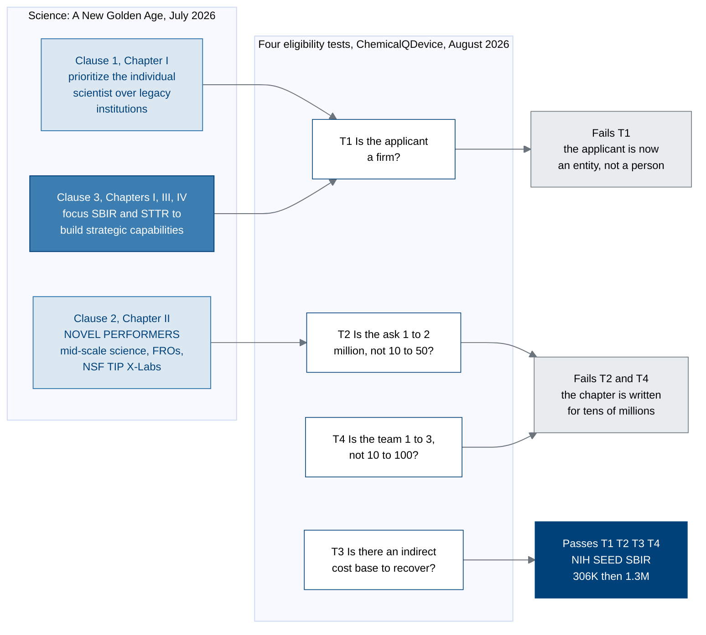

# Figure 1 - Three candidate clauses through one eligibility filter

**Type.** mermaid-type, flowchart LR. **Section.** §1, The Novel-Performer Case.
**Perspective.** *Which clause of the report a San Diego company actually
qualifies under, and why the two better-known clauses fail.* No other figure in
this paper runs an eligibility test; Figure 2 scores the company against the
report's institutional-form table but assumes the clause has already been
chosen.

**Caption (three balanced lines, 63 to 65 characters).**

```
Three clauses of one report, four eligibility tests, and the only
clause a San Diego firm with no indirect-cost base survives. The
two that fail, fail on size, not on merit or on subject matter.
```

## Mermaid source



## TikZ construction notes

Absolute coordinates, so adding an element later moves nothing already placed.
Canvas 14.6 by 6.4 cm, drawn left to right in four columns.

| Element | Style token | Placement |
|:--|:--|:--|
| Source cluster title | `mmlanetitle` | Anchored south west on the cluster, 1.2 mm above |
| Clause 1, Clause 2 | `mmsoft`, `text width=30mm` | Column 0, x = 0, y = 1.55 and y = 0 |
| Clause 3 | `mmmid`, `text width=30mm` | Column 0, x = 0, y = -1.55; vertical pitch 1.55 cm |
| Source cluster | `mmlane`, `fit` all three | `inner sep=6pt` |
| Tests T1 to T4 | `mmdec`, `text width=21mm`, `aspect=1.7` | Column 1, x = 4.85, y = 2.10, 0.70, -0.70, -2.10; pitch 1.40 cm |
| Test cluster | `mmlane`, `fit` T1 to T4 | `inner sep=6pt`, clear of the source cluster by 12 mm |
| Fail 1, Fail 2 | `mmgray`, `text width=27mm` | Column 2, x = 9.35, y = 1.75 and y = -1.20 |
| Pass | `mmgoal`, `text width=32mm` | Column 3, x = 13.15, y = -0.60 |
| Clause to test edges | `mmedge` | C1 to T1 straight; C2 to T2 straight; C3 to T1 with `bend right=18` so it clears C2 |
| Fail edges | `mmedged` | T1 to F1, T2 to F2, T4 to F2. T4 to F2 uses `bend left=15` |
| Pass edge | `mmedgeb`, line width 1 pt | T3 to P3, the only heavy edge on the canvas |
| Edge labels | `mmlabel` | `fill=protowhite`, `inner sep=1.5pt`, so each punches a hole in its line |
| In-figure note | `pnote` | x = 0, y = -3.35, `text width=132mm` |

The three clauses are drawn at one pitch and the four tests at another, so the
eye reads the two clusters as two different kinds of object. Clause 3 is
`mmmid` rather than `mmsoft` before any test has been run, which is the one
piece of foreshadowing the figure allows itself.

Edge routing: the only edge that could cross a node is C3 to T1, because C3 sits
below C2 and T1 sits above T2. It is bent right 18 degrees, which carries it
1.1 cm clear of C2's south east corner. No other pair of edges shares a
horizontal band.

## The four tests, with their sources

| Test | Question | Report basis | ChemicalQDevice, August 2026 |
|:--|:--|:--|:--|
| T1 | Is the applicant a firm? | Chapter IV, SBIR opens doors for technician-founded ventures | Yes, a California C corporation |
| T2 | Is the ask 1 to 2 million? | Chapter II, NOVEL PERFORMERS is written for tens of millions | $1,606,000 over 33 months |
| T3 | Is there an indirect-cost base? | Chapter II, deference to the incumbents that consume the funding | No negotiated rate agreement exists |
| T4 | Is the team 1 to 3? | Chapter II, coordinated teams of ten to a hundred people | 2.6 FTE at full Phase II staffing |

## Repository sources

- `funding/science-golden-age/chunk-01-front-matter-and-summary.md` - the individual-scientist sentence and the SBIR and STTR focus recommendation
- `funding/science-golden-age/chunk-03-chapter-two-revitalizing-science-and-technology-enterprise.md` - the NOVEL PERFORMERS section, its scale statement, and the $200 billion finding
- `funding/science-golden-age/chunk-04-chapter-three-securing-dominance-in-critical-and-emerging-technologies.md` - SBIR and STTR deployed strategically, coupling federally-seeded companies with the scientific enterprise
- `funding/science-golden-age/chunk-05-chapter-four-science-and-technology-better-lives-of-all-americans.md` - programs like SBIR open doors for technician-founded ventures
- `funding/pdac-funding-applications/applications/app-05-nih-sbir-seed/` - the $306,000 and $1,300,000 split this figure terminates in
