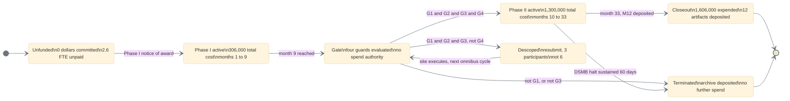

# Figure 7 - The Phase I to Phase II award state machine and its four guards

**Type.** mermaid-type, stateDiagram-v2. **Section.** §3, The $1.6M Gate and the
$3.5M Programme. **Perspective.** *What the award is doing at every moment
between the Phase I notice and Phase II closeout, and what has to be true for
the gate transition to fire.* No other figure shows the award as a machine with
states; Figure 13 shows the same 33 months as a calendar, which is the opposite
projection of the same interval.

**Caption (three balanced lines, 64 to 65 characters).**

```
One award in five states, and the four guards that must all hold
at month nine. Two of the four are technical, one is regulatory,
and the fourth belongs to an institution the company cannot bind.
```

## Mermaid source



## The four guards

| Guard | Condition | Milestone | Who can satisfy it |
|:--|:--|:--|:--|
| G1 | Bench stop latency at or below 250 ms at the 95th percentile over 200 runs | M3 | ChemicalQDevice alone |
| G2 | Every ASME V\&V 40 credibility factor at or above its gate, suite hashed | M4 | ChemicalQDevice alone |
| G3 | IND amendment safe to proceed, 30-day clock closed, no clinical hold | M5 | FDA, on a company filing |
| G4 | Site agreement executed and IRB approval in hand | M1, M2 | UC San Diego alone |

G4 is the only guard the company cannot satisfy by working harder. It is drawn
in `mmgrayd` rather than `mmsoft` for exactly that reason, and the `Descoped`
state exists only because G4 can fail while G1, G2 and G3 all hold.

## TikZ construction notes

Canvas 14.2 by 6.8 cm. Two horizontal bands: the spine at y = 0 and the
off-spine outcomes at y = -2.55. Drawn left to right, because an award is a
sequence, not a hierarchy.

| Element | Style token | Placement |
|:--|:--|:--|
| Initial pseudostate | `umlinit` | x = -0.35, y = 0 |
| Unfunded | `umlstategray`, `text width=25mm` | x = 0.95, y = 0 |
| Phase I active | `umlstateon`, `text width=27mm` | x = 4.30, y = 0 |
| Gate | `umlstate`, `text width=25mm`, `line width=1pt` | x = 7.55, y = 0 |
| Phase II active | `umlstateon`, `text width=27mm` | x = 10.85, y = 0 |
| Closeout | `umlstatesoft`, `text width=27mm` | x = 14.05, y = 0 |
| Descoped | `umlstatesoft`, `text width=25mm` | x = 6.10, y = -2.55 |
| Terminated | `umlstategray`, `text width=25mm` | x = 10.10, y = -2.55 |
| Final pseudostate | `umlfinal` | x = 12.95, y = -2.55 |
| Spine transitions | `umlarrow` | Straight, horizontal, at y = 0 |
| Gate to Descoped | `umlarrow`, `bend right=20` | Leaves the gate at south west, arrives north west |
| Gate to Terminated | `umlarrow`, `bend left=14` | Leaves south east, clears Phase II's south west corner by 6 mm |
| Descoped return | `umldash`, `bend right=32` | The only return edge; 32 clears both the Gate box and its guard label |
| Guard labels | `umlguard` | Centred on the transition, raised 3.2 mm, `fill=protowhite` |
| Guard legend | `umlnote`, `text width=42mm` | x = 0.95, y = -2.55, listing G1 to G4 |
| In-figure note | `pnote` | x = -0.6, y = -4.05, `text width=134mm` |

Bend discipline: the two gate exits are 20 and 14 rather than a shared value,
because they leave the same node in different directions and a shared bend would
put their first 4 mm on top of each other. The one return edge takes 32, the
minimum that clears an intervening node at this pitch.

Every guard label sits above its own transition at a single fixed 3.2 mm offset,
never on the line, and carries a white fill so the transition passes behind it.

## Repository sources

- `funding/pdac-funding-applications/applications/app-05-nih-sbir-seed/` - the 9 plus 24 month term and the two award amounts
- `funding/pdac-funding-applications/final-apply/sections/sec-08-budget-and-leverage.tex` - the site agreement as the binding constraint, which is why G4 is drawn as the exception
- `trial-ind/` - the IND amendment and the 30-day clock that G3 turns on
- `funding/potential-partners/UC-San-Diego/` - the institution that holds G4
- ASME V\&V 40 credibility gates, cited in the paper as `asmevv40`
