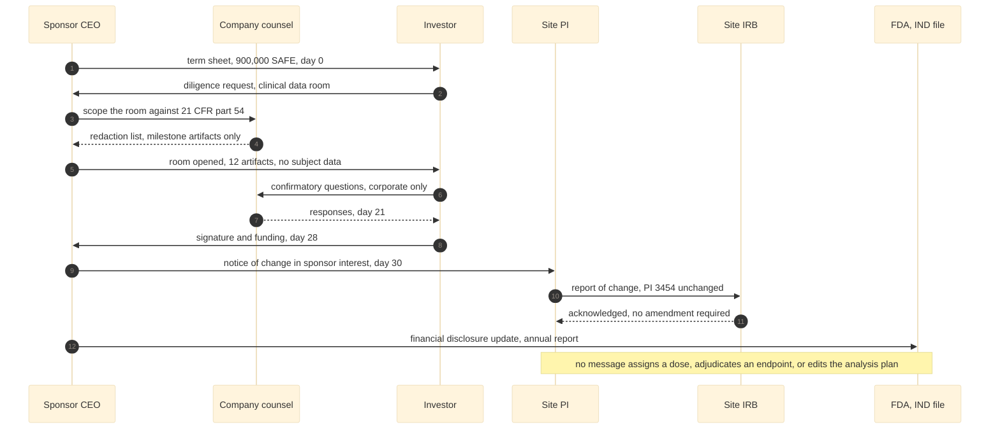

# Figure 12 - Who signs what, in what order, during a financing event

**Type.** mermaid-type, sequenceDiagram. **Section.** §4, Non-Dilutive to
Dilutive Bridge. **Perspective.** *The message order of a private round while a
trial is enrolling, and the three lifelines no message is allowed to reach.* No
other figure in this paper orders events by actor; Figure 10 states the same
firewall as permissions, which says what is allowed but not in what sequence.

**Caption (three balanced lines, 64 to 65 characters).**

```
Eleven messages during a financing round, and the three lifelines
no message reaches. Dose assignment, endpoint adjudication, and
the analysis plan are untouched between term sheet and signature.
```

## Mermaid source



## The three lifelines nothing reaches

The figure draws three further lifelines with no incoming message and marks each
with the struck-cable glyph `\pxmark`. They are the point of the figure and
must be visually unmistakable.

| Lifeline | What it decides | Why no message reaches it |
|:--|:--|:--|
| Dose assignment | Which participant receives dose level 1, 2 or 3 | Assigned by the site PI on the DSMB's recommendation |
| Endpoint adjudication | Whether an event is a DLT and its grade | Adjudicated by the site, against CTCAE and the ISGPS grading |
| Statistical analysis | The analysis populations and the Clopper-Pearson intervals | Contracted at a fixed fee not tied to outcome, locked before first dose |

A Phase 1 3+3 escalation carries no randomization, so the firewall cannot bind
on a randomization schedule. It binds instead on dose assignment, which is the
Phase 1 analogue, and the wording is carried forward so it still binds when the
Phase 2 successor introduces randomization.

## TikZ construction notes

Canvas 14.4 by 9.6 cm. Six lifelines at a 2.52 cm pitch, three struck lifelines
in a separate band beneath a rule.

| Element | Style token | Placement |
|:--|:--|:--|
| Actor heads | `mmactor`, `text width=21mm` | y = 0, x = 0, 2.52, 5.04, 7.56, 10.08, 12.60 |
| Lifelines | `mmlife` | From y = -0.42 to y = -6.10, one per actor |
| Activation bars | `mmact`, `minimum height` per span | Width 2.6 mm, centred on the lifeline |
| Messages 1 to 12 | `mmmsg` solid, `mmret` dashed for returns | y = -0.85 down to y = -5.80, uniform 0.45 cm pitch |
| Message labels | `\tiny\sffamily`, `fill=protowhite` | Above the arrow, `inner sep=1.2pt` |
| Sequence numbers | `\tiny`, `text=protogray` | Anchored east at x = -0.55, one per message row |
| Band rule | `pagrayd`, 0.5 pt | Full width at y = -6.45 |
| Struck lifelines | `mmgray`, `text width=27mm` | y = -7.05, x = 1.30, 6.10, 10.90 |
| Struck glyph | `\pxmark` | Centred 7 mm above each struck box |
| Day markers | `pnote` | Anchored east at x = -0.55 for days 0, 21, 28, 30 |
| In-figure note | `pnote`, `text width=132mm` | x = -0.55, y = -8.55 |

Overlap discipline: message rows are on a uniform 0.45 cm pitch, which at
`\tiny` leaves 2.1 mm of clear space between a label's descender and the arrow
below it. No message spans more than three lifelines, so no label is wider than
its own span. Messages 9 and 12 are the two longest spans and are placed 0.9 cm
apart rather than 0.45, so their labels cannot collide.

## Repository sources

- 21 CFR part 54, Financial Disclosure by Clinical Investigators, §54.2 and §54.4
- Forms FDA 3454 and 3455, referenced in the message at day 30
- `trial-ind/` - the IND annual report the last message updates
- `trial-protocol/` - the 3+3 escalation, which is why the firewall binds on dose assignment rather than on randomization
- `funding/capitalization-plan/d2/fig-11-capital-tiers.md` - the $900,000 SAFE this sequence executes
