# Figure 13 - Thirty-three months, twelve milestones, twelve artifact dates

**Type.** mermaid-type, gantt. **Section.** §5, Twelve Milestones a Program
Officer Can Audit. **Perspective.** *When each milestone opens, when it closes,
and when the artifact that proves it exists.* No other figure carries the
calendar; Figure 7 states the same interval as a state machine, which says what
the award is doing but never how long.

**Caption (three balanced lines, 63 to 65 characters).**

```
Thirty-three months, twelve milestones, and the artifact date on
each. Phase I holds five at 306,000 dollars; Phase II holds seven
at 1,300,000. The gate at month nine is the only hard boundary.
```

## Mermaid source

```mermaid
%%{init: {'theme':'base','themeVariables':{'fontSize':'11px'}}}%%
gantt
    title Twelve auditable milestones, months 1 to 33
    dateFormat X
    axisFormat %s
    section Phase I, 306,000
    M1 site feasibility executed      :m1, 1, 2
    M2 IRB submission accepted        :m2, 2, 3
    M3 interlock bench verification   :m3, 3, 4
    M4 VVUQ suite frozen and hashed   :m4, 4, 4
    M5 IND amendment safe to proceed  :m5, 6, 4
    section Gate
    Four guards evaluated             :milestone, g1, 9, 0
    section Phase II, 1,300,000
    M6 first participant dosed        :m6, 10, 4
    M7 first advised robotic Whipple  :m7, 12, 5
    M8 dose level 1 cleared           :m8, 15, 6
    M9 audit replay to a third party  :m9, 18, 7
    M10 dose level 2 cleared          :m10, 22, 7
    M11 interim PK, PD and ctDNA      :m11, 26, 6
    M12 closeout and public deposit   :m12, 30, 4
```



## The twelve rows, with cost and artifact

| ID | Months | Milestone | Cost | Evidence artifact |
|:--|:--|:--|:--|:--|
| M1 | 1 to 2 | Site feasibility executed | $24,000 | Countersigned feasibility memorandum |
| M2 | 2 to 4 | IRB submission accepted | $31,000 | IRB acknowledgment and protocol v1.0 |
| M3 | 3 to 6 | Interlock bench verification | $96,000 | 200-run latency report, p95 table |
| M4 | 4 to 7 | VVUQ suite frozen and hashed | $73,000 | VVUQ report and SHA-256 manifest |
| M5 | 6 to 9 | IND amendment safe to proceed | $82,000 | FDA acknowledgment, 30-day clock closed |
| M6 | 10 to 13 | First participant dosed | $164,000 | Consent, dispensing record, day-1 CRF |
| M7 | 12 to 16 | First advised robotic Whipple | $228,000 | Operative note, advisory log, replay bundle |
| M8 | 15 to 20 | Dose level 1 cleared, n = 3 | $196,000 | DSMB minutes and safety table |
| M9 | 18 to 24 | Audit replay to a third party | $131,000 | Replay record and hash-match certificate |
| M10 | 22 to 28 | Dose level 2 cleared, n = 6 | $242,000 | Cumulative safety table, ISGPS grades |
| M11 | 26 to 31 | Interim PK, PD and ctDNA | $187,000 | PK report and ctDNA clearance table |
| M12 | 30 to 33 | Closeout and public deposit | $152,000 | Zenodo deposit, report, repository tag |

The five Phase I rows sum to $306,000, as 24 + 31 + 96 + 73 + 82 in thousands.
The seven Phase II rows sum to $1,300,000. Both totals are exact, and a
milestone table that does not sum to its award is the fastest way to lose a
program officer.

## TikZ construction notes

Canvas 14.6 by 7.4 cm. Horizontal axis is months 0 to 33 at 0.415 cm per month,
which puts month 33 at x = 13.70 and leaves 0.9 cm for the right-hand cost
column.

| Element | Style token | Placement |
|:--|:--|:--|
| Month rules | `pagraym`, 0.3 pt | At months 0, 6, 12, 18, 24, 30, 33; label anchored south at y = 0.38 |
| Phase I bars, M1 to M5 | `mmbar` | y = 0, -0.52, -1.04, -1.56, -2.08 |
| Gate rule | `protoblue`, 1 pt, dashed | Full height at month 9, x = 3.735, from y = 0.55 to y = -6.05 |
| Gate label | `\tiny\sffamily\bfseries`, `text=protoblue` | Anchored south at the rule, y = 0.58 |
| Phase II bars, M6 to M12 | `mmbark` | y = -2.86, -3.38, -3.90, -4.42, -4.94, -5.46, -5.98 |
| Band rule | `pagrayd`, 0.5 pt | y = -2.47, separating the two sections |
| Row labels | `\tiny\sffamily`, anchored west | At x = bar end plus 0.12 cm |
| Cost column | `d2cell`, `text width=15mm` | Right-aligned at x = 13.95, one per row |
| Artifact diamonds | `mmdec`, `scale=0.42` | At each bar's right edge, on the bar centre line |
| Section labels | `mmlanetitle` | Anchored east at x = -0.15, y = -1.04 and y = -4.42 |
| Totals | `\tiny\sffamily\bfseries` | Beneath the cost column at y = -2.47 and y = -6.42 |
| In-figure note | `pnote`, `text width=134mm` | x = -0.15, y = -6.95 |

Row pitch is 0.52 cm throughout, and the bar height is 0.36 cm, so 1.6 mm of
clear space separates every bar from the one beneath it. Row labels sit to the
right of their own bar and never above it, so no label can touch the row above.

The gate rule is the only full-height element. It crosses no bar, because M5
ends at month 9 and M6 begins at month 10; the one-month dead band at the gate
is real and is drawn.

## Repository sources

- `funding/pdac-funding-applications/applications/app-05-nih-sbir-seed/` - the 9 plus 24 month term
- `funding/pdac-funding-applications/final-apply/sections/sec-08-budget-and-leverage.tex` - the four-layer budget the twelve costs are cut from
- `trial-protocol/` - the 3+3 escalation that fixes M8 at n = 3 and M10 at n = 6
- `trial-ind/` - the IND amendment at M5 and the annual report at M12
- ASME V&V 40, the credibility gate M4 freezes against
