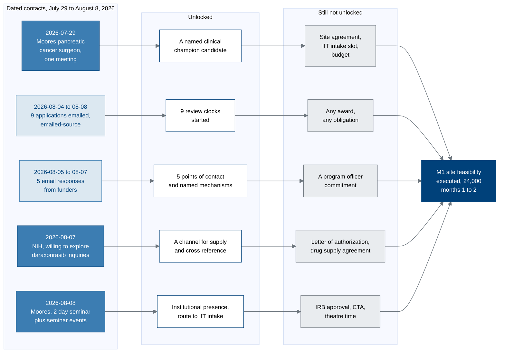

# Figure 19 - What each July and August 2026 contact unlocks, and what it does not

**Type.** mermaid-type, flowchart LR. **Section.** §8, San Diego and the August
2026 Record. **Perspective.** *Four dated contacts, the specific thing each one
makes possible, and the specific thing each one still does not.* No other figure
in this paper carries a dated record of what actually happened; every other
figure describes a plan.

**Caption (3 balanced lines, 66 to 69 characters, numbered as printed).**

```
Figure 19. Four contacts between July 29 and August 8, 2026, and what
each one actually unlocks. Every arrow ends at the same milestone,
M1, and not one of the four is on its own sufficient to close that.
```

## Mermaid source



## The five rows, as the record states them

| Date | Contact | Unlocked | Still not unlocked |
|:--|:--|:--|:--|
| 2026-07-29 | One Moores Cancer Center pancreatic cancer surgeon, one meeting | A named clinical champion candidate | Site agreement, IIT intake slot, budget |
| 2026-08-04 to 08-08 | Nine funding applications emailed | Nine review clocks started | Any award or obligation |
| 2026-08-05 to 08-07 | Five email responses received | Five points of contact, named mechanisms | A program officer commitment |
| 2026-08-07 | NIH, willing to explore additional daraxonrasib inquiries | A channel for supply and cross-reference | Letter of authorization, supply agreement |
| 2026-08-08 | UC San Diego Moores, two-day seminar plus seminar events | Institutional presence, route to IIT intake | IRB approval, CTA, theatre time |

## TikZ construction notes

Canvas 14.6 by 7.2 cm, four columns left to right at a 3.85 cm pitch. Five rows
at a 1.42 cm pitch.

| Element | Style token | Placement |
|:--|:--|:--|
| Column 0, contacts | `mmmid` for rows 1, 4, 5; `mmsoft` for rows 2, 3 | x = 0, `text width=29mm` |
| Column 1, unlocked | `mmin` | x = 3.85, `text width=27mm` |
| Column 2, not unlocked | `mmgray` | x = 7.70, `text width=27mm` |
| Column 3, milestone | `mmgoal`, `text width=30mm`, `minimum height=15mm` | x = 11.90, y = -2.84, spanning all five rows |
| Row y values | | 0, -1.42, -2.84, -4.26, -5.68 |
| Contact to unlocked | `mmedgeb` | Straight, horizontal |
| Unlocked to not unlocked | `mmedge` | Straight, horizontal |
| Not unlocked to M1 | `mmedged` | Rows 1 and 5 bend 22 and -22; rows 2 and 4 bend 12 and -12; row 3 is straight |
| Column titles | `mmlanetitle` | Anchored south at y = 0.82, one per column |
| Date column | `\tiny`, `text=protogray` | Set inside the column 0 node as its first line |
| In-figure note | `pnote`, `text width=132mm` | x = 0, y = -6.60 |

Bend discipline: the five edges converging on M1 are the only place in this
figure where edges could overlap. The bends are 22, 12, 0, -12 and -22, a
symmetric fan, so the five arrivals are separated by at least 3 mm on M1's west
face and no two edges share a tangent.

Rows 2 and 3 are `mmsoft` rather than `mmmid` because they record correspondence
rather than a meeting. The distinction has to survive without reading the
labels.

## Repository sources

- `funding/pdac-funding-applications/applications/emailed-source/` - the nine applications emailed 2026-08-04 to 2026-08-08
- `funding/potential-partners/UC-San-Diego/` - the Moores contact record and the 2026-07-29 surgeon meeting
- `funding/pdac-funding-applications/final-apply/sections/sec-07-moores-partnership.tex` - the IIT intake path that row 5 leads to
- `funding/capitalization-plan/mermaid/fig-13-twelve-milestone-calendar.md` - M1, the milestone all five rows terminate at
