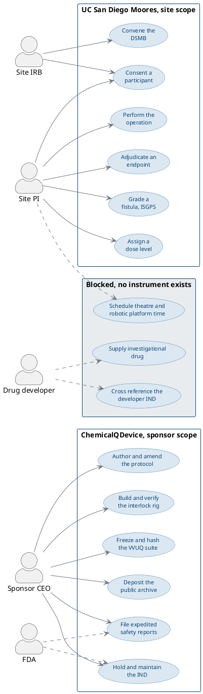

# Figure 6 - What the sponsor may do alone and what only the site may do

**Type.** plantuml-type, use case with two system boundaries. **Section.** §2,
The Entity and the Asset. **Perspective.** *The line between what
ChemicalQDevice can execute on its own authority and what requires an
institution, with the three cases neither party may execute today drawn in the
corridor between them.* No other figure in this paper draws corporate and
contractual authority; Figure 10 draws financial permission, which is a
different boundary over the same actors.

**Caption (three balanced lines, 62 to 65 characters).**

```
Two system boundaries, twelve use cases, and the corridor between
them holding three that neither party may execute today. Each of
the three is blocked by exactly one missing signed instrument.
```

## PlantUML source



## The three blocked cases

| Case | Blocked by | Instrument that would unblock it | Who signs |
|:--|:--|:--|:--|
| Supply investigational drug | No supply agreement | Clinical trial supply agreement | Revolution Medicines |
| Schedule theatre and robotic time | No clinical trial agreement | Executed CTA with a budget | UC San Diego |
| Cross reference the developer IND | No letter of authorization | Letter of authorization to FDA | Revolution Medicines |

Each is blocked by exactly one signature, and no amount of company work removes
any of the three. That is the honest reading of the asset register in §2, and it
is why the corridor is drawn as a third boundary rather than as a footnote.

## TikZ construction notes

Canvas 14.6 by 9.0 cm. Three vertical bands separated by two corridors of 9 mm
clear space each, which exceeds the 8 mm minimum in the stage sub-prompt.

| Element | Style token | Placement |
|:--|:--|:--|
| Actor CEO | `\umlactor{ceo}{-0.55}{1.45}` | Left margin, above the sponsor band |
| Actor PI | `\umlactor{pi}{-0.55}{-2.60}` | Left margin, beside the site band |
| Actor IRB | `\umlactor{irb}{-0.55}{-4.55}` | Left margin, below PI |
| Actor FDA | `\umlactor{fda}{15.05}{1.45}` | Right margin, mirroring CEO |
| Actor developer | `\umlactor{dev}{15.05}{-6.55}` | Right margin, beside the blocked band |
| Sponsor cases S1 to S6 | `umlusecase`, `text width=25mm` | Two columns at x = 2.35 and 5.55; rows y = 1.45, 0.15, -1.15 |
| Sponsor boundary | `umlpkg`, `fit` S1 to S6 | `inner sep=6pt`, tab title `umlpkgtab` at north west |
| Site cases T1 to T6 | `umlusecase`, `text width=25mm` | Two columns at x = 2.35 and 5.55; rows y = -2.60, -3.90, -5.20 |
| Site boundary | `umlpkg`, `fit` T1 to T6 | `inner sep=6pt`; its north edge sits 9 mm below the sponsor south edge |
| Blocked cases B1 to B3 | `umlusegray`, `text width=27mm` | One row at y = -6.95, x = 2.35, 6.55, 10.75 |
| Blocked boundary | `umlpkg` with `fill=pagrayl`, `fit` B1 to B3 | `inner sep=6pt`, 9 mm below the site south edge |
| Solid associations | `umlassoc` | Actor to case within the same boundary |
| Dashed associations | `umldash` | FDA and developer, who act on a case without owning it |
| Instrument notes | `umlnote`, `text width=32mm` | x = 12.35, y = -2.60 and y = -4.60, naming the two missing agreements |
| In-figure note | `pnote`, `text width=134mm` | x = -0.55, y = -8.35 |

Boundary discipline: no use case touches its boundary rectangle, because every
boundary is a `fit` node with 6 pt `inner sep` and every case is placed at least
6 mm inside the extreme case in its own row. The two corridors carry no node at
all; the association lines that cross them are the only ink there.

The five actors are placed at the two margins and never between boundaries, so
no actor glyph can land in a corridor. Each actor's label is set beneath its
stick figure at the fixed 0.56 cm offset the `\umlactor` macro applies.

## Repository sources

- `trial-protocol/`, `trial-ind/`, `trial-phase-2/` - the sponsor cases S1 to S6, which are the assets the company already holds
- `funding/potential-partners/UC-San-Diego/` - the site cases and the missing CTA
- `funding/pdac-funding-applications/final-apply/sections/sec-05-trial-evidence.tex` - the ISGPS grading and DSMB roles assigned to the site
- `funding/supplementary/source-files/Physical-AI-Oncology-Trial-Competition-Proposal.zip` - the January 13, 2026 baseline against which the blocked band is unchanged
- 21 CFR part 312, which places IND maintenance and expedited safety reporting on the sponsor
