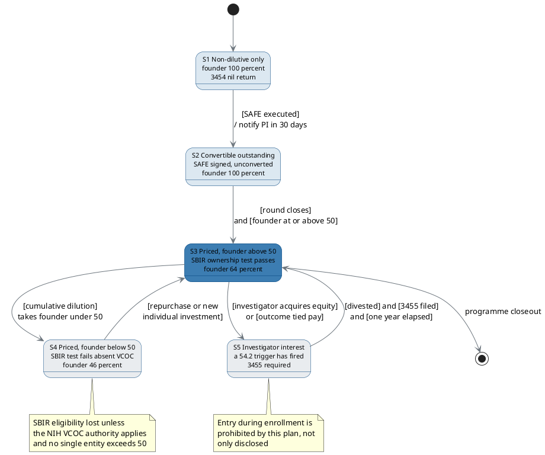

# Figure 10 - The 21 CFR part 54 capital firewall as five states with guards

**Type.** plantuml-type, state with guards. **Section.** §4, Non-Dilutive to
Dilutive Bridge. **Perspective.** *Every capital position the company can hold,
and the exact regulatory guard on every transition between them.* No other
figure states permission over money; Figure 12 orders the same round in time,
and Figure 11 draws the tiers as objects rather than as states.

**Caption (three balanced lines, 62 to 65 characters).**

```
The capital firewall as five states. Two of them, below the rule,
may not be entered while a participant is on study. Every guard
names its own regulation and the form the entry would require.
```

## PlantUML source



## The five states, with the regulation on each

| State | Position | Governing test | Form | Permitted during enrollment |
|:--|:--|:--|:--|:--|
| S1 | Non-dilutive only, founder 100 percent | 13 CFR 121.702 ownership | 3454, nil return | Yes |
| S2 | Convertible outstanding, unconverted | 13 CFR 121.702 ownership | 3454, nil return | Yes |
| S3 | Priced, founder 64 percent | 13 CFR 121.702 ownership | 3454, nil return | Yes |
| S4 | Priced, founder 46 percent | 13 CFR 121.702, VCOC exception | 3454, nil return | No, by plan |
| S5 | An investigator holds a §54.2 interest | 21 CFR §54.2, §54.4 | 3455, disclosure | No, by plan |

## The §54.2 and §54.4 triggers that move S3 to S5

| Trigger | Citation | Threshold |
|:--|:--|:--|
| Compensation affected by study outcome | §54.2(a) | Any amount |
| Significant equity, sponsor not publicly traded | §54.2(b) | Any equity interest |
| Significant equity, sponsor publicly traded | §54.2(b) | Above $50,000 |
| Proprietary interest in the tested product | §54.2(f) | Any patent, licence or royalty |
| Significant payments of other sorts | §54.4(a)(3)(ii) | Above $25,000 beyond study cost |

The disclosure period runs for the duration of the study and one year after its
completion, which is why the S5 to S3 return guard carries an elapsed-time term
that none of the other guards has.

## TikZ construction notes

Canvas 14.6 by 7.6 cm. One horizontal spine for the three permitted states and
one band beneath a rule for the two prohibited ones. The rule is the firewall,
and it is the only full-width element in the figure.

| Element | Style token | Placement |
|:--|:--|:--|
| Initial pseudostate | `umlinit` | x = -0.30, y = 0 |
| S1 non-dilutive | `umlstatesoft`, `text width=30mm` | x = 1.15, y = 0 |
| S2 convertible | `umlstatesoft`, `text width=30mm` | x = 5.55, y = 0 |
| S3 priced above 50 | `umlstateon`, `text width=30mm` | x = 9.95, y = 0 |
| Final pseudostate | `umlfinal` | x = 13.55, y = 0 |
| Firewall rule | `protoblue`, 1.1 pt, dashed | Full width at y = -1.95, x = -0.30 to 14.10 |
| Firewall label | `\scriptsize\sffamily\bfseries`, `text=protoblue` | Anchored west on the rule, `fill=protowhite`, x = 0.10 |
| S4 below 50 | `umlstategray`, `text width=30mm` | x = 5.55, y = -3.35 |
| S5 investigator interest | `umlstategray`, `text width=30mm` | x = 10.75, y = -3.35 |
| Spine transitions | `umlarrow` | Straight, horizontal, at y = 0 |
| S3 to S4 | `umlarrow`, `bend right=18` | Crosses the rule once, at x = 7.90 |
| S4 to S3 | `umldash`, `bend right=18` | Returns on the mirrored path, 4 mm clear of the outbound |
| S3 to S5 | `umlarrow`, `bend left=14` | Crosses the rule once, at x = 11.85 |
| S5 to S3 | `umldash`, `bend left=14` | Mirrored, 4 mm clear |
| Guards | `umlguard` | Two lines, centred on the transition, raised 3.4 mm, white fill |
| Notes on S4 and S5 | `umlnote`, `text width=38mm` | Anchored north, 4 mm beneath each prohibited state |
| In-figure note | `pnote`, `text width=134mm` | x = -0.30, y = -6.35 |

Crossing discipline: exactly four edges cross the firewall rule, at x = 7.90 and
x = 11.85, in outbound and return pairs 4 mm apart. No other ink crosses the
rule, so the rule reads as a boundary rather than as decoration.

Guard placement: every guard sits above its own transition at a fixed 3.4 mm
offset with a white fill, never inside a state label. The two guards on the
crossing pairs are set outside the rule band, above y = -1.55 or below
y = -2.35, so no guard text sits on the firewall itself.

## Repository sources

- 21 CFR part 54, Financial Disclosure by Clinical Investigators, §54.2 and §54.4
- 13 CFR 121.702, the SBIR ownership and control eligibility test
- Forms FDA 3454 and 3455
- `funding/capitalization-plan/d2/fig-11-capital-tiers.md` - the three tiers whose occupancy these states describe
- `funding/pdac-funding-applications/final-apply/sections/sec-08-budget-and-leverage.tex` - the non-federal cost-share framing this figure constrains
