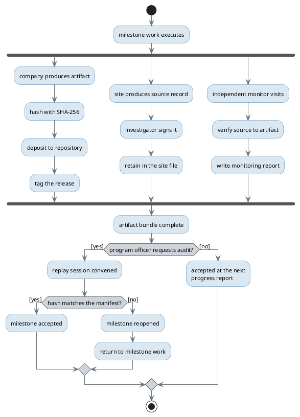

# Figure 15 - Evidence production and program-officer audit, running concurrently

**Type.** plantuml-type, activity with fork and join. **Section.** §5, Twelve
Milestones a Program Officer Can Audit. **Perspective.** *What three parties do
at the same time to close one milestone, and the single step that can send a
closed milestone backwards.* No other figure shows concurrency; Figure 13 shows
the twelve milestones in sequence and says nothing about what happens inside one.

**Caption (three balanced lines, 62 to 64 characters).**

```
One milestone, three concurrent evidence branches, and the join
that has to close before a program officer can audit anything.
The replay is the only step that can send a milestone backwards.
```

## PlantUML source



## The three branches, and who owns each

| Branch | Owner | Output | Cost carried in | Retention |
|:--|:--|:--|:--|:--|
| A, artifact | ChemicalQDevice | Hashed deposit and release tag | The milestone's own line | Permanent, public |
| B, source record | UC San Diego Moores | Signed source document | Site clinical conduct | Two years past the last approval |
| C, verification | Independent monitor | Monitoring report | Independent safety monitoring | Sponsor file, permanent |

The three branches must join before an audit can begin, because an audit
compares them: the hash proves the artifact has not moved, the source record
proves the artifact describes something that happened, and the monitoring report
proves a third party looked at both. Any one alone is a claim, not evidence.

## TikZ construction notes

Canvas 14.0 by 10.4 cm. Drawn top down, because an activity with a fork and a
join is genuinely a hierarchy in time and is the one figure in this paper where
`TB` is correct.

| Element | Style token | Placement |
|:--|:--|:--|
| Initial node | `umlinit` | x = 6.90, y = 0 |
| Milestone work | `umlbox`, `text width=34mm` | x = 6.90, y = -0.85 |
| Fork bar | `umlbar`, `minimum width=88mm` | x = 6.90, y = -1.75 |
| Branch A steps | `umlbox`, `text width=27mm` | x = 1.55, y = -2.55, -3.55, -4.55, -5.55 |
| Branch B steps | `umlbox`, `text width=27mm` | x = 6.90, y = -2.55, -3.55, -4.55 |
| Branch C steps | `umlbox`, `text width=27mm` | x = 12.25, y = -2.55, -3.55, -4.55 |
| Branch titles | `d2title` | Anchored south, 4 mm above each branch's first step |
| Join bar | `umlbar`, `minimum width=88mm` | x = 6.90, y = -6.35 |
| Bundle complete | `umlkey`, `text width=34mm` | x = 6.90, y = -7.15 |
| Audit decision | `mmdec`, `text width=22mm` | x = 6.90, y = -8.20 |
| Hash decision | `mmdec`, `text width=22mm` | x = 3.30, y = -9.35 |
| Accepted | `umlstateon`, `text width=26mm` | x = 10.60, y = -9.35 |
| Reopened | `umlstategray`, `text width=26mm` | x = 0.55, y = -10.45 |
| Final node | `umlfinal` | x = 13.35, y = -10.45 |
| Fork and join edges | `umlarrow` | Vertical only, from the bar to each branch head |
| Return edge | `umldash`, `bend left=36` | Reopened back to milestone work, routed outside the branch band on the left at x = -0.30 |
| Guard labels | `umlguard` | On the decision exits, offset 3.0 mm, white fill |
| In-figure note | `pnote`, `text width=132mm` | x = -0.30, y = -11.35 |

Branch pitch is 5.35 cm horizontally and 1.00 cm vertically. A 27 mm box at
`\scriptsize` is 2.70 cm wide, so 2.65 cm of clear space separates adjacent
branches, well past the 6 mm floor.

The return edge is the only long edge on the canvas. It takes `bend left=36`
and is routed at x = -0.30, outside the leftmost branch column, so it passes no
node at less than 8 mm. Branch A has four steps and branches B and C have three,
so branch A's fourth step sits alone at y = -5.55 with nothing beside it; the
join bar is placed at y = -6.35 to keep 0.8 cm below that lowest step.

## Repository sources

- `funding/capitalization-plan/mermaid/fig-13-twelve-milestone-calendar.md` - the twelve milestones this activity runs once per milestone
- `trial-protocol/` - the source-record and monitoring obligations on the site
- `trial-ind/` - the sponsor retention obligations under 21 CFR §312.57 and §312.62
- `funding/pdac-funding-applications/final-apply/sections/sec-06-physical-ai-governance.tex` - the hash-and-replay method branch A implements
- 21 CFR §312.62, record retention for two years after the last marketing approval or investigation discontinuation
