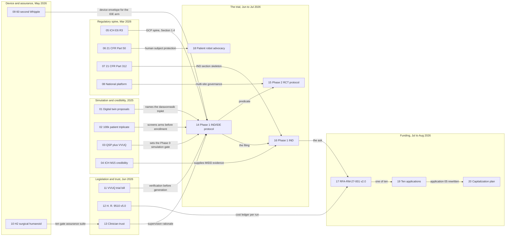

# pdac-presentation - LLM Pancreatic Oncology Clinical Trial System (v0.9.0)

[](https://github.com/kevinkawchak/Clinical-AI-Demos/blob/main/releases.md)
[](slides/)
[](abstracts/README.md)
[](cover-images/extracted/)
[](slides/)
[](#palette)
[](#the-deck)
[](https://www.python.org/)
[](../LICENSE)

**A seminar deck for a startup CEO presenting to a leading university comprehensive
cancer center: twenty deposited papers, in chronological order, and the Phase 1
LLM-directed robotic Whipple trial they were written to support.**

---

## The deck

| Field | Value |
|:--|:--|
| Title | LLM Pancreatic Oncology Clinical Trial System: Large Documents, Funding, and AI Peer Review |
| Author | Kevin Kawchak, Chief Executive Officer, ChemicalQDevice |
| Date | Friday, August 14, 2026 |
| Audience | Oncology trials seminar, university comprehensive cancer center |
| Orientation | 16:9 landscape, 13.333 in by 7.5 in |
| Slides | 23 total: 1 title, 20 paper slides, 2 reference slides |
| Formats | [`.pptx`](slides/LLM-Pancreatic-Oncology-Clinical-Trial-System.pptx) and [`.pdf`](slides/LLM-Pancreatic-Oncology-Clinical-Trial-System.pdf) |
| Page numbers | Lower right corner of every slide |
| Footer | Author on the left, date centered, page number right, on every slide |
| References | Last two slides, twenty entries, every DOI hyperlinked to `https://doi.org` |

Nothing in the deck is an approved protocol, an active IND, or an enacted statute.
Every slide carries independent research and every artifact it names is deposited
under a digital object identifier and readable today.

## What is in this directory

```
pdac-presentation/
  README.md                    # This file
  abstracts/                   # Abstract of record for every paper the deck cites
    README.md                  # Index plus the full deposited abstract corpus
  build/                       # The reproducible build, four Python modules
    README.md
    extract_covers.py          # 19 covers out of the source .docx, in document order
    render_cover_20.py         # The one cover the source document does not carry
    slide_content.py           # The seven-line evaluation of each of the 20 papers
    build_deck.py              # python-pptx renderer plus the single-line fit check
    export_pdf.py              # Headless LibreOffice Impress PDF export
  cover-images/                # Cover art, source and extracted
    README.md
    ChemicalQDevice-PDAC-Covers-13Aug26.docx
    extracted/
      README.md
      cover-01-...jpg .. cover-20-...jpg
  prompts/                     # The prompt of record and the build output of record
    README.md
    prompt-pdac.md
    output-pdac.md
  slides/                      # The deliverables
    README.md
    LLM-Pancreatic-Oncology-Clinical-Trial-System.pptx
    LLM-Pancreatic-Oncology-Clinical-Trial-System.pdf
  theme/                       # The trial the deck is arguing for
    README.md
    update-final-LaTeX.zip
```

## Slide anatomy

Every paper slide carries one cover image and one seven-line evaluation. The two
framing lines and the two or three synthesis lines are square bullets; the three
evaluative axes are an arabic numbered list, because they read as a set.

```
+-----------------------------------------------------------------------------+
| LLM Pancreatic Oncology Clinical Trial System: ...   Paper 07 of 20 | DOI    |  running header
|=============================================================================|  navy rule
| 07.  Adaption: 21 CFR Part 312, Investigational New Drug Application         |  serif headline
| ====                                                                        |  accent rule
|                                                                             |
|  +---------------------+     - Paper Title:  ...                            |
|  |                     |     - Abstract:     ...                            |
|  |    cover image      |     1. Strengths:   ...                            |
|  |    (white page,     |     2. Limitations: ...                            |
|  |     thin border)    |     3. Results:     ...                            |
|  |                     |                                                    |
|  |                     |    +-------------------------------------------+   |
|  |                     |    | - LLM Trust:   ...                        |   |  pale panel
|  +---------------------+    | - LLM Benefit: ...                        |   |
|                             +-------------------------------------------+   |
|-----------------------------------------------------------------------------|
| Kevin Kawchak, CEO ChemicalQDevice   Friday, August 14, 2026              7 |  footer
+-----------------------------------------------------------------------------+
```

| Line | What it answers |
|:--|:--|
| Paper Title | What was deposited, and on what date |
| Abstract | The one sentence the paper's own abstract of record supports |
| Strengths | What the work does that a trialist would call sound |
| Limitations | What it does not do, stated by the paper itself rather than softened |
| Results | The number the paper actually reports |
| LLM Trust | How the paper made an LLM-based pancreatic cancer trial more trustworthy than it was before the paper existed |
| LLM Benefit | What the paper contributes to the upcoming LLM-enabled trial in [`theme/`](theme/) |

Two papers need more than one synthesis line and take it rather than being
compressed into a line that would misstate them: paper 13 carries a second
**LLM Trust** line, and papers 14 and 20 carry a second **LLM Benefit** line.

## Cover image cadence

Four consecutive left-hand covers, then one right-hand cover, repeating. Papers
5, 10, 15 and 20 are the right-hand covers. `slide_content.side_for()` is the
single source of truth for the rule, so the cadence cannot drift.

```
paper   1  2  3  4  5   6  7  8  9 10  11 12 13 14 15  16 17 18 19 20
side    L  L  L  L  R   L  L  L  L  R   L  L  L  L  R   L  L  L  L  R
```

## The twenty papers

| # | Paper | Deposited | DOI | Cover |
|--:|:--|:--|:--|:--|
| 1 | End-to-End PDAC Digital Twin Clinical Trial Proposals | Jun 24, 2025 | [10.5281/zenodo.15735068](https://doi.org/10.5281/zenodo.15735068) | left |
| 2 | ChatGPT 100,000 Patient In Silico Phase III Triplicate | Jul 24, 2025 | [10.5281/zenodo.16415815](https://doi.org/10.5281/zenodo.16415815) | left |
| 3 | QSP Metastatic PDAC Simulation: Code, VVUQ, and Playbook | Aug 29, 2025 | [10.5281/zenodo.17001137](https://doi.org/10.5281/zenodo.17001137) | left |
| 4 | Accelerating FDA Compliance of in silico Trials via Digital Twin | Sep 30, 2025 | [10.5281/zenodo.17239510](https://doi.org/10.5281/zenodo.17239510) | left |
| 5 | Adaption: ICH Harmonised Guideline | Mar 12, 2026 | [10.5281/zenodo.18973368](https://doi.org/10.5281/zenodo.18973368) | right |
| 6 | Adaption: 21 CFR Part 50 | Mar 16, 2026 | [10.5281/zenodo.19040707](https://doi.org/10.5281/zenodo.19040707) | left |
| 7 | Adaption: 21 CFR Part 312 | Mar 17, 2026 | [10.5281/zenodo.19057628](https://doi.org/10.5281/zenodo.19057628) | left |
| 8 | National Platform for Physical AI Oncology Trials | Mar 28, 2026 | [10.5281/zenodo.19244918](https://doi.org/10.5281/zenodo.19244918) | left |
| 9 | 2030: 60 Second PDAC Robotic Whipple and Daraxonrasib Simulation | May 15, 2026 | [10.5281/zenodo.20196639](https://doi.org/10.5281/zenodo.20196639) | left |
| 10 | Mobile Pancreatic Cancer Unitree H2 Surgical Humanoid | May 28, 2026 | [10.5281/zenodo.20421754](https://doi.org/10.5281/zenodo.20421754) | right |
| 11 | VVUQ Physical AI Oncology Trial Bill | May 30, 2026 | [10.5281/zenodo.20454870](https://doi.org/10.5281/zenodo.20454870) | left |
| 12 | H. R. 9510 (Bill v5.0) 2026 | Jun 10, 2026 | [10.5281/zenodo.20619762](https://doi.org/10.5281/zenodo.20619762) | left |
| 13 | Earning the Clinician's Trust | Jun 16, 2026 | [10.5281/zenodo.20710602](https://doi.org/10.5281/zenodo.20710602) | left |
| 14 | On-Premises LLM-Directed Robotic Whipple, Phase 1 IND/IDE | Jun 21, 2026 | [10.5281/zenodo.20780121](https://doi.org/10.5281/zenodo.20780121) | left |
| 15 | Phase 2 Daraxonrasib + LLM Guided Robotic PDAC Whipple | Jun 23, 2026 | [10.5281/zenodo.20807027](https://doi.org/10.5281/zenodo.20807027) | right |
| 16 | Investigational New Drug Application, Daraxonrasib Phase 1 | Jul 1, 2026 | [10.5281/zenodo.21097442](https://doi.org/10.5281/zenodo.21097442) | left |
| 17 | Clinical Trial Funding Application v2.0, RFA-RM-27-001 | Jul 12, 2026 | [10.5281/zenodo.21317266](https://doi.org/10.5281/zenodo.21317266) | left |
| 18 | Patient Robot Advocacy | Jul 31, 2026 | [10.5281/zenodo.21720120](https://doi.org/10.5281/zenodo.21720120) | left |
| 19 | 10 Funding Applications | Aug 4, 2026 | [10.5281/zenodo.21787424](https://doi.org/10.5281/zenodo.21787424) | left |
| 20 | From Independent Scientist to Novel Performer | Aug 11, 2026 | [10.5281/zenodo.21887807](https://doi.org/10.5281/zenodo.21887807) | right |

## The argument the twenty papers make

The deck is chronological because the case is cumulative. Each row hands the next
one something it could not have produced on its own.



## Palette

The deck uses exactly five colors, plus white and a near-black ink for body copy.
Every slide ground is white, because all twenty covers are white-page scans and a
dark ground frames them badly.

| Swatch | Hex | Role |
|:--|:--|:--|
| Navy | `#002f5f` | Headlines, rules, labels, page numbers, panel edge |
| Gray | `#666666` | Running header, footer, secondary copy |
| Accent blue | `#407cb9` | Bullet glyphs, synthesis labels, hyperlinks, accent rules |
| Pale | `#e3eaee` | Statistic tiles and the LLM Trust and LLM Benefit panel |
| Silver | `#dcdcdc` | Cover image border, hairline rules |

## Reproducing the deck

```bash
# From the repository root
pip install python-pptx pillow

python pdac-presentation/build/extract_covers.py     # 19 covers from the source .docx
python pdac-presentation/build/render_cover_20.py    # the reconstructed 20th cover
python pdac-presentation/build/build_deck.py         # writes the .pptx, fit check first
python pdac-presentation/build/export_pdf.py         # writes the .pdf (LibreOffice Impress)
```

`build_deck.py` refuses to write the deck if any bullet or numbered item would
wrap onto a second line. See [`build/README.md`](build/README.md) for how the
check works and what to do when it fires.

## Provenance and known gaps

Two facts about the source material are stated here rather than buried, because a
seminar audience is entitled to both.

1. **Nineteen covers, twenty papers.** `ChemicalQDevice-PDAC-Covers-13Aug26.docx`
   was assembled on August 13, 2026 and does not carry a cover page for paper 20,
   *From Independent Scientist to Novel Performer* (deposited August 11, 2026).
   `render_cover_20.py` reconstructs that page from the paper's own deposited
   front matter and abstract of record. The reconstructed page says so on its
   face, in a footer line, so it cannot be mistaken for the deposited PDF.
2. **Nineteen abstracts, twenty papers.** `abstracts/README.md` does not carry an
   entry for paper 19, *10 Funding Applications* (10.5281/zenodo.21787424). Its
   slide is built from that paper's own cover page, which carries the full table
   of contents and the ten-recipient roster, and from Table 17 and Section 6 of
   [`theme/update-final-LaTeX.zip`](theme/), which lists all ten mechanisms, terms
   and asks. No quantity on that slide is estimated.

## Related directories

| Path | Relationship |
|:--|:--|
| [`abstracts/`](abstracts/) | The abstract of record behind every Abstract, Strengths, Limitations and Results line |
| [`theme/`](theme/) | The trial system paper the LLM Trust and LLM Benefit lines argue toward |
| [`cover-images/`](cover-images/) | The source Word document and the twenty extracted covers |
| [`build/`](build/) | The four-module reproducible build |
| [`slides/`](slides/) | The `.pptx` and `.pdf` deliverables |
| [`prompts/`](prompts/) | The verbatim prompt and the verbatim build output |
| [`../README.md`](../README.md) | Repository overview and release history |
| [`../releases.md`](../releases.md) | v0.9.0 release notes |

## Disclaimer

Independent research. Not medical or regulatory advice. Not endorsed or sponsored
by the FDA, NIH, HHS, an IRB, ICH, CFR, a trial sponsor, a contract research
organization, a clinical site, a regulator, or a medical society. No trial
described in this deck is active or approved.
