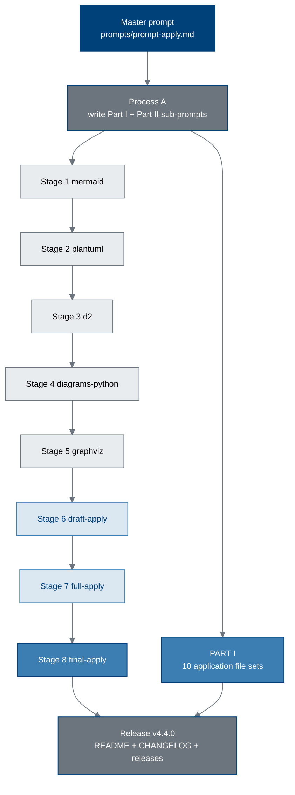

# pdac-funding-applications - 10 Independent-Scientist Applications + Summary Paper (v4.4.0)

[](https://creativecommons.org/licenses/by/4.0/)
[](applications)
[](../science-golden-age)
[](../science-golden-age/chunk-03-chapter-two-revitalizing-science-and-technology-enterprise.md)
[](../potential-partners/UC-San-Diego)
[](final-apply)
[](sub-prompts)
[](https://orcid.org/0009-0007-5457-8667)
[](../../README.md)
[](https://doi.org/10.5281/zenodo.xxxxxxxx)

This directory builds two deliverables from one master prompt
([`prompts/prompt-apply.md`](prompts/prompt-apply.md)):

- **PART I.** Ten complete, recipient-unique **Phase 1 pancreatic cancer trial
  funding application email file sets** (no DOIs), each written in Kevin
  Kawchak's name as an **independent scientist** under the funding approach set
  out in the White House report *Science: A New Golden Age*, and each stating
  the intent to partner at **UC San Diego Moores Cancer Center**. Five are
  written from a surgical perspective and five from a medical oncology
  perspective; both sets describe the same hybrid procedure, which carries
  surgical and medical oncology arms together.
- **PART II.** One **summary paper** (one DOI) describing the ten applications,
  built through the eight-stage sub-prompt schedule below, at approximately one
  quarter of the character count of the parent
  [`patient-robot-advocacy`](../supplementary/source-files) source set.

Nothing here is a submission of record. Every application is a draft the author
compiles, verifies, and sends; every recipient address must be confirmed against
the funder's current published contact page before use.

---

## 1. Build pipeline



## 2. Milestone schedule (one pull request, updated as each lands)

| Milestone | Stage | Output directory | Status |
|:--|:--|:--|:--|
| M0 | Bootstrap (Process A) | `prompts/`, `sub-prompts/` | complete |
| M1 | PART I, applications 01-05 (surgical) | [`applications/`](applications) | pending |
| M2 | PART I, applications 06-10 (medical oncology) | [`applications/`](applications) | pending |
| M3 | PART II Stage 1, mermaid-type | [`mermaid/`](mermaid) | pending |
| M4 | PART II Stage 2, plantuml-type | [`plantuml/`](plantuml) | pending |
| M5 | PART II Stage 3, d2-type | [`d2/`](d2) | pending |
| M6 | PART II Stage 4, diagrams-python-type | [`diagrams-python/`](diagrams-python) | pending |
| M7 | PART II Stage 5, graphviz-type | [`graphviz/`](graphviz) | pending |
| M8 | PART II Stage 6, draft-apply | [`draft-apply/`](draft-apply) | pending |
| M9 | PART II Stage 7, full-apply | [`full-apply/`](full-apply) | pending |
| M10 | PART II Stage 8, final-apply | [`final-apply/`](final-apply) | pending |
| M11 | Release v4.4.0 | root `README.md`, `CHANGELOG.md`, `releases.md` | pending |

## 3. Directory map

```
funding/pdac-funding-applications/
  README.md                  this build hub
  prompts/                   prompt-apply.md (master, verbatim) + output-apply.md
  sub-prompts/
    part-i/                  5 sub-prompts driving the ten application file sets
    part-ii/                 8 sub-prompts driving the summary paper
  applications/              PART I: ten recipient-unique email file sets
    app-01-nih-pioneer-award/        .. app-05-nih-sbir-seed/      (surgical)
    app-06-fnih-amp/                 .. app-10-ucsd-moores-engine/ (medical onc)
  mermaid/         (Stage 1) mermaid-type figure specifications
  plantuml/        (Stage 2) plantuml-type figure specifications
  d2/              (Stage 3) d2-type figure specifications
  diagrams-python/ (Stage 4) diagrams (python)-type figure specifications
  graphviz/        (Stage 5) graphviz-type figure specifications
  draft-apply/     (Stage 6) main.tex, applystyle.sty, references.bib, sections/, zip
  full-apply/      (Stage 7) same set, fully written
  final-apply/     (Stage 8) same set, senior-author polished (no publication/)
```

## 4. The ten applications

Set A is written from a surgical perspective, Set B from a medical oncology
perspective. Both sets describe the same hybrid operation: an eight-arm robotic
pancreaticoduodenectomy with perioperative daraxonrasib (RMC-6236) and an
on-premises, advisory-only LLM.

| # | Directory | Recipient program | *Golden Age* anchor |
|:--|:--|:--|:--|
| 01 | [`app-01-nih-pioneer-award`](applications/app-01-nih-pioneer-award) | NIH Common Fund, Director's Pioneer Award | Long-horizon person-based grants "modeled on NIH Director's Pioneer Award" |
| 02 | [`app-02-arpa-h`](applications/app-02-arpa-h) | ARPA-H mission office | The ARPA program-manager model; ARPA-H and ARPA-E |
| 03 | [`app-03-nsf-tip-x-labs`](applications/app-03-nsf-tip-x-labs) | NSF TIP Directorate, X-Labs | First federal program funding independent research organizations outside academia |
| 04 | [`app-04-doe-genesis-mission`](applications/app-04-doe-genesis-mission) | DOE Office of Science, Genesis Mission | EO 14363; the Robotics national mission and physical AI-driven discovery |
| 05 | [`app-05-nih-sbir-seed`](applications/app-05-nih-sbir-seed) | NIH SEED, SBIR/STTR | "Programs like SBIR open doors for technician-founded ventures" |
| 06 | [`app-06-fnih-amp`](applications/app-06-fnih-amp) | Foundation for the NIH, AMP | FNIH and the Accelerating Medicines Partnership held up as the model |
| 07 | [`app-07-hhmi-investigator`](applications/app-07-hhmi-investigator) | HHMI Investigator Program | Person-based funding of roughly $10M over seven years |
| 08 | [`app-08-nci-ctep`](applications/app-08-nci-ctep) | NCI Cancer Therapy Evaluation Program | Biological-sciences priority; the report's own cancer framing |
| 09 | [`app-09-convergent-fro`](applications/app-09-convergent-fro) | Convergent Research, FRO program | Focused research organizations as time-bound nonprofit research startups |
| 10 | [`app-10-ucsd-moores-engine`](applications/app-10-ucsd-moores-engine) | UC San Diego Moores Cancer Center | Regional innovation clusters; non-federal cost share |

## 5. Files used from other directories (Rule 5)

| Source | Used where |
|:--|:--|
| [`../science-golden-age/chunk-01`](../science-golden-age/chunk-01-front-matter-and-summary.md) | The four transmittal-letter goals and the "individual scientist over legacy institutions" framing, quoted in every application's opening section |
| [`../science-golden-age/chunk-03`](../science-golden-age/chunk-03-chapter-two-revitalizing-science-and-technology-enterprise.md) | The $200 billion annual federal R&D portfolio, the incumbency tax, mid-scale science, HHMI-style person funding, fast grants, golden tickets |
| [`../science-golden-age/chunk-04`](../science-golden-age/chunk-04-chapter-three-securing-dominance-in-critical-and-emerging-technologies.md) | Clinical-trial economics, FDA reform, FNIH/AMP, user facilities, cost share |
| [`../science-golden-age/chunk-05`](../science-golden-age/chunk-05-chapter-four-science-and-technology-better-lives-of-all-americans.md) | Craft, technicians, and regional clusters (application 10) |
| [`../science-golden-age/chunk-06`](../science-golden-age/chunk-06-chapter-five-a-new-golden-age.md) | Genesis Mission, Gold Standard Science, closed-loop autonomous experimentation (applications 04 and 09) |
| [`../science-golden-age/chunk-08`](../science-golden-age/chunk-08-annex-fiscal-year-2028-research-and-development-budget-priorities.md) | The six national missions, long-duration grants, fast grants, 3:1 prize leverage, cost share |
| [`../science-golden-age/chunk-09`, `chunk-10`](../science-golden-age) | BibTeX keys for every *Golden Age* citation used in the applications and the paper |
| [`../RFA-RM-27-001-v2/LaTeX Source Files.zip`](../RFA-RM-27-001-v2) | Trial synopsis numbers, budget figures, endpoint wording, and `references.bib` entries reused here |
| [`../supplementary/source-files/patient-robot-advocacy.zip`](../supplementary/source-files) | Color scheme, the five TikZ diagram vocabularies, cover-page and back-matter furniture, table-column conventions |
| [`../supplementary/source-files/Daraxonrasib-Efficient-LLM-Trial-Simulations.zip`](../supplementary/source-files) | Simulation quantitative data: QSP mOS and HR values, credibility scores, LLM cost comparisons |
| [`../supplementary/source-files/Physical-AI-Oncology-Trial-Competition-Proposal.zip`](../supplementary/source-files) | The first released proposal time point, used for the program chronology table |
| [`../supplementary/Physical AI Oncology Trial Founding Documents.md`](../supplementary) | The fourteen prior works and their DOIs, used in every application's prior-work table |
| [`../daraxonrasib-llm-story.md`](../daraxonrasib-llm-story.md) | The June 2025 to July 2026 LLM chronology and the QSP versus RASolute 302 comparison |
| [`../tripartisan-llm-support.md`](../tripartisan-llm-support.md) | The three frontier-model roles table used in the governance sections |
| [`../potential-partners/UC-San-Diego`](../potential-partners/UC-San-Diego) | The partnership sequence, required positioning, and success criteria for Moores Cancer Center |
| [`../../trial-ind`](../../trial-ind) | The sub-prompt, directory, and commit conventions this build adapts |

## 6. Conventions carried from `trial-ind`

- One `sections/*.tex` per paper section, one commit per file (Rule 6).
- The second-to-last commit of every stage fixes errors; the last commit performs
  the remaining repository updates (Rule 7).
- Every stage emits its own Overleaf-ready `.zip` alongside the loose sources
  (Rule 13).
- Every commit is pushed the moment it is made, so the branch can be monitored
  without intervention (Rule 8).

## 7. License

Creative Commons Attribution 4.0 International (CC BY 4.0).
