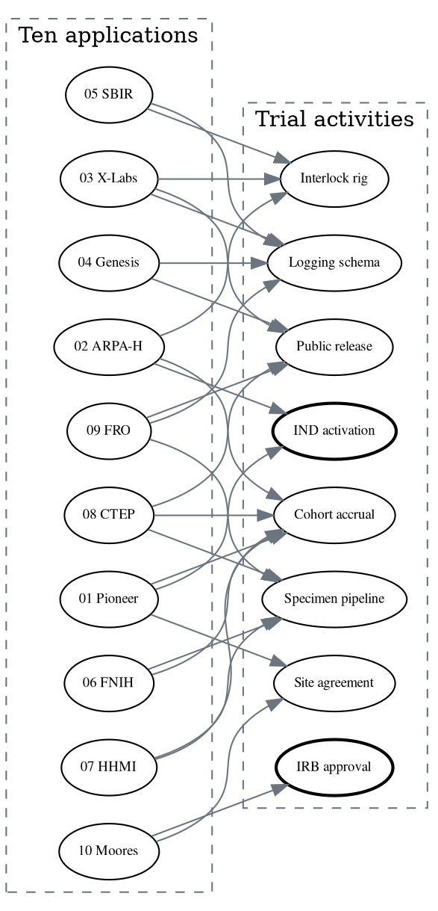

# Figure 6 - Which award unblocks which activity

**Type.** graphviz-type, directed acyclic graph. **Section.** §2, The Ten
Applications. **Perspective.** *Redundancy.* Application 01's Figure 3 shows one
award's dependencies; this shows all ten against the same activity set, and the
result is that only two activities have a single upstream source.

**Caption (three balanced lines, 63 to 67 characters each).**

```
Ten awards against eight trial activities. Six activities have two or
more upstream awards and survive any single refusal; the two that do
not are drawn heavier, and both are regulatory.
```

## DOT source



## TikZ construction notes

| Element | Style token | Placement |
|:--|:--|:--|
| Award cluster | `gvcluster` dashed, corner title | Left, ten `gvnode` ellipses in two columns of five, x = 0 and 2.4, y pitch 1.15 |
| Activity cluster | `gvcluster2` dashed | Right, eight `gvbox` at x = 8.6, y pitch 1.35 |
| Single-source activities | `gvboxk` filled Corporate Blue, 0.9pt stroke | IND activation and IRB approval only |
| Edges | `gvedge` thin black | Twenty-three edges routed through a 2.2-wide corridor at x = 5.0 to 7.0 so none passes under an ellipse |
| Corridor | Unfilled | Left deliberately empty; the density of the corridor is part of the reading |

Two columns of awards keeps the left cluster the same height as the right one,
which stops the edge fan from crossing itself at the top and bottom.

## Repository sources

- Each `funding/pdac-funding-applications/applications/app-*/sections/sec-05-budget-site.tex` - the activity each ask funds
- `funding/pdac-funding-applications/applications/app-01-nih-pioneer-award/sections/sec-05-budget-site.tex` - the single-source finding this figure generalises
- `funding/potential-partners/UC-San-Diego/priority-steps.md` - the site agreement and IRB activities
