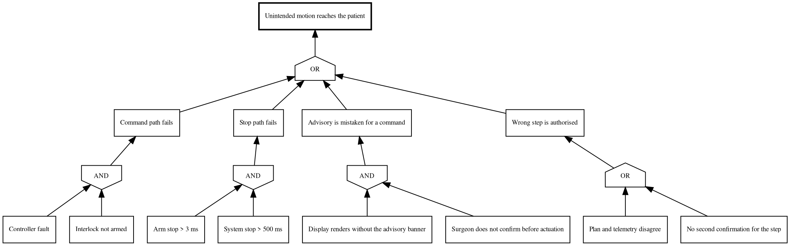

# Figure 10 - Every path to an unsafe state, and the gate that has to fail first

**Type.** graphviz-type, fault tree with AND and OR gates. **Section.** §6,
Physical AI Governance. **Perspective.** *Failure propagation.* Application 02's
Figure 4 is a programme fault tree, about the award; this is a clinical fault
tree, about the patient, and the two share no node.

**Caption (three balanced lines, 62 to 66 characters each).**

```
One top event and every path to it. Three of the four branches are
AND gates, so no single failure reaches the patient, and the one OR
branch is the one governed by procedure rather than by hardware.
```

## DOT source



## TikZ construction notes

| Element | Style token | Placement |
|:--|:--|:--|
| Top event | `gvboxk`, 0.9pt stroke | y = 0, centred at x = 5.6 |
| Top gate | `\umlgateor` | y = -1.05, directly beneath the top event |
| Four branches | `gvboxs` | y = -2.4, x = 0.4, 3.9, 7.4, 10.9 |
| Four gates | `\umlgateand` three times, `\umlgateor` once | y = -3.45, each directly beneath its branch |
| Eight leaves | `gvboxg` | y = -4.9, two per branch at a 1.7 offset |
| Edges | `gvedge` | Every edge is vertical or near-vertical; no edge crosses a gate glyph |

The one OR branch, "wrong step is authorised", is the only branch whose leaves
are both procedural. Marking it visually is the figure's argument: hardware
redundancy does not cover a procedural gap.

## Repository sources

- `funding/pdac-funding-applications/applications/app-01-nih-pioneer-award/sections/sec-04-operation-governance.tex` - the 3 ms and 500 ms stop specifications
- `funding/pdac-funding-applications/applications/app-02-arpa-h/sections/sec-05-budget-site.tex` - the programme fault tree this one complements
- `funding/pdac-funding-applications/applications/app-04-doe-genesis-mission/sections/sec-02-mechanism-fit.tex` - the absent command path
