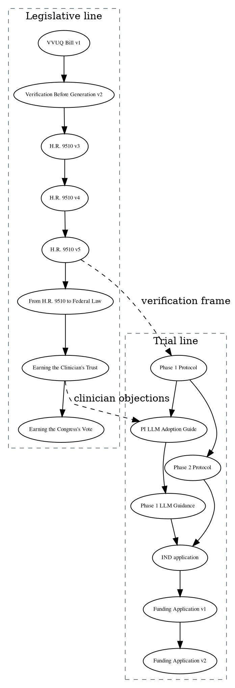

# Figure 16 - The fourteen founding documents and how each feeds the next

**Type.** graphviz-type, citation graph. **Section.** §5, Trial Evidence.
**Perspective.** *Provenance.* Figure 4 puts the same works on a time axis; this
puts them in a citation order, and the two disagree in one place, which is the
point.

**Caption (three balanced lines, 64 to 68 characters each).**

```
Fourteen deposited works and the citation edges between them. The
bill line and the trial line run in parallel and meet only twice,
which is why the legislative drafts are not on the trial's path.
```

## DOT source



## TikZ construction notes

| Element | Style token | Placement |
|:--|:--|:--|
| Two clusters | `gvcluster` legislative, `gvcluster2` trial | Left column x = 0 to 3.2, right column x = 6.4 to 10.6, so the two lines are visibly parallel |
| Fourteen nodes | `gvnode`, `gvkey` for the two junction nodes | Vertical pitch 1.3 within each cluster |
| In-line edges | `gvedge` solid | Never leave their cluster |
| Cross edges | `gvedged` dashed with a label | Exactly two, drawn horizontally so they are the only edges crossing the gap |
| Gap | 3.2 wide, unfilled | The emptiness is the argument |

Only two dashed edges cross the gap. Drawing them horizontally and leaving the
corridor otherwise empty makes the separation legible at a glance.

## Repository sources

- `funding/supplementary/Physical AI Oncology Trial Founding Documents.md` - all fourteen works and their DOIs
- `funding/RFA-RM-27-001/` and `funding/RFA-RM-27-001-v2/` - the two funding-application nodes
- `funding/daraxonrasib-llm-story.md` - the ordering the citation edges follow
