# Figure 20 - The verification artifacts, field by field

**Type.** graphviz-type, record nodes. **Section.** §10, Risks and Limits.
**Perspective.** *What a sceptic can check.* Figure 15 gives the trial's data
schema for re-analysis; this gives the verification artifacts and, for each
field, the reviewer question it answers, which is a different audience.

**Caption (three balanced lines, 63 to 67 characters each).**

```
Five verification artifacts and the reviewer question each field
answers. Every field is released with the cohort, and the two marked
fields are the ones that can falsify the programme's central claim.
```

## DOT source

```dot
digraph verification {
  rankdir=LR; node [shape=record, fontname="Times", fontsize=8];
  stop  [label="{stop_latency_record|arm_id : int|measured_ms : float|bench_or_intraop : enum|<q> Q: is the interlock as fast as claimed?}"];
  adv   [label="{advisory_decision_record|case_id : uuid|accepted : bool|latency_ms : float|<q> Q: how often is advice rejected?}"];
  esc   [label="{escalation_cohort_record|dose_level : int|dlt_count : int|negative_results : text|<q> Q: were negatives reported?}"];
  sim   [label="{simulation_credibility_record|test_id : int|passed : bool|credibility_score : float|<q> Q: does 81.9 reproduce?}"];
  prov  [label="{provenance_record|artifact_id : uuid|model_commit : sha|reviewer : enum|<q> Q: who checked this, and when?}"];
  stop -> adv -> esc -> sim -> prov [style=invis];
}
```



## TikZ construction notes

| Element | Style token | Placement |
|:--|:--|:--|
| Five records | Header `gvcellh`, three field rows `gvcell`, question row `gvcellg` | Five columns, 2.7cm wide, 0.35 apart; each record is a stack of five anchored cells |
| Falsifying fields | `gvcells` fill on `credibility_score` and `negative_results` | The only two tinted field cells |
| Question row | Italic, `pagrayl` fill | Set apart from the typed fields by a 0.3pt rule |
| No edges | None drawn | The records do not join; joining is Figure 15's subject, and drawing edges here would blur the two |

Drawing no edges is deliberate. Figure 15 is about joins; this figure is about
what a single artifact answers on its own, and an edge would import the wrong
question.

## Repository sources

- `funding/pdac-funding-applications/applications/app-04-doe-genesis-mission/sections/sec-04-operation-governance.tex` - three of the five record types
- `funding/supplementary/source-files/Daraxonrasib-Efficient-LLM-Trial-Simulations.zip` - the 81.9 credibility score and the 55 verification tests
- `funding/pdac-funding-applications/applications/app-09-convergent-fro/sections/sec-03-evidence.tex` - the negative-results release commitment
- `funding/science-golden-age/chunk-06-chapter-five-a-new-golden-age.md` - Gold Standard Science and the acceptance of negative results
