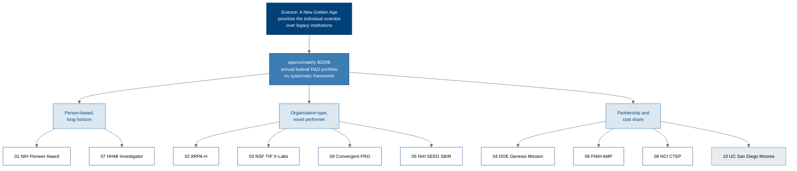

# Figure 1 - From one paragraph of federal policy to ten addressed applications

**Type.** mermaid-type, flowchart. **Section.** §2, The Ten Applications.
**Perspective.** *How a single policy sentence becomes ten specific asks.* No
other figure in the paper traces the policy-to-recipient mapping; Figure 3
tabulates the ten applications but does not show where they come from.

**Caption (three balanced lines, 62 to 66 characters each).**

```
One sentence of federal policy, three mechanism families, and the
ten recipients each family reaches. The split is by mechanism, not
by agency, which is why one recipient is not a federal funder.
```

## Mermaid source



## TikZ construction notes

| Element | Style token | Placement |
|:--|:--|:--|
| Policy sentence | `mmgoal` | Rank 0, centred at x = 5.5 |
| $200B portfolio | `mmmid` | Rank 1, y = -1.9 |
| Three mechanism families | `mmsoft` | Rank 2, y = -3.8, x = 0.6 / 5.5 / 10.4 |
| Ten recipients | `mmin`, and `mmgray` for recipient 10 | Rank 3, y = -6.0, on a 2.35 pitch inside each family |
| Edges | `mmedgeb` down the spine, `mmedge` to leaves | No edge crosses a node: families are separated by 4.9 |

Recipient 10 is set in `mmgray` because it is the only recipient that is not a
funder. The distinction has to be visible without reading the labels.

## Repository sources

- `funding/science-golden-age/chunk-01-front-matter-and-summary.md` - the policy sentence
- `funding/science-golden-age/chunk-03-chapter-two-revitalizing-science-and-technology-enterprise.md` - the $200B finding
- `funding/pdac-funding-applications/applications/README.md` - the ten recipients and their anchors
