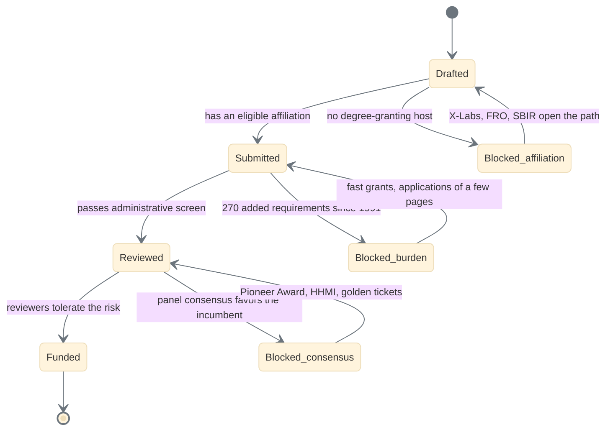

# Figure 2 - The states an independent scientist's proposal passes through

**Type.** mermaid-type, state diagram. **Section.** §1, The Golden Age Mandate.
**Perspective.** *Where the incumbency tax used to stop the loop, and which of
the ten mechanisms removes each stop.* Figure 1 shows the mapping; this shows
the failure states that mapping is meant to eliminate.

**Caption (three balanced lines, 63 to 67 characters each).**

```
The five states a proposal from an unaffiliated scientist passes
through, and the three at which the report says the enterprise
currently stalls. Each stall names the mechanism that removes it.
```

## Mermaid source



## TikZ construction notes

| Element | Style token | Placement |
|:--|:--|:--|
| Initial and final | `umlinit`, `umlfinal` | x = -1.6 and x = 12.4, y = 0 |
| Four progress states | `umlstate`, `umlstateon` for Funded | Rank y = 0, pitch 3.4 |
| Three blocked states | `umlstategray` | Rank y = -2.5, beneath the state they block |
| Return edges | `umlarrow` with `bend left=18` | Looseness kept low so a return curve cannot re-enter the state it leaves |
| Guards | `umlguard` on the transition | Never floating |

The three blocked states sit directly below the state they interrupt, so the
vertical alignment carries the meaning and the reader does not have to follow an
edge to find the pairing.

## Repository sources

- `funding/science-golden-age/chunk-03-...md` - the incumbency tax, 270 requirements since 1991, consensus review, fast grants, golden tickets
- `funding/science-golden-age/chunk-01-...md` - the Pioneer Award and portable support
- `funding/pdac-funding-applications/applications/app-03-nsf-tip-x-labs/README.md` - the affiliation block, stated directly in application 07's email
