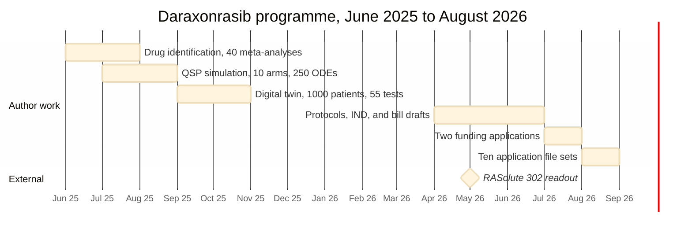

# Figure 4 - Daraxonrasib chronology, June 2025 to August 2026

**Type.** mermaid-type, gantt. **Section.** §5, Trial Evidence.
**Perspective.** *Duration and overlap.* Figure 2 of application 07 sets the
same events on a single axis to separate author work from external readout;
this figure instead shows how long each activity ran and where two ran at once,
which is the productivity claim's actual content.

**Caption (three balanced lines, 61 to 65 characters each).**

```
Fourteen months of author work against the one external readout.
Bar length is elapsed time, not effort, and the two 2025 overlaps
are what a single operator could not have run sequentially.
```

## Mermaid source



## TikZ construction notes

| Element | Style token | Placement |
|:--|:--|:--|
| Month grid | `pagraym` hairlines | 0.42cm per month, 15 months, ticks at Jun 25, Sep 25, Dec 25, Mar 26, Jun 26, Aug 26 |
| Author bars | `mmbar`, `mmbark` for the two 2025 overlaps | Six rows, 0.62 apart |
| External milestone | `mmbarg` diamond at May 2026 | Its own row, separated by a rule |
| Overlap shading | `mmband` behind rows 2 and 3 | Marks the two months in which two activities ran together |

The two overlapping bars are the figure's point, so they are the only bars in
the darker `mmbark` fill. Everything else is `mmbar`.

## Repository sources

- `funding/daraxonrasib-llm-story.md` - the full June 2025 to July 2026 chronology
- `funding/supplementary/source-files/Daraxonrasib-Efficient-LLM-Trial-Simulations.zip` - simulation dates and durations
- `funding/supplementary/Physical AI Oncology Trial Founding Documents.md` - the fourteen work dates
- `funding/RFA-RM-27-001/` and `funding/RFA-RM-27-001-v2/` - the July 7 and July 12, 2026 application dates
