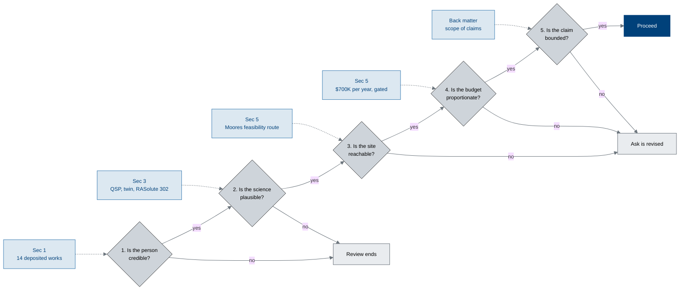

# Figure 8 - The go / no-go gates a reviewer applies

**Type.** mermaid-type, flowchart with decisions. **Section.** §3, The Surgical
Set. **Perspective.** *The reviewer's own decision procedure, and which section
of the applications answers each gate.* Every other figure describes the
programme; this one describes the reader.

**Caption (three balanced lines, 64 to 68 characters each).**

```
The five questions a reviewer asks in order, and the section of the
application that answers each. A no at gate 1 or gate 2 ends the
review; a no at gates 3 to 5 changes the ask rather than ending it.
```

## Mermaid source



## TikZ construction notes

| Element | Style token | Placement |
|:--|:--|:--|
| Five gates | `mmdec`, aspect 2.1 | One rank, y = 0, pitch 2.9 |
| Five answering sections | `mmsoft` | Rank y = 1.9, directly above the gate each answers |
| Two outcomes | `mmgray` | Rank y = -2.1, at x = 1.45 and x = 8.7 |
| Proceed | `mmgoal` | End of the rank, x = 12.8 |
| Answer edges | `mmedged` vertical | 1.9 of clear space, so a dashed answer edge never crosses a gate edge |

Placing each answering section directly above its gate means the pairing is read
from position, and the dashed edges only confirm it.

## Repository sources

- `funding/pdac-funding-applications/applications/app-01-nih-pioneer-award/` - §1, §3, §5 and back matter, the canonical section numbering
- `funding/potential-partners/UC-San-Diego/README.md` - gate 3, the feasibility route
- `funding/RFA-RM-27-001-v2/LaTeX Source Files.zip` - gate 4, the budget frame
