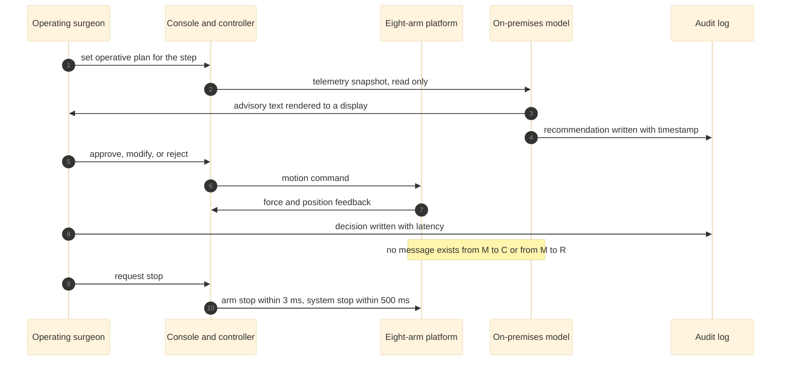

# Figure 12 - Who says what to whom across the operative day

**Type.** mermaid-type, sequence diagram. **Section.** §6, Physical AI
Governance. **Perspective.** *Message order inside one operation.* Figure 13
gives the advisory system's states and guards; this gives the conversation, and
the point is that every message into the robot originates with a human.

**Caption (three balanced lines, 62 to 66 characters each).**

```
One operative day as a message sequence. Every arrow reaching the
robot leaves a human first, and the two audit writes are the only
messages that cross the hospital trust boundary.
```

## Mermaid source



## TikZ construction notes

| Element | Style token | Placement |
|:--|:--|:--|
| Five lifelines | `mmactor` head, `mmlife` dashes | x = 0, 2.9, 5.8, 8.7, 11.6 |
| Eleven messages | `mmmsg`, `mmret` for feedback | y pitch 0.62; labels on a white ground so they never overprint a lifeline |
| Absent path | `\pxmark` between the M and C lifelines | Placed at the note's y, so the struck link and its explanation share a row |
| Stop pair | `mmedgek` heavier stroke | The last two messages, visually separated by a 0.3 gap |

The `Note over M,R` becomes a `\pnote` with the struck-link glyph rather than a
box, because a boxed note at that position would overlap the R lifeline.

## Repository sources

- `funding/pdac-funding-applications/applications/app-01-nih-pioneer-award/sections/sec-04-operation-governance.tex` - the three boundaries and the stop latencies
- `funding/pdac-funding-applications/applications/app-04-doe-genesis-mission/sections/sec-02-mechanism-fit.tex` - the trust boundary
- `funding/tripartisan-llm-support.md` - the model's role as advisory only
