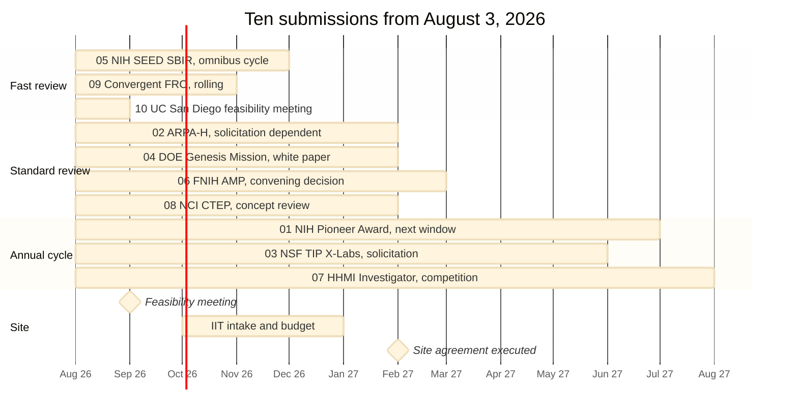

# Figure 17 - The ten submissions, their review clocks, and the site milestones

**Type.** mermaid-type, gantt. **Section.** §8, Budget and Leverage.
**Perspective.** *Ten review clocks running in parallel against one site
timeline.* Figure 4 is a gantt of past work; this is a gantt of future review,
and the two share no bar.

**Caption (three balanced lines, 63 to 67 characters each).**

```
Ten submissions sent on one day and ten review clocks that are not
the same length. The site milestones beneath them are the binding
constraint: no award can start before the site agreement executes.
```

## Mermaid source



## TikZ construction notes

| Element | Style token | Placement |
|:--|:--|:--|
| Month grid | `pagraym` hairlines | 0.30cm per month, 13 months |
| Three review bands | `mmbar` fast, `mmbark` standard, `mmbarg` annual | Ten rows, 0.55 apart, banded by review length |
| Site band | `mmband` behind the last three rows | Separated from the submission bands by a 0.4 gap and a rule |
| Two milestones | `mmdec` at 60 percent scale | Diamonds at Sep 2026 and Feb 2027 |
| Binding constraint | Vertical `protoblue` dashed rule at Feb 2027 | Drawn full height, labelled at the top |

The vertical rule at the site-agreement date is the figure's argument: nine of
the ten review clocks close before it, and none of them can start work until it
passes.

## Repository sources

- `funding/pdac-funding-applications/applications/*/email-*.txt` - the review-route note in each pre-send checklist
- `funding/potential-partners/UC-San-Diego/priority-steps.md` - the site milestone sequence
- `funding/pdac-funding-applications/applications/app-10-ucsd-moores-engine/` - the feasibility meeting as the first site event
