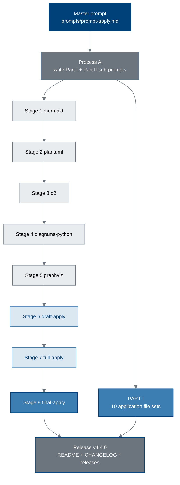

# pdac-funding-applications - 10 Independent-Scientist Applications + Summary Paper (v4.4.0)

This directory builds two deliverables from one master prompt.

- **PART I.** Ten complete, recipient-unique **Phase 1 pancreatic cancer trial
  funding application email file sets** (no DOIs), each written in Kevin
  Kawchak's name as an **independent scientist** under the funding approach set
  out in the White House report *Science: A New Golden Age*, and each stating
  the intent to partner at **UC San Diego Moores Cancer Center**. Five are
  written from a surgical perspective and five from a medical oncology
  perspective; both sets describe the same hybrid procedure, which carries
  surgical and medical oncology arms together.
- **PART II.** One **summary paper** (one DOI) describing the ten applications,
  built through the eight-stage sub-prompt schedule below, at approximately one
  quarter of the character count of the parent source set.

Nothing here is a submission of record. Every application is a draft the author
compiles, verifies, and sends; every recipient address must be confirmed against
the funder's current published contact page before use.

---

## 1. Build pipeline

