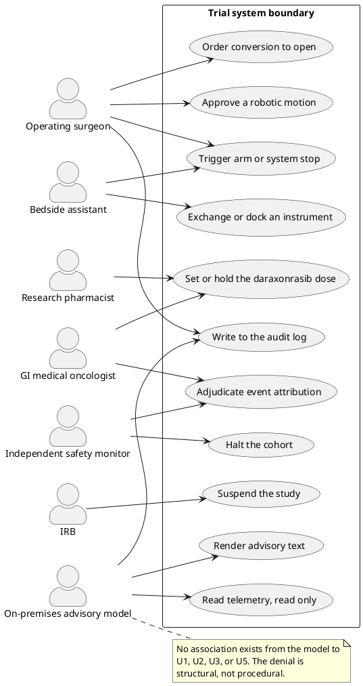

# Figure 5 - Every actor in the trial and the actions each is authorized to take

**Type.** plantuml-type, use case. **Section.** §3, The Surgical Set.
**Perspective.** *The complete authority table as associations.* Applications 02
and 10 each show a three-actor slice; this is the whole set, including the two
actors that appear in no application figure.

**Caption (three balanced lines, 63 to 67 characters each).**

```
Seven actors and the eleven actions each may take. Every action has
at least one human association; the advisory model has exactly one,
and the struck links are the four it is denied by construction.
```

## PlantUML source



## TikZ construction notes

| Element | Style token | Placement |
|:--|:--|:--|
| Six human actors | `\umlactor` | Left column, x = 0, y pitch 1.55 |
| Advisory model | `\umlactor` in `protogray` | Right column, x = 12.6, y = -4.2, so its associations are read against the human ones |
| Eleven use cases | `umlusekey` for U1 to U3, `umlusecase` for U4 to U8, `umlusegray` for U9 to U11 | Two columns inside the boundary at x = 5.0 and x = 8.6, pitch 1.3 |
| Boundary | `umlpkg` with `umlpkgtab` corner title | `fit` to the eleven ellipses plus 7pt |
| Denied paths | `\pxmark` on a `umldash` stub toward U1, U2, U3, U5 | Four marks, each 0.5 from its target so it cannot be read as an association |
| Note | `umlnote` | Right of the model, connected by a single `umldash` |

The three fills separate authority classes: Corporate Blue for actions only the
surgeon takes, pale blue for shared clinical actions, gray for actions the model
may take. A reader who ignores the labels still reads the structure.

## Repository sources

- `funding/pdac-funding-applications/applications/app-02-arpa-h/sections/sec-04-operation-governance.tex` - the three-actor slice this figure completes
- `funding/pdac-funding-applications/applications/app-10-ucsd-moores-engine/sections/sec-04-operation-governance.tex` - the site-facing authority statement
- `funding/pdac-funding-applications/applications/app-08-nci-ctep/sections/sec-04-operation-governance.tex` - adjudication and cohort halt
