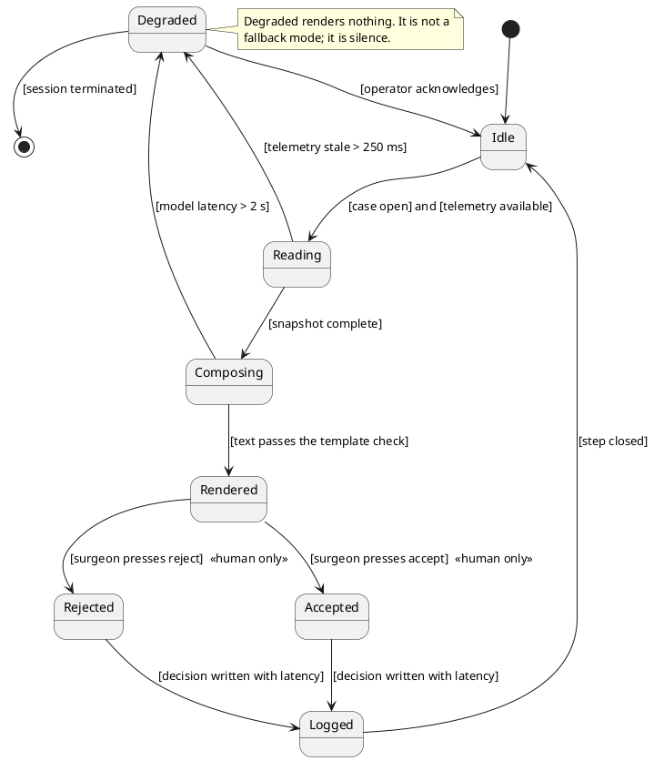

# Figure 13 - The advisory system's states and the guard on every transition

**Type.** plantuml-type, state diagram with guards. **Section.** §6, Physical AI
Governance. **Perspective.** *Guards, not messages.* Figure 12 gives the same
operative day as a message sequence; this gives the state machine underneath it,
and the two transitions only a human can fire are the reason both are needed.

**Caption (three balanced lines, 62 to 66 characters each).**

```
Six advisory states and the guard on every transition. Two guards
can only be satisfied by a human action, and they are the two that
separate a rendered recommendation from an executed motion.
```

## PlantUML source



## TikZ construction notes

| Element | Style token | Placement |
|:--|:--|:--|
| Six states | `umlstate`, `umlstateon` for Accepted, `umlstategray` for Degraded and Rejected | Upper rank y = 0 for the four normal states, lower rank y = -2.4 for Degraded and Logged |
| Initial and final | `umlinit`, `umlfinal` | x = -1.5 and x = 12.5 |
| Guards | `umlguard` on the transition | Every guard sits on its own edge with `pos=0.5` and a white ground |
| Human-only marks | `umlbar` stub in `protoblue` on the two guarded edges | Placed on the edge, 0.35 from the source, so it cannot be read as belonging to a state |
| Degraded note | `umlnote` | Below the Degraded state, connected by one `umldash` |

The two human-only transitions leave the same state, so they are drawn at
`bend left=14` and `bend right=14` with equal looseness; any larger bend makes
the upper curve re-enter the Composing box.

## Repository sources

- `funding/pdac-funding-applications/applications/app-08-nci-ctep/sections/sec-04-operation-governance.tex` - the guarded adjudication state machine this one parallels
- `funding/pdac-funding-applications/applications/app-04-doe-genesis-mission/sections/sec-03-evidence.tex` - the closed loop with one measured human gate
- `funding/pdac-funding-applications/applications/app-01-nih-pioneer-award/sections/sec-04-operation-governance.tex` - stop latencies and the advisory boundary
