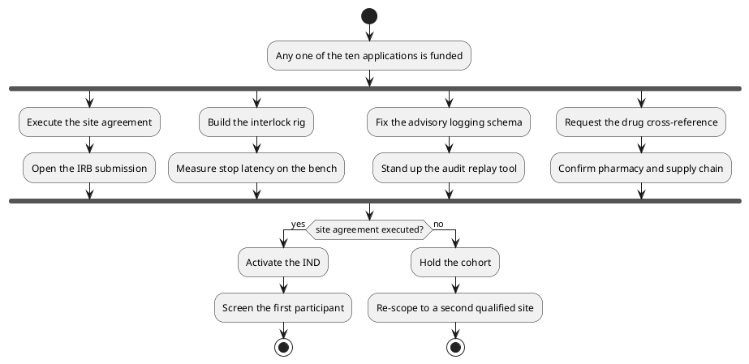

# Figure 19 - What happens in parallel once any one application is funded

**Type.** plantuml-type, activity with fork and join. **Section.** §9, Build
Method. **Perspective.** *Concurrency.* Figure 6 shows which award unblocks
which activity as a dependency graph; this shows what runs at the same time
once any one of them lands, which is a different question and needs a fork.

**Caption (three balanced lines, 64 to 68 characters each).**

```
One award, four parallel workstreams, one join. The join condition is
the site agreement, not the money, which is why nine of the ten asks
can be satisfied by any single award rather than by all ten.
```

## PlantUML source



## TikZ construction notes

| Element | Style token | Placement |
|:--|:--|:--|
| Start and stop | `umlinit`, `umlfinal` | y = 1.4 and y = -6.6 |
| Fork and join bars | `umlbar`, 8.8cm wide | y = 0.2 and y = -3.4, both full width so the four lanes are visibly parallel |
| Four lanes | `umlbox` pairs | x = 0.4, 3.4, 6.4, 9.4; two boxes per lane at y = -1.0 and y = -2.3 |
| Decision | `mmdec` | y = -4.4, centred |
| Two outcomes | `umlstateon` yes branch, `umlstategray` no branch | y = -5.8, at x = 3.0 and x = 8.6 |

Four lanes at a 3.0 pitch with 2.7cm boxes leaves 0.3 between lanes, which is
enough to read them as separate and not enough to look disconnected. The fork
bar is drawn wider than the outermost lane so it visibly spans all four.

## Repository sources

- `funding/pdac-funding-applications/applications/app-01-nih-pioneer-award/sections/sec-05-budget-site.tex` - the dependency graph this figure complements
- `funding/pdac-funding-applications/applications/app-05-nih-sbir-seed/sections/sec-04-operation-governance.tex` - the three technical risks that become three of the four lanes
- `funding/potential-partners/UC-San-Diego/priority-steps.md` - the drug cross-reference and pharmacy lane
