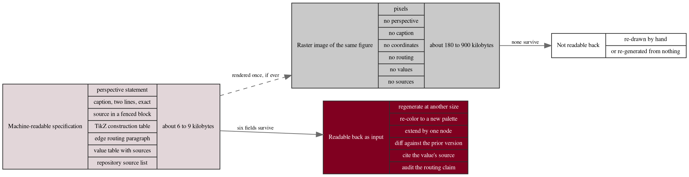

# Figure 5 - What a figure specification stores

**Type.** graphviz-type, dot record. **Section.** §2, Methods.
**Perspective.** *What one machine-readable figure specification holds, field by
field, against what a raster image of the same figure holds, and which of those
fields can be read back as input to the next paper.* No other figure in this
paper is about storage; Figure 3 is about the build's concurrency and Figure 4
about one turn's mechanism.

**Caption (2 balanced lines, 72 and 74 characters, numbered as printed).**

```
Figure 5. Two records for one figure: the machine-readable specification and
the raster image, with the six fields only the first can return as input.
```

## DOT source



## TikZ construction table

Absolute coordinates. Canvas 14.6 by 7.6 cm. Two record columns on the left,
two outcome records on the right, four ranks at a stated separation.

| Element | Style token | Placement |
|:--|:--|:--|
| Rank separation | 4.85 cm | Between column 1 and column 2 |
| Specification record header | `gvcellh`, width 52 mm, height 0.50 cm | x = 0, y = 0 |
| Specification record fields, 7 | `gvcells`, width 52 mm, height 0.42 cm | x = 0, y = -0.50 down to -3.02, pitch 0.42 cm |
| Specification record footer | `gvcells`, bold | x = 0, y = -3.44, carrying the size |
| Raster record header | `gvcellh`, width 52 mm | x = 0, y = -4.35 |
| Raster record fields, 7 | `gvcellg`, width 52 mm, height 0.42 cm | x = 0, y = -4.85 down to -7.37 |
| Raster record footer | `gvcellg`, bold | x = 0, y = -7.79 |
| Reuse record header | `gvcellh`, width 50 mm | x = 8.05, y = -0.85 |
| Reuse record fields, 6 | `gvcells`, width 50 mm, height 0.42 cm | x = 8.05, y = -1.35 down to -3.45 |
| Dead record header | `gvcellh`, width 50 mm | x = 8.05, y = -5.20 |
| Dead record fields, 2 | `gvcellg`, width 50 mm | x = 8.05, y = -5.70 and -6.12 |
| Field separators | Charcoal rule, 0.4 pt | Between every pair of fields, uniform weight |
| Survive edge | `gvedgeb`, 0.75 pt | From the specification record's east edge at y = -1.90 to the reuse record's west edge at y = -2.15 |
| No-survive edge | `gvedgeg` | From the raster record's east edge at y = -6.05 to the dead record's west edge at y = -5.91 |
| Render edge | `gvedged` | From the specification record's south edge at x = 2.60 to the raster record's north edge at x = 2.60 |
| Edge labels | `gvedge` label, white fill | Midpoint of each run |
| Ratio callout | `gvboxm`, `text width=40mm` | x = 8.05, y = -7.55 |
| In-figure note | `pnote` | x = 0, y = -8.55, `text width=140mm` |

Both left-hand records carry exactly seven fields at one 0.42 cm field height,
so the comparison is field for field and the difference in what each field
holds is the only variable.

## Structure table

| Field | Specification holds | Raster holds |
|:--|:--|:--|
| Perspective | A sentence stating what no other figure shows | Nothing |
| Caption | Two lines, exactly as printed, with the figure number | Nothing, or a filename |
| Source | Valid diagram source in a fenced block | Pixels |
| Construction | A table of style tokens and absolute coordinates | Nothing |
| Routing | A paragraph naming every edge that could cross and its clearance | Nothing |
| Values | Every number in the figure with the file it came from | Nothing |
| Sources | Exact repository paths | Nothing |
| Size on disk | About 6 to 9 kilobytes | About 180 to 900 kilobytes |

The paper's twenty-five specifications occupy roughly 190 kilobytes in total,
which is less than a single high-resolution raster of one of the figures they
describe. That is the storage claim, and it is why every figure in this work is
drawn in TikZ from a specification rather than rendered to an image.

## Edge routing

Three edges. The survive edge and the no-survive edge are near-horizontal runs
of 1.90 cm and 1.75 cm respectively, in separate horizontal bands 4.15 cm
apart, so they cannot cross. The render edge is a vertical drop at x = 2.60,
through the 0.91 cm gutter between the two left-hand records, and is dashed
because it is optional: in this paper it is never taken. No edge passes through
a record field, because both horizontal edges leave and enter at a field
boundary rather than at a field center.

## Repository sources

- `new-trial-system/mermaid`, `new-trial-system/plantuml`, `new-trial-system/d2`, `new-trial-system/diagrams-python`, `new-trial-system/graphviz` - the twenty-five specifications whose sizes the record's footer reports
- `funding/capitalization-plan/mermaid` and its four sibling directories - the prior twenty specifications, which this work re-read as input rather than re-deriving
- `new-trial-system/prompts/prompt-new-trial.md` - the instruction forbidding raster output
