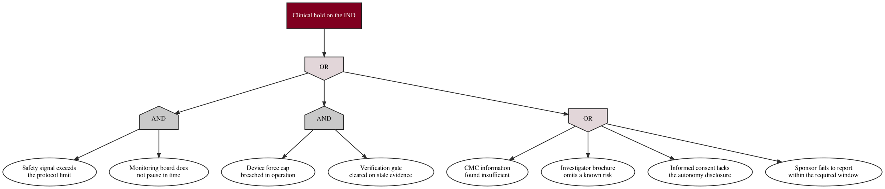

# Figure 9 - What would have to fail for a clinical hold

**Type.** graphviz-type, fault tree. **Section.** §3, IND.
**Perspective.** *The specific combinations of basal failure that produce a
clinical hold on this IND, with the gate type on each junction, so the sponsor's
risk is stated as a logical structure rather than as a list of worries.* No
other figure in this paper draws failure logic; Figure 6 draws what the IND was
built from, Figure 7 when, and Figure 8 which requirement each module satisfies.

**Caption (2 balanced lines, 74 and 77 characters, numbered as printed).**

```
Figure 9. The clinical hold as a top event over eight basal failures, with
the two AND gates that make a hold require a coincidence rather than a fault.
```

## DOT source



## TikZ construction table

Absolute coordinates. Canvas 15.0 by 9.4 cm. Four ranks top to bottom at a
stated separation, because a fault tree is read downward from its top event.

| Element | Style token | Placement |
|:--|:--|:--|
| Rank separation | 2.15 cm | Uniform between rank 0 and rank 3 |
| Top event | `gvboxk`, `text width=44mm`, `line width=0.9pt` | Rank 0, x = 7.50, y = 0 |
| Top OR gate | `\umlgateor` | Rank 1, x = 7.50, y = -2.15 |
| Left AND gate | `\umlgateand` | Rank 2, x = 2.20, y = -4.30 |
| Center AND gate | `\umlgateand` | Rank 2, x = 7.50, y = -4.30 |
| Right OR gate | `\umlgateor` | Rank 2, x = 12.80, y = -4.30 |
| Basal events b1, b2 | `gvnode`, `text width=24mm` | Rank 3, x = 0.95 and 3.45, y = -6.90 |
| Basal events b3, b4 | `gvnode`, `text width=24mm` | Rank 3, x = 6.25 and 8.75, y = -6.90 |
| Basal events b5 to b8 | `gvgray`, `text width=24mm` | Rank 3, x = 10.85, 13.35, 10.85, 13.35 at y = -6.90 and y = -8.55 |
| Gate to gate edges | `gvedge` | Three edges from the top OR gate's foot, fanning to the three rank 2 gate heads |
| Gate to basal edges | `gvedge` | Two from each AND gate, four from the right OR gate |
| Gate labels | Drawn inside the glyph by `\umlgateand` and `\umlgateor` | No separate text node |
| Cut set callout | `gvboxm`, `text width=46mm` | x = 2.20, y = -8.55, in the empty left quadrant of rank 3's lower row |
| In-figure note | `pnote` | x = 0, y = -9.85, `text width=142mm` |

The two AND gates sit at the same rank and the same y, and the OR gate that
shares that rank sits at the same y as well, so the reader can see at a glance
that the three branches are alternatives at equal depth. No basal event feeds
two gates: each of the eight has exactly one parent, so every minimal cut set
is disjoint from the others.

## Structure table

| Gate | Type | Inputs | Minimal cut set |
|:--|:--|:--|:--|
| Top | OR | Left AND, center AND, right OR | A hold follows from any one of the three branches |
| Left | AND | b1 safety signal exceeds the protocol limit; b2 monitoring board does not pause in time | Both must occur; a signal alone is handled by the pause rule |
| Center | AND | b3 device force cap breached in operation; b4 verification gate cleared on stale evidence | Both must occur; a breach alone triggers the emergency stop |
| Right | OR | b5 CMC insufficient; b6 brochure omits a known risk; b7 consent lacks the autonomy disclosure; b8 sponsor reporting window missed | Any one is sufficient, because each is a documentation deficiency the agency can act on alone |

The figure's claim is in the gate types. The two clinical branches are AND
gates, so a hold on clinical grounds requires a coincidence of a signal and a
failure to respond to it. The documentation branch is an OR gate, so a hold on
documentation grounds requires only one omission. That asymmetry is the reason
the new system's advantage matters most on the right-hand branch: four
documentation failures, each independently sufficient, are exactly the class of
failure a system that regenerates a complete dossier in hours can eliminate.

## Edge routing

Eleven edges. The three rank 1 to rank 2 edges fan from a single point at the
top OR gate's foot to three gate heads 5.30 cm apart, at angles of 68, 90 and
112 degrees, and cannot cross because they diverge monotonically. Each rank 2
to rank 3 edge drops 2.60 cm to a basal event directly beneath its gate, within
a 1.25 cm horizontal offset, so no edge crosses a sibling subtree. The right OR
gate feeds four basal events in two rows; its two lower edges pass between the
two upper basal events, through the 0.35 cm gap at x = 12.10, which is the only
place in the figure an edge passes between two nodes and is stated here for that
reason. The cut set callout sits in the empty lower-left quadrant, x = 0.35 to
4.05, where no node or edge is placed.

## Repository sources

- `trial-ind/final-ind/publication/LaTeX Source Files.zip` - the CMC module, the investigator's brochure, the consent language, and the sponsor reporting commitments under 21 CFR 312
- `trial-protocol/final-protocol/publication/LaTeX Source Files.zip` - the pause and stopping rules, the force caps, and the emergency stop budget behind b1, b2 and b3
- `new-trial-system/inputs/VVUQ-Physical-AI-Oncology-Trial-Bill.zip` - the verification currency requirement behind b4
- `new-trial-system/inputs/Earning-the-Clinician's-Trust.zip` - the autonomy disclosure behind b7
