# Figure 15 - Five bill versions and four companion documents

**Type.** graphviz-type, cluster with records. **Section.** §5, Legislation.
**Perspective.** *What each successive bill version added that its predecessor
did not carry, and which of the four companion documents supplied the material
for that addition, so the legislative work is shown as an accumulation with a
named source at every step.* No other figure in this paper shows the drafting
history; Figure 14 assigns duties in the finished text and Figure 16 traces one
requirement downward from it.

**Caption (2 balanced lines, 73 and 71 characters, numbered as printed).**

```
Figure 15. Five bill versions across eleven days, the delta each added, and
the four companion documents that supplied the material for those deltas.
```

## DOT source

```dot
digraph lineage {
  rankdir=LR;
  node [shape=record, fontname="Times", fontsize=9, color="#2E2E2E"];
  edge [color="#2E2E2E", arrowsize=0.6];

  subgraph cluster_bill {
    label="Bill versions, H. R. 9510";
    color="#6B6B6B"; style=dashed;
    v1 [label="{v1.0, Jun 1 2026|standalone act|Verification Before Generation}",
        style=filled, fillcolor="#E2D6D9"];
    v2 [label="{v2.0, Jun 4 2026|FD and C amendment|becomes an amendment}",
        style=filled, fillcolor="#E2D6D9"];
    v3 [label="{v3.0, Jun 4 2026|visual amendment|findings become figures}",
        style=filled, fillcolor="#A32A3C", fontcolor="#FFFFFF"];
    v4 [label="{v4.0, Jun 7 2026|machine-readable|Mermaid in statute}",
        style=filled, fillcolor="#A32A3C", fontcolor="#FFFFFF"];
    v5 [label="{v5.0, Jun 10 2026|financial data|cost ledger per run}",
        style=filled, fillcolor="#800020", fontcolor="#FFFFFF"];
  }

  subgraph cluster_comp {
    label="Companion documents";
    color="#6B6B6B"; style=dashed;
    c1 [label="{VVUQ Physical AI Oncology Trial Bill|May 30 2026|statutory text and definitions}",
        style=filled, fillcolor="#C9C9C9"];
    c2 [label="{Earning the Clinician's Trust|Jun 16 2026|eight trust questions}",
        style=filled, fillcolor="#C9C9C9"];
    c3 [label="{From H. R. 9510 to Federal Law|Jun 14 2026|narrative case}",
        style=filled, fillcolor="#C9C9C9"];
    c4 [label="{Earning the Congress's Vote|Jun 17 2026|enactment framework}",
        style=filled, fillcolor="#C9C9C9"];
  }

  v1 -> v2 -> v3 -> v4 -> v5;
  c1 -> v1 [style=dashed, label="supplies text"];
  c3 -> v4 [style=dashed, label="supplies case"];
  c2 -> v5 [style=dashed, label="supplies duties"];
  c4 -> v5 [style=dashed, label="supplies path"];
}
```



## TikZ construction table

Absolute coordinates. Canvas 15.2 by 8.2 cm. Two dashed clusters, the bill
lineage on the upper rank and the companion documents on the lower.

| Element | Style token | Placement |
|:--|:--|:--|
| Rank separation | 4.10 cm | Between the two cluster centers |
| v1 to v5 records | 3-field records: `gvcellh` header, two `gvcells` fields, width 27 mm | Upper rank, y = 0; x = 0, 3.05, 6.10, 9.15, 12.20; pitch 3.05 cm |
| v3 and v4 fill | `gvcellk` mid fill on the header cell | Same geometry, fill only |
| v5 fill | `gvcellh` burgundy header, 0.9 pt stroke | Same geometry |
| Bill cluster frame | `gvcluster`, dashed | `fit` v1 to v5, `inner sep=6pt` |
| c1 to c4 records | 3-field records, width 32 mm | Lower rank, y = -4.10; x = 0, 3.95, 7.90, 11.85; pitch 3.95 cm |
| Companion cluster frame | `gvcluster2`, dashed | `fit` c1 to c4, `inner sep=6pt` |
| Cluster titles | `gvctitle` | Anchored north west inside each frame, 1.5 mm inset |
| Lineage edges, 4 | `gvedgeb`, 0.75 pt | Horizontal, record east anchor to record west anchor, at y = -0.55 |
| Supply edges, 4 | `gvedged` | From a companion record's north anchor to a version record's south anchor |
| Supply labels | `gvedge` label, white fill | Midpoint of each supply edge |
| Delta strip | `gvboxm`, `text width=54mm` | x = 0, y = -6.35 |
| Days strip | `gvboxs`, `text width=44mm` | x = 8.20, y = -6.35 |
| In-figure note | `pnote` | x = 0, y = -7.20, `text width=144mm` |

The five version records share one width and one three-field structure, so the
delta field is read across the rank as a single line of text. The four
companion records are wider, 32 mm against 27 mm, which distinguishes the two
classes without a second stroke weight.

## Structure table

| Version | Date | Delta over its predecessor | Companion that supplied it |
|:--|:--|:--|:--|
| v1.0 | Jun 1, 2026 | The standalone Verification Before Generation Act | VVUQ Physical AI Oncology Trial Bill, May 30, 2026 |
| v2.0 | Jun 4, 2026 | Recast as an amendment to the Federal Food, Drug, and Cosmetic Act | Carried from v1.0 |
| v3.0 | Jun 4, 2026 | Findings rendered as figures inside the statutory text | Carried from v2.0 |
| v4.0 | Jun 7, 2026 | Machine-readable diagrams inside the bill itself | From H. R. 9510 to Federal Law, Jun 14, 2026 |
| v5.0 | Jun 10, 2026 | The financial data amendment: a cost ledger attached to every verification run | Earning the Clinician's Trust, Jun 16, 2026, and Earning the Congress's Vote, Jun 17, 2026 |

Five versions were deposited across eleven days, June 1 to June 10, 2026, and
four companion documents were deposited in the same window. The prior system's
comparable unit is a single bill draft circulated for comment over a
legislative session.

## Edge routing

Eight edges. The four lineage edges are horizontal at a single y of -0.55 and
run between adjacent records 0.35 cm apart, so none can cross. The four supply
edges rise from a companion record's north anchor to a version record's south
anchor; three are near-vertical with a horizontal offset below 0.85 cm, and the
fourth, `c2` to `v5`, has an offset of 4.30 cm and is drawn as a two-segment
orthogonal path that rises to y = -2.05, runs right, then rises into `v5`, so it
passes 1.05 cm below the bill cluster's south edge and crosses no other supply
edge. The supply labels sit on the vertical segment of each edge with a white
fill.

## Repository sources

- `new-trial-system/inputs/HR-9510-Bill-v5.zip` - the v5.0 text, its findings section recording the v1 to v4 lineage, and the financial data amendment
- `new-trial-system/inputs/VVUQ-Physical-AI-Oncology-Trial-Bill.zip` - statutory text, definitions, prior law, findings, and implementation, the material v1.0 was built from
- `new-trial-system/inputs/Earning-the-Clinician's-Trust.zip` - the eight trust questions that became duties in v5.0
- `new-trial-system/abstracts/README.md` - the June 1, 4, 7, 10, 14, 16 and 17, 2026 deposit dates
